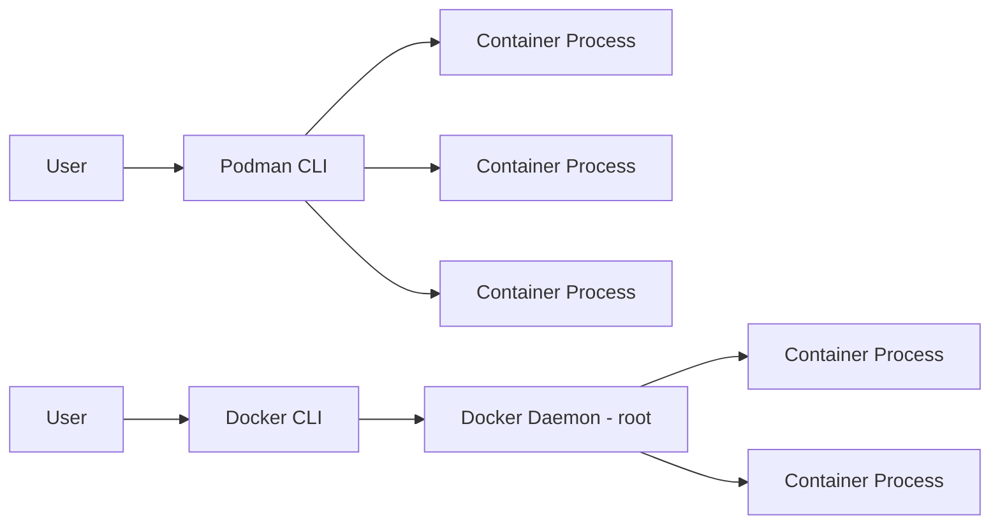

# How to Install and Configure Podman on RHEL

Author: [nawazdhandala](https://www.github.com/nawazdhandala)

Tags: RHEL, Podman, Containers, Linux

Description: A hands-on guide to installing Podman on RHEL, configuring registries, storage, and verifying your setup is ready for production container workloads.

---

If you have been running containers with Docker for years and recently moved to RHEL, you will notice that Docker is not included by default. Red Hat has moved to Podman as its container engine, and honestly, after spending time with it, I think it is a better fit for most server workloads. No daemon, no root requirement, and full OCI compatibility.

This guide walks through installing and configuring Podman on a fresh RHEL system.

## Why Podman Over Docker?

Podman is a daemonless container engine. That means there is no background process running as root waiting for instructions. Each container runs as a child process of the Podman command, which makes it simpler to manage and more secure by default.



## Prerequisites

- A RHEL system with an active subscription
- Root or sudo access
- Network connectivity for pulling packages

## Installing Podman

Podman ships in the default RHEL repositories, so installation is straightforward.

## Install the container-tools module which includes podman, buildah, and skopeo
```bash
sudo dnf install -y container-tools
```

If you only want Podman without the full suite:

## Install just podman
```bash
sudo dnf install -y podman
```

Verify the installation:

## Check podman version and build info
```bash
podman --version
podman info
```

You should see output showing Podman 4.x or later with the cgroups v2 configuration.

## Configuring Container Registries

Podman uses `/etc/containers/registries.conf` to know where to pull images from. By default, RHEL configures `registry.redhat.io` and `registry.access.redhat.com`.

If you want to add Docker Hub or other registries, edit the config:

## Add unqualified search registries
```bash
sudo vi /etc/containers/registries.conf
```

Find the `unqualified-search-registries` line and update it:

```toml
unqualified-search-registries = ["registry.redhat.io", "registry.access.redhat.com", "docker.io"]
```

This tells Podman to search these registries in order when you pull an image without specifying a full registry path.

## Configuring Container Storage

Podman stores container data and images locally. The storage configuration lives at `/etc/containers/storage.conf` for system-wide settings or `~/.config/containers/storage.conf` for per-user settings.

## Check current storage configuration
```bash
podman info --format '{{.Store.GraphRoot}}'
podman info --format '{{.Store.RunRoot}}'
```

For rootful containers, images are stored under `/var/lib/containers/storage/`. For rootless containers, they go under `~/.local/share/containers/storage/`.

If you need to change the storage driver or location:

```bash
sudo vi /etc/containers/storage.conf
```

The default driver on RHEL is `overlay`, which is the best choice for most setups:

```toml
[storage]
driver = "overlay"
graphroot = "/var/lib/containers/storage"
```

## Configuring Authentication for Registries

If you need to pull from `registry.redhat.io`, you will need to authenticate:

## Log in to the Red Hat registry
```bash
podman login registry.redhat.io
```

For Docker Hub:

```bash
podman login docker.io
```

Credentials are stored in `${XDG_RUNTIME_DIR}/containers/auth.json` for rootless or `/run/containers/0/auth.json` for root.

## Testing Your Installation

Pull and run a test container to make sure everything works:

## Pull the UBI 9 minimal image from Red Hat
```bash
podman pull registry.access.redhat.com/ubi9/ubi-minimal
```

## Run a quick test container
```bash
podman run --rm registry.access.redhat.com/ubi9/ubi-minimal cat /etc/redhat-release
```

You should see the Red Hat release information printed to your terminal.

## Configuring Podman for Rootless Use

One of Podman's strongest features is rootless container support. To set up a regular user for rootless containers:

## Verify subuid and subgid mappings exist for your user
```bash
grep $USER /etc/subuid
grep $USER /etc/subgid
```

If your user is missing from these files, add the mappings:

## Add subordinate UID and GID ranges for the user
```bash
sudo usermod --add-subuids 100000-165535 --add-subgids 100000-165535 $USER
```

After modifying these files, reset the Podman storage for the user:

```bash
podman system migrate
```

## Enabling Podman Socket for Docker Compatibility

Some tools expect a Docker-compatible socket. Podman can emulate this:

## Enable the podman socket for the current user
```bash
systemctl --user enable --now podman.socket
```

## Verify the socket is active
```bash
systemctl --user status podman.socket
```

You can then set `DOCKER_HOST` to point tools at the Podman socket:

```bash
export DOCKER_HOST=unix://$XDG_RUNTIME_DIR/podman/podman.sock
```

## Setting Resource Limits

On RHEL, Podman uses cgroups v2 by default. You can set default resource limits in `/etc/containers/containers.conf`:

```toml
[containers]
pids_limit = 2048
log_size_max = 1048576
```

Or apply limits per-container at runtime:

## Run a container with memory and CPU limits
```bash
podman run --rm --memory 512m --cpus 1.0 registry.access.redhat.com/ubi9/ubi-minimal sleep 10
```

## Useful Podman Commands to Know

Here is a quick reference for day-to-day work:

```bash
# List running containers
podman ps

# List all containers including stopped ones
podman ps -a

# List downloaded images
podman images

# Remove all stopped containers
podman container prune

# Remove unused images
podman image prune

# View container logs
podman logs <container-id>

# Get detailed container info
podman inspect <container-id>
```

## Firewall Considerations

If your containers need to expose ports, make sure the firewall allows traffic:

## Allow a specific port through the firewall
```bash
sudo firewall-cmd --add-port=8080/tcp --permanent
sudo firewall-cmd --reload
```

## Wrapping Up

Podman on RHEL is production-ready out of the box. The key configuration files to remember are:

- `/etc/containers/registries.conf` for registry settings
- `/etc/containers/storage.conf` for storage backend
- `/etc/containers/containers.conf` for runtime defaults

Once you have these configured for your environment, Podman works just like Docker for most use cases, but without the overhead of a daemon and with better security defaults. In the next posts, we will dig into running containers, building images, and setting up pods.
