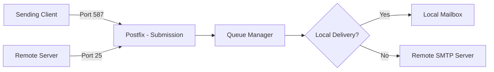

# How to Install and Configure a Postfix SMTP Server on RHEL

Author: [nawazdhandala](https://www.github.com/nawazdhandala)

Tags: RHEL, Postfix, SMTP, Mail Server, Linux

Description: A practical guide to installing Postfix on RHEL and configuring it as a fully functional SMTP server for sending and receiving email.

---

## Why Postfix?

Postfix is the default MTA (Mail Transfer Agent) on RHEL and has been the workhorse of Linux mail servers for years. It replaced Sendmail as the go-to choice because it is faster, easier to configure, and more secure by design. Whether you need a server to send system notifications or a full-blown mail server for your organization, Postfix is the right tool.

## Prerequisites

- A RHEL system with root or sudo access
- A valid hostname and DNS records (MX, A, PTR) pointing to your server
- Ports 25 (SMTP), 587 (submission), and optionally 465 (SMTPS) accessible

## Installing Postfix

Postfix is usually installed by default on RHEL. If not, install it:

```bash
# Install postfix
sudo dnf install -y postfix
```

If Sendmail is installed, remove it to avoid conflicts:

```bash
# Remove sendmail if present
sudo dnf remove -y sendmail
```

## Mail Flow Overview



## Main Configuration File

The primary configuration file is `/etc/postfix/main.cf`. Back it up before editing:

```bash
# Backup original config
sudo cp /etc/postfix/main.cf /etc/postfix/main.cf.bak
```

### Essential Settings

Edit `/etc/postfix/main.cf` with these core settings:

```bash
# Set the hostname (FQDN of your mail server)
myhostname = mail.example.com

# Set the domain name for outgoing mail
mydomain = example.com

# Use the domain name in outgoing mail addresses
myorigin = $mydomain

# Listen on all interfaces (default is localhost only)
inet_interfaces = all

# Accept mail for these domains
mydestination = $myhostname, localhost.$mydomain, localhost, $mydomain

# Trusted networks that can relay through this server
mynetworks = 127.0.0.0/8, 10.0.0.0/24

# Mailbox location (Maildir format, one file per message)
home_mailbox = Maildir/

# Banner shown to connecting clients
smtpd_banner = $myhostname ESMTP

# Disable the open relay - reject unauthorized relay attempts
smtpd_relay_restrictions = permit_mynetworks, permit_sasl_authenticated, reject_unauth_destination
```

### Network and Protocol Settings

```bash
# Use IPv4 only (set to 'all' if you need IPv6)
inet_protocols = ipv4

# Maximum message size (25 MB)
message_size_limit = 26214400

# Mailbox size limit (1 GB)
mailbox_size_limit = 1073741824
```

## Configuring the Submission Port (587)

Edit `/etc/postfix/master.cf` to enable the submission port for authenticated email sending:

```bash
# Uncomment and configure the submission service
submission inet n       -       n       -       -       smtpd
  -o syslog_name=postfix/submission
  -o smtpd_tls_security_level=encrypt
  -o smtpd_sasl_auth_enable=yes
  -o smtpd_tls_auth_only=yes
  -o smtpd_reject_unlisted_recipient=no
  -o smtpd_relay_restrictions=permit_sasl_authenticated,reject
  -o milter_macro_daemon_name=ORIGINATING
```

## Setting Up SASL Authentication

Install the Cyrus SASL packages:

```bash
# Install SASL authentication support
sudo dnf install -y cyrus-sasl cyrus-sasl-plain
```

Add SASL configuration to `/etc/postfix/main.cf`:

```bash
# Enable SASL authentication
smtpd_sasl_auth_enable = yes
smtpd_sasl_type = cyrus
smtpd_sasl_path = smtpd
smtpd_sasl_security_options = noanonymous
smtpd_sasl_local_domain = $myhostname
broken_sasl_auth_clients = yes
```

Start the SASL authentication daemon:

```bash
# Enable and start saslauthd
sudo systemctl enable --now saslauthd
```

## DNS Configuration

For a mail server to work properly, you need these DNS records:

| Record Type | Name | Value |
|---|---|---|
| A | mail.example.com | 203.0.113.10 |
| MX | example.com | mail.example.com (priority 10) |
| PTR | 203.0.113.10 | mail.example.com |

Without a PTR record, many receiving mail servers will reject your mail.

## Firewall Configuration

Open the necessary ports:

```bash
# Allow SMTP and submission ports
sudo firewall-cmd --permanent --add-service=smtp
sudo firewall-cmd --permanent --add-port=587/tcp
sudo firewall-cmd --reload
```

## Starting and Enabling Postfix

```bash
# Enable and start postfix
sudo systemctl enable --now postfix
```

Verify it is running:

```bash
# Check postfix status
sudo systemctl status postfix

# Verify postfix is listening
sudo ss -tlnp | grep -E ':(25|587)'
```

## Testing the Configuration

### Check Configuration Syntax

```bash
# Verify configuration for errors
sudo postfix check
```

### Send a Test Email

```bash
# Send a test email from the command line
echo "This is a test email from Postfix on RHEL" | mail -s "Test Email" user@example.com
```

### Check the Mail Queue

```bash
# View the mail queue
sudo postqueue -p

# Flush the mail queue (attempt delivery of all queued mail)
sudo postqueue -f
```

### Check Mail Logs

```bash
# View recent mail log entries
sudo journalctl -u postfix --since "1 hour ago"

# Or check the traditional mail log
sudo tail -f /var/log/maillog
```

## Basic Anti-Spam Measures

Add these restrictions to `/etc/postfix/main.cf` to block common spam patterns:

```bash
# Require proper HELO/EHLO greeting
smtpd_helo_required = yes
smtpd_helo_restrictions = reject_invalid_helo_hostname, reject_non_fqdn_helo_hostname

# Sender restrictions
smtpd_sender_restrictions = reject_non_fqdn_sender, reject_unknown_sender_domain

# Recipient restrictions
smtpd_recipient_restrictions =
    permit_mynetworks,
    permit_sasl_authenticated,
    reject_unauth_destination,
    reject_unknown_recipient_domain,
    reject_rbl_client zen.spamhaus.org
```

## Viewing All Active Settings

Postfix has many parameters with defaults. To see every active setting:

```bash
# Show all non-default configuration values
sudo postconf -n

# Show a specific parameter value
sudo postconf myhostname
```

## Common Troubleshooting

**Mail stuck in queue:**

```bash
# Show detailed queue information
sudo postqueue -p

# View a specific queued message
sudo postcat -q <queue_id>

# Delete a specific message from the queue
sudo postsuper -d <queue_id>

# Delete all messages from the queue
sudo postsuper -d ALL
```

**Connection refused errors:**

Check that `inet_interfaces` is set correctly and that the firewall allows traffic on port 25.

**Relay access denied:**

Make sure the sending client IP is in `mynetworks` or the user is authenticated via SASL.

## Wrapping Up

You now have a working Postfix SMTP server on RHEL. This covers the basics of sending and receiving mail. For a production setup, you will want to add TLS encryption, SPF/DKIM/DMARC authentication, and integrate with Dovecot for IMAP access. Those topics are covered in the other posts in this series.
