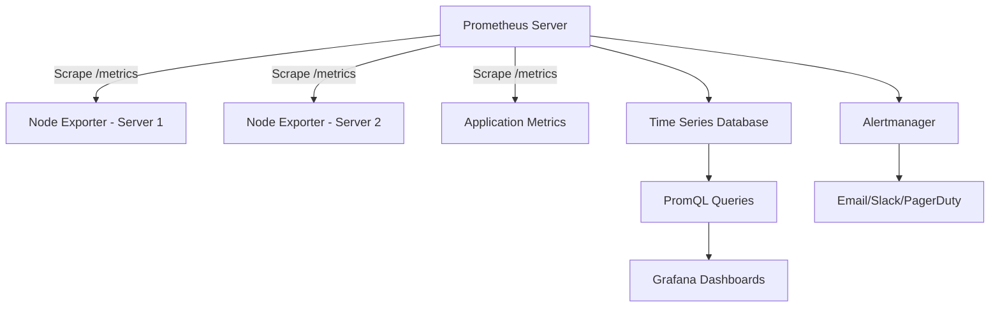

# How to Install and Configure Prometheus on RHEL

Author: [nawazdhandala](https://www.github.com/nawazdhandala)

Tags: RHEL, Prometheus, Monitoring, Metrics, Linux

Description: Learn how to install, configure, and run Prometheus as a systemd service on RHEL for collecting and querying time-series metrics from your infrastructure.

---

Prometheus is an open-source monitoring system that collects metrics from targets by scraping HTTP endpoints. It stores data as time series and provides a powerful query language called PromQL. On RHEL, you can install Prometheus from pre-built binaries and run it as a systemd service.

## Architecture



## Prerequisites

- RHEL server with root or sudo access
- At least 2GB RAM and 20GB disk space for a small deployment
- Port 9090 available for the Prometheus web UI

## Step 1: Create a Prometheus User

```bash
# Create a system user for Prometheus (no home directory, no login shell)
sudo useradd --no-create-home --shell /bin/false prometheus
```

## Step 2: Create Directory Structure

```bash
# Create directories for Prometheus configuration and data
sudo mkdir -p /etc/prometheus
sudo mkdir -p /var/lib/prometheus

# Set ownership
sudo chown prometheus:prometheus /etc/prometheus
sudo chown prometheus:prometheus /var/lib/prometheus
```

## Step 3: Download and Install Prometheus

```bash
# Download the latest Prometheus release
# Check https://prometheus.io/download/ for the current version
PROM_VERSION="2.51.0"
cd /tmp
curl -LO "https://github.com/prometheus/prometheus/releases/download/v${PROM_VERSION}/prometheus-${PROM_VERSION}.linux-amd64.tar.gz"

# Extract the archive
tar xvf "prometheus-${PROM_VERSION}.linux-amd64.tar.gz"
cd "prometheus-${PROM_VERSION}.linux-amd64"

# Copy binaries to /usr/local/bin
sudo cp prometheus /usr/local/bin/
sudo cp promtool /usr/local/bin/

# Set ownership
sudo chown prometheus:prometheus /usr/local/bin/prometheus
sudo chown prometheus:prometheus /usr/local/bin/promtool

# Copy console templates and libraries
sudo cp -r consoles /etc/prometheus/
sudo cp -r console_libraries /etc/prometheus/

# Set ownership
sudo chown -R prometheus:prometheus /etc/prometheus/consoles
sudo chown -R prometheus:prometheus /etc/prometheus/console_libraries

# Clean up
cd /tmp
rm -rf "prometheus-${PROM_VERSION}.linux-amd64"*
```

## Step 4: Configure Prometheus

Create the main configuration file:

```bash
sudo vi /etc/prometheus/prometheus.yml
```

```yaml
# Global configuration
global:
  # How often Prometheus scrapes targets
  scrape_interval: 15s

  # How often rules are evaluated
  evaluation_interval: 15s

  # Timeout for scrape requests
  scrape_timeout: 10s

# Alerting configuration (optional, for Alertmanager)
alerting:
  alertmanagers:
    - static_configs:
        - targets: []
          # - alertmanager:9093

# Rule files for recording rules and alerts
rule_files: []
  # - "alert_rules.yml"
  # - "recording_rules.yml"

# Scrape configurations - define what to monitor
scrape_configs:
  # Monitor Prometheus itself
  - job_name: "prometheus"
    static_configs:
      - targets: ["localhost:9090"]

  # Monitor the local server with Node Exporter
  # (install Node Exporter separately)
  - job_name: "node"
    static_configs:
      - targets: ["localhost:9100"]
        labels:
          environment: "production"
          role: "webserver"
```

Set ownership:

```bash
sudo chown prometheus:prometheus /etc/prometheus/prometheus.yml
```

Validate the configuration:

```bash
# Check the configuration file for errors
promtool check config /etc/prometheus/prometheus.yml
```

## Step 5: Create a Systemd Service

```bash
sudo vi /etc/systemd/system/prometheus.service
```

```ini
[Unit]
Description=Prometheus Monitoring System
Documentation=https://prometheus.io/docs/introduction/overview/
Wants=network-online.target
After=network-online.target

[Service]
User=prometheus
Group=prometheus
Type=simple

# Prometheus startup command with configuration flags
ExecStart=/usr/local/bin/prometheus \
    --config.file=/etc/prometheus/prometheus.yml \
    --storage.tsdb.path=/var/lib/prometheus/ \
    --web.console.templates=/etc/prometheus/consoles \
    --web.console.libraries=/etc/prometheus/console_libraries \
    --storage.tsdb.retention.time=30d \
    --web.enable-lifecycle

# Restart on failure
Restart=always
RestartSec=5

# Security hardening
ProtectSystem=full
NoNewPrivileges=true

[Install]
WantedBy=multi-user.target
```

## Step 6: Start Prometheus

```bash
# Reload systemd to pick up the new service
sudo systemctl daemon-reload

# Start Prometheus
sudo systemctl start prometheus

# Enable it to start on boot
sudo systemctl enable prometheus

# Check the status
sudo systemctl status prometheus
```

## Step 7: Configure the Firewall

```bash
# Allow access to the Prometheus web UI
sudo firewall-cmd --permanent --add-port=9090/tcp
sudo firewall-cmd --reload
```

## Step 8: Access the Web UI

Open your browser and navigate to:

```
http://your-server-ip:9090
```

You should see the Prometheus web interface. Try a simple query:

```promql
up
```

This returns 1 for targets that are reachable and 0 for those that are not.

## Basic PromQL Queries

```promql
# Check which targets are up
up

# CPU usage (requires Node Exporter)
100 - (avg by(instance) (rate(node_cpu_seconds_total{mode="idle"}[5m])) * 100)

# Memory usage percentage
(1 - node_memory_MemAvailable_bytes / node_memory_MemTotal_bytes) * 100

# Disk usage percentage
(1 - node_filesystem_avail_bytes{mountpoint="/"} / node_filesystem_size_bytes{mountpoint="/"}) * 100

# HTTP request rate (for instrumented applications)
rate(http_requests_total[5m])
```

## Adding More Scrape Targets

To monitor additional servers, add them to the scrape configuration:

```yaml
scrape_configs:
  - job_name: "node"
    static_configs:
      - targets:
          - "server1.example.com:9100"
          - "server2.example.com:9100"
          - "server3.example.com:9100"
        labels:
          environment: "production"

      - targets:
          - "staging1.example.com:9100"
        labels:
          environment: "staging"
```

Reload the configuration without restarting:

```bash
# Send SIGHUP to reload configuration
sudo kill -HUP $(pgrep prometheus)

# Or use the lifecycle API (if --web.enable-lifecycle is set)
curl -X POST http://localhost:9090/-/reload
```

## Storage and Retention

```bash
# Check current storage size
du -sh /var/lib/prometheus/

# Prometheus stores data in 2-hour blocks
ls -la /var/lib/prometheus/
```

Configure retention in the service file:

- `--storage.tsdb.retention.time=30d` - Keep data for 30 days
- `--storage.tsdb.retention.size=10GB` - Keep up to 10GB of data

## Troubleshooting

```bash
# Check Prometheus logs
sudo journalctl -u prometheus --no-pager -n 50

# Verify configuration
promtool check config /etc/prometheus/prometheus.yml

# Check targets status via API
curl -s http://localhost:9090/api/v1/targets | python3 -m json.tool

# Check Prometheus build info
prometheus --version
```

## Summary

Installing Prometheus on RHEL involves downloading the binary, creating a dedicated user and directories, writing a configuration file that defines your scrape targets, and running it as a systemd service. The web UI at port 9090 lets you query metrics with PromQL, and adding new targets is as simple as editing the YAML configuration and reloading.
