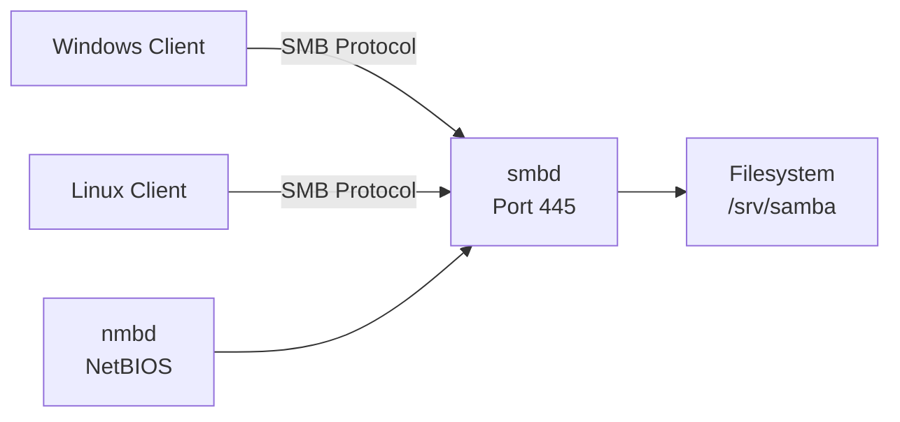

# How to Install and Configure a Samba File Server on RHEL 9

Author: [nawazdhandala](https://www.github.com/nawazdhandala)

Tags: RHEL, Samba, File Server, Linux

Description: Set up a Samba file server on RHEL 9 from scratch, covering installation, share configuration, user management, and basic security settings.

---

## What Samba Does

Samba implements the SMB/CIFS protocol on Linux, allowing RHEL servers to share files and printers with Windows clients. It also lets Linux machines participate in Windows workgroups and domains. If you have a mixed environment with both Windows and Linux machines, Samba is the bridge between them.

## Prerequisites

- RHEL 9 with root access
- Network connectivity to client machines

## Step 1 - Install Samba

```bash
# Install Samba server and client packages
sudo dnf install -y samba samba-client samba-common
```

## Step 2 - Create a Share Directory

```bash
# Create the directory to share
sudo mkdir -p /srv/samba/shared

# Set permissions
sudo chmod 0775 /srv/samba/shared
sudo chown nobody:nobody /srv/samba/shared
```

## Step 3 - Configure Samba

Back up the default configuration and create a clean one:

```bash
# Back up original config
sudo cp /etc/samba/smb.conf /etc/samba/smb.conf.bak
```

Edit /etc/samba/smb.conf:

```ini
[global]
    workgroup = WORKGROUP
    server string = RHEL 9 Samba Server
    security = user
    map to guest = Bad User
    dns proxy = no
    log file = /var/log/samba/log.%m
    max log size = 1000

[shared]
    path = /srv/samba/shared
    browseable = yes
    writable = yes
    guest ok = no
    valid users = @samba_users
    create mask = 0664
    directory mask = 0775
```

## Step 4 - Create Samba Users

Samba maintains its own password database separate from the system passwords:

```bash
# Create a system user (if not already existing)
sudo useradd -M -s /sbin/nologin smbuser1

# Set the Samba password for the user
sudo smbpasswd -a smbuser1

# Enable the Samba account
sudo smbpasswd -e smbuser1
```

Create a group for Samba users:

```bash
# Create a Samba users group
sudo groupadd samba_users

# Add users to the group
sudo usermod -aG samba_users smbuser1

# Set group ownership on the share
sudo chgrp samba_users /srv/samba/shared
```

## Step 5 - Validate Configuration

```bash
# Test the Samba configuration for errors
testparm
```

testparm checks the syntax of smb.conf and reports any issues. Fix any errors before proceeding.

## Step 6 - Configure SELinux

```bash
# Set the correct SELinux context for the share
sudo semanage fcontext -a -t samba_share_t "/srv/samba/shared(/.*)?"
sudo restorecon -Rv /srv/samba/shared

# Enable Samba-related SELinux booleans
sudo setsebool -P samba_enable_home_dirs on
sudo setsebool -P samba_export_all_rw on
```

## Step 7 - Configure Firewall

```bash
# Open Samba service in the firewall
sudo firewall-cmd --permanent --add-service=samba
sudo firewall-cmd --reload
```

## Step 8 - Start Samba Services

```bash
# Enable and start Samba and its companion service
sudo systemctl enable --now smb nmb

# Verify they are running
sudo systemctl status smb nmb
```

## Step 9 - Test the Share

### From a Linux Client

```bash
# List available shares
smbclient -L //192.168.1.10 -U smbuser1

# Connect to the share
smbclient //192.168.1.10/shared -U smbuser1
```

### From a Windows Client

1. Open File Explorer
2. Type `\\192.168.1.10\shared` in the address bar
3. Enter the Samba username and password

## Multiple Shares Example

```ini
[shared]
    path = /srv/samba/shared
    browseable = yes
    writable = yes
    valid users = @samba_users

[public]
    path = /srv/samba/public
    browseable = yes
    writable = no
    guest ok = yes

[private]
    path = /srv/samba/private
    browseable = no
    writable = yes
    valid users = admin
```

## Samba Service Architecture



## Logging

Samba logs to /var/log/samba/ by default. Check logs for connection issues:

```bash
# View the main Samba log
sudo tail -f /var/log/samba/log.smbd

# View per-client logs
ls /var/log/samba/
```

## Wrap-Up

Setting up a Samba file server on RHEL 9 involves installing the packages, configuring shares in smb.conf, managing Samba users, and handling SELinux and firewall settings. The process is well-documented and works reliably for sharing files between Linux and Windows systems. For more advanced setups like Active Directory integration, multi-channel performance, or print serving, see the other posts in this series.
