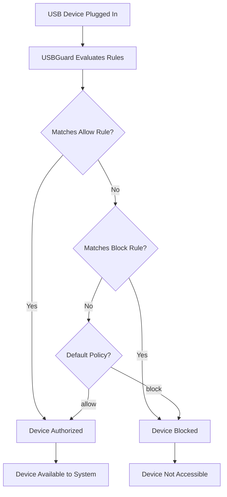

# How to Install and Configure USBGuard on RHEL to Block Rogue USB Devices

Author: [nawazdhandala](https://www.github.com/nawazdhandala)

Tags: RHEL, USBGuard, USB Security, Linux

Description: Install and configure USBGuard on RHEL to protect your systems from rogue USB devices, BadUSB attacks, and unauthorized peripheral connections.

---

USB ports are one of the most overlooked attack vectors on Linux servers. Someone plugs in a malicious USB device, and suddenly you have a keyboard injecting commands, a storage device exfiltrating data, or a network adapter redirecting traffic. USBGuard lets you define a policy for which USB devices are allowed and blocks everything else. Here is how to set it up on RHEL.

## What USBGuard Does

USBGuard is a software framework that implements USB device authorization policies. It uses the Linux kernel's USB device authorization mechanism to allow or block devices based on rules you define. Think of it as a firewall for USB ports.

## Installing USBGuard

```bash
# Install USBGuard
sudo dnf install usbguard -y

# Verify installation
rpm -q usbguard
```

## Generating an Initial Policy

Before enabling USBGuard, generate a policy that allows all currently connected USB devices. This prevents you from locking yourself out of a keyboard or mouse:

```bash
# Generate a policy based on currently connected devices
sudo usbguard generate-policy > /etc/usbguard/rules.conf
```

Review the generated policy:

```bash
# View the generated rules
sudo cat /etc/usbguard/rules.conf
```

Each rule describes an allowed device with attributes like vendor ID, product ID, serial number, and device name.

## Understanding the Policy Format

A typical rule looks like this:

```
allow id 1d6b:0002 serial "0000:00:14.0" name "xHCI Host Controller" hash "..." with-interface 09:00:00 with-connect-type ""
```

The key parts:
- `allow` or `block` - the action
- `id vendor:product` - USB vendor and product IDs
- `serial` - device serial number
- `name` - device name string
- `hash` - hash of device attributes for precise matching
- `with-interface` - USB interface class

## Enabling USBGuard

Once you have reviewed the policy and confirmed it includes your essential devices:

```bash
# Enable and start USBGuard
sudo systemctl enable --now usbguard

# Check the service status
sudo systemctl status usbguard
```

## Testing the Policy

List currently authorized devices:

```bash
# Show all USB devices and their authorization status
sudo usbguard list-devices
```

Try plugging in a USB device that is not in your policy. It should be blocked:

```bash
# After plugging in an unknown device, check the list
sudo usbguard list-devices

# You should see the new device with a "block" status
```

## Allowing a New Device

When you plug in a legitimate device that gets blocked:

```bash
# List devices to find the blocked one
sudo usbguard list-devices

# Allow the device temporarily (until next plug)
sudo usbguard allow-device 15

# Or allow the device permanently by adding a rule
sudo usbguard append-rule 'allow id 0781:5567 name "Cruzer Blade" with-interface 08:06:50'
```

## Blocking All New USB Devices by Default

Edit the USBGuard configuration to set the default policy:

```bash
# Edit the daemon configuration
sudo vi /etc/usbguard/usbguard-daemon.conf
```

Key settings:

```
# Block all new devices by default
ImplicitPolicyTarget=block

# What to do when the policy cannot be applied
PresentDevicePolicy=apply-policy

# Action for devices connected at boot before USBGuard starts
InsertedDevicePolicy=apply-policy
```

After changes:

```bash
# Restart USBGuard to apply configuration changes
sudo systemctl restart usbguard
```

## Policy Workflow



## Monitoring USB Events

Check the USBGuard audit log for USB activity:

```bash
# View recent USB authorization events
sudo journalctl -u usbguard --since "today"

# Watch USB events in real time
sudo usbguard watch
```

## Backing Up Your Policy

```bash
# Back up the rules file
sudo cp /etc/usbguard/rules.conf /etc/usbguard/rules.conf.backup-$(date +%Y%m%d)
```

## Common Server Deployment

For servers that should never have USB devices plugged in (other than pre-existing controllers):

```bash
# Generate policy for existing devices
sudo usbguard generate-policy > /etc/usbguard/rules.conf

# Set strict blocking
sudo sed -i 's/^ImplicitPolicyTarget=.*/ImplicitPolicyTarget=block/' /etc/usbguard/usbguard-daemon.conf
sudo sed -i 's/^PresentDevicePolicy=.*/PresentDevicePolicy=apply-policy/' /etc/usbguard/usbguard-daemon.conf

# Enable the service
sudo systemctl enable --now usbguard
```

This allows the existing USB controllers (which are always present) but blocks anything new that gets plugged in.

## Troubleshooting

If USBGuard blocks a device you need:

```bash
# Find the device in the blocked list
sudo usbguard list-devices | grep block

# Get detailed device info
sudo usbguard list-devices -b

# Allow it and add to permanent policy
sudo usbguard allow-device DEVICE_NUMBER
sudo usbguard list-devices | grep DEVICE_NUMBER >> /etc/usbguard/rules.conf
```

If you accidentally lock yourself out of the keyboard/mouse, you can recover by booting into single-user mode or using a remote SSH session to fix the policy.
