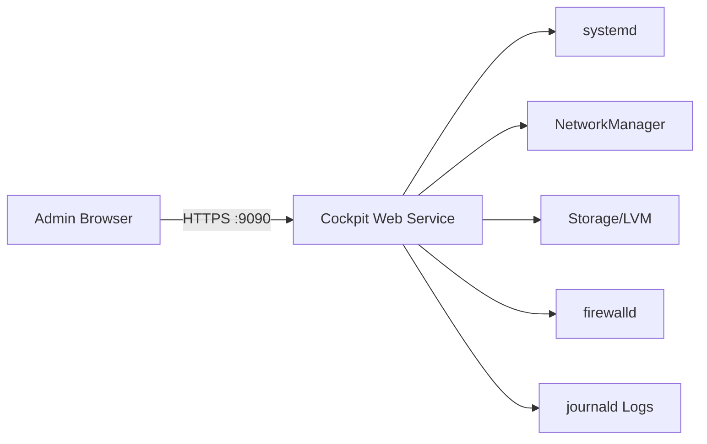

# How to Install and Enable the Cockpit Web Console on RHEL 9

Author: [nawazdhandala](https://www.github.com/nawazdhandala)

Tags: RHEL, Cockpit, Web Console, Installation, Linux

Description: Learn how to install, enable, and start the Cockpit web console on RHEL 9 for browser-based server management.

---

If you've been managing RHEL servers purely from the terminal, Cockpit is worth a look. It gives you a clean web interface for day-to-day admin tasks without replacing the command line. Think of it as a visual dashboard that sits alongside your existing workflow.

I started using Cockpit a few years back when I needed to hand off basic server monitoring to a team that wasn't comfortable with SSH. It turned out to be surprisingly useful for my own work too.

## What Is Cockpit?

Cockpit is a lightweight, web-based server management tool developed by Red Hat. It runs on port 9090 by default and uses your existing system accounts for authentication. The key thing is that it doesn't run its own daemon in the background consuming resources - it activates on demand through systemd socket activation.

Here's a high-level view of how Cockpit fits into your infrastructure:



## Prerequisites

Before you begin, make sure you have:

- A RHEL 9 system with a valid subscription or configured repositories
- Root or sudo access
- Network connectivity to reach port 9090

## Installing Cockpit

On a minimal RHEL 9 installation, Cockpit might not be present. On a server or workstation install, it's usually already there. Let's check first.

Check if Cockpit is already installed:

```bash
rpm -q cockpit
```

If it's not installed, pull it in with dnf:

```bash
sudo dnf install cockpit -y
```

This installs the core Cockpit package along with a handful of dependencies. The total footprint is small, usually under 50 MB.

## Enabling and Starting the Cockpit Socket

Cockpit uses socket activation, which means the web server only starts when someone actually connects. This is efficient and keeps resource usage low on idle servers.

Enable and start the cockpit socket:

```bash
sudo systemctl enable --now cockpit.socket
```

Verify it's running:

```bash
sudo systemctl status cockpit.socket
```

You should see output indicating the socket is active and listening. Something like:

```
● cockpit.socket - Cockpit Web Service Socket
     Loaded: loaded (/usr/lib/systemd/system/cockpit.socket; enabled; preset: disabled)
     Active: active (listening) since ...
```

## Opening the Firewall

RHEL 9 ships with firewalld enabled by default. You need to allow traffic on the cockpit service (port 9090/tcp).

Allow Cockpit through the firewall:

```bash
sudo firewall-cmd --add-service=cockpit --permanent
sudo firewall-cmd --reload
```

Confirm the rule is in place:

```bash
sudo firewall-cmd --list-services
```

You should see `cockpit` in the list of allowed services.

## Accessing the Web Console

Open a browser and navigate to:

```
https://<your-server-ip>:9090
```

You'll see a certificate warning because Cockpit generates a self-signed certificate on first use. That's normal for internal use. Accept the warning and log in with any system user that has a password set.

For admin tasks, log in as a user with sudo privileges. Cockpit will prompt you to enable "administrative access" after login, which essentially runs a `sudo` session in the background.

## Configuring the TLS Certificate

For production use, you'll want a proper certificate instead of the self-signed one.

Place your certificate and key in the Cockpit configuration directory:

```bash
# Combine your cert and key into a single file
# Cockpit expects a combined PEM file
sudo cat /etc/pki/tls/certs/your-cert.pem /etc/pki/tls/private/your-key.pem > /etc/cockpit/ws-certs.d/your-cert.cert
```

Cockpit picks up the certificate with the highest priority filename in `/etc/cockpit/ws-certs.d/`. Restart the socket to apply:

```bash
sudo systemctl restart cockpit.socket
```

## Cockpit Configuration File

You can customize Cockpit behavior through `/etc/cockpit/cockpit.conf`. This file doesn't exist by default, so you create it as needed.

Create a basic configuration file:

```bash
sudo tee /etc/cockpit/cockpit.conf << 'EOF'
[WebService]
# Set the page title shown in the browser tab
LoginTitle = My RHEL Server

# Session idle timeout in minutes
IdleTimeout = 15

# Restrict to specific origins if needed
# Origins = https://server.example.com:9090
EOF
```

## Verifying the Installation

Let's do a quick sanity check to make sure everything is in order.

Run through these verification steps:

```bash
# Check the socket is enabled and active
systemctl is-enabled cockpit.socket
systemctl is-active cockpit.socket

# Check the firewall rule
firewall-cmd --query-service=cockpit

# Check which port Cockpit is listening on
ss -tlnp | grep 9090
```

All three checks should return positive results. If `ss` shows port 9090 in LISTEN state, you're good.

## Troubleshooting Common Issues

**Browser shows "connection refused"**: Check that the socket is active and the firewall rule is in place. Also verify SELinux isn't blocking the connection:

```bash
# Check for SELinux denials related to cockpit
sudo ausearch -m avc -ts recent | grep cockpit
```

**Login fails with correct credentials**: Make sure the user account has a password set and isn't locked:

```bash
# Check if account is locked
sudo passwd -S username
```

**Cockpit service crashes on start**: Check the journal for errors:

```bash
sudo journalctl -u cockpit.service -b --no-pager | tail -30
```

## What You Can Do from Here

Once Cockpit is running, you get access to:

- Real-time CPU, memory, disk, and network graphs
- Service management (start, stop, enable, disable)
- Log viewer with filtering
- Storage management (LVM, RAID, NFS)
- User account management
- Terminal access right in the browser

Each of these topics deserves its own deep dive, and we'll cover them in upcoming posts.

## Wrapping Up

Setting up Cockpit on RHEL 9 takes about five minutes. The socket-activated design means it costs you almost nothing when nobody is using it, and it provides a solid web interface when you need one. For teams that need visibility into server health without granting everyone SSH access, it's a practical solution that doesn't require a heavyweight monitoring stack.
