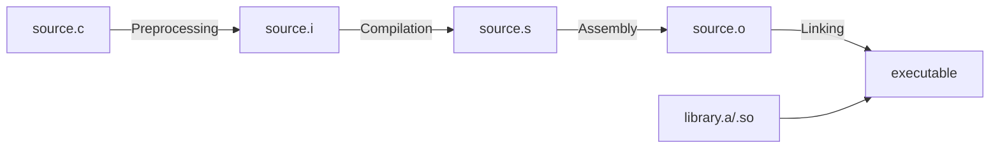

# How to Install GCC and Development Tools on RHEL

Author: [nawazdhandala](https://www.github.com/nawazdhandala)

Tags: RHEL, GCC, Development Tools, C, C++, Linux

Description: A complete guide to installing GCC, G++, and the essential development toolchain on RHEL for compiling C and C++ programs.

---

GCC (GNU Compiler Collection) is the foundation of software development on Linux. Whether you are building C programs, compiling kernel modules, or installing software from source, you need GCC on your RHEL system.

## Installing the Development Tools Group

RHEL bundles essential build tools into a convenient group package.

```bash
# Install the complete development toolchain
sudo dnf groupinstall -y "Development Tools"

# This installs:
# - gcc (C compiler)
# - gcc-c++ (C++ compiler)
# - make (build automation)
# - automake, autoconf (build system generators)
# - libtool (shared library support)
# - rpm-build (for building RPM packages)
# - binutils (assembler, linker, etc.)
# - gdb (debugger)
# - and more
```

## Installing GCC Individually

If you only need the compiler without the full group:

```bash
# Install just the C compiler
sudo dnf install -y gcc

# Install the C++ compiler
sudo dnf install -y gcc-c++

# Install make separately
sudo dnf install -y make

# Verify the installations
gcc --version
g++ --version
make --version
```

## Checking the Installed GCC Version

```bash
# Show the full version
gcc -v

# Just the version number
gcc -dumpversion

# Show the target architecture
gcc -dumpmachine
# Output: x86_64-redhat-linux
```

## Compiling a Simple C Program

```bash
# Create a test C program
cat > hello.c << 'CFILE'
#include <stdio.h>

/* A simple program to verify GCC works */
int main(void) {
    printf("Hello from GCC on RHEL!\n");
    return 0;
}
CFILE

# Compile it
gcc -o hello hello.c

# Run it
./hello
# Output: Hello from GCC on RHEL!
```

## Compiling a C++ Program

```bash
# Create a test C++ program
cat > hello.cpp << 'CPPFILE'
#include <iostream>
#include <string>

// Test modern C++ features
int main() {
    std::string message = "Hello from G++ on RHEL!";
    std::cout << message << std::endl;

    // Test C++17 features
    auto [x, y] = std::make_pair(10, 20);
    std::cout << "Structured bindings: " << x << ", " << y << std::endl;

    return 0;
}
CPPFILE

# Compile with C++17 support
g++ -std=c++17 -o hello_cpp hello.cpp

# Run it
./hello_cpp
```

## Installing Additional Development Libraries

```bash
# Common development libraries you might need
sudo dnf install -y \
    glibc-devel \        # C standard library headers
    glibc-static \       # Static C library
    libstdc++-devel \    # C++ standard library headers
    libstdc++-static \   # Static C++ library
    kernel-headers \     # Linux kernel headers
    kernel-devel         # Kernel build infrastructure
```

## Using GCC Compiler Flags

```bash
# Compile with warnings enabled (always recommended)
gcc -Wall -Wextra -Werror -o myapp myapp.c

# Compile with debugging symbols for gdb
gcc -g -O0 -o myapp_debug myapp.c

# Compile with optimizations for production
gcc -O2 -o myapp_release myapp.c

# Compile with maximum optimization
gcc -O3 -march=native -o myapp_fast myapp.c
```

## Compilation Pipeline



## Installing GCC Toolset for Newer Versions

RHEL provides GCC Toolset packages that include newer GCC versions.

```bash
# List available GCC toolsets
sudo dnf search gcc-toolset

# Install GCC Toolset 13 (includes GCC 13)
sudo dnf install -y gcc-toolset-13

# Enable the toolset for your session
scl enable gcc-toolset-13 bash

# Verify the newer GCC version
gcc --version
# Output: gcc (GCC) 13.x.x

# Or run a single command with the toolset
scl enable gcc-toolset-13 -- gcc -o myapp myapp.c
```

## Summary

Installing GCC on RHEL is as simple as installing the "Development Tools" group. For newer compiler versions, use GCC Toolset packages. With GCC installed, you can compile C/C++ programs, build software from source, and set up a complete development environment on your RHEL system.
