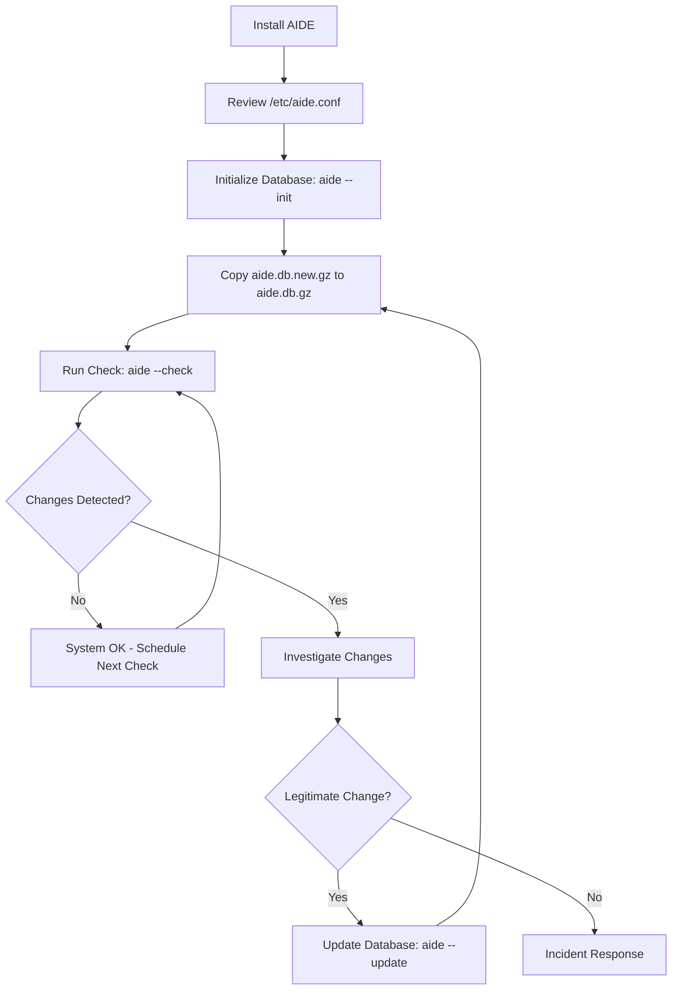

# How to Install and Initialize AIDE on RHEL 9 for File Integrity Monitoring

Author: [nawazdhandala](https://www.github.com/nawazdhandala)

Tags: RHEL, AIDE, File Integrity, Security, Linux

Description: Learn how to install and initialize AIDE (Advanced Intrusion Detection Environment) on RHEL 9 to monitor file integrity and detect unauthorized changes to your system.

---

File integrity monitoring is one of those things you don't think about until something goes wrong. Maybe a config file got changed and nobody knows who did it, or worse, an attacker modified a system binary and you had no way to notice. AIDE (Advanced Intrusion Detection Environment) solves this by taking a snapshot of your filesystem and alerting you when things change.

In this guide, I will walk through installing AIDE on RHEL 9, initializing the database, and running your first integrity check.

## What AIDE Does

AIDE works by building a database of file attributes - checksums, permissions, ownership, timestamps, and more. Once you have a baseline, you can compare the current state of the filesystem against that database to find anything that has been added, removed, or modified.

This is especially useful for:

- Detecting unauthorized changes to system binaries
- Catching configuration drift
- Meeting compliance requirements (PCI DSS, STIG, CIS benchmarks)
- Getting an early warning of compromise

## Installing AIDE

AIDE is available in the standard RHEL 9 repositories. Install it with dnf:

```bash
# Install AIDE from the base repository
sudo dnf install aide -y
```

Verify the installation:

```bash
# Check that AIDE is installed and show the version
aide --version
```

You should see output showing the AIDE version along with the compile-time options, including which hash algorithms are available.

## Understanding the Default Configuration

Before initializing the database, take a look at the default configuration:

```bash
# View the main AIDE configuration file
sudo cat /etc/aide.conf
```

The default config on RHEL 9 is pretty comprehensive. It monitors critical directories like `/boot`, `/bin`, `/sbin`, `/lib`, `/lib64`, `/usr`, and `/etc`. The config file uses macros to define groups of attributes to check. For example:

```
# Default attribute groups defined in aide.conf
CONTENT_EX = sha512+ftype+p+u+g+n+acl+selinux+xattrs
DATAONLY = p+n+u+g+s+acl+selinux+xattrs+sha512
```

These macros combine different check types:

- `sha512` - SHA-512 checksum
- `p` - permissions
- `u` - user ownership
- `g` - group ownership
- `n` - number of hard links
- `acl` - POSIX ACLs
- `selinux` - SELinux context
- `xattrs` - extended attributes
- `ftype` - file type

## Initializing the AIDE Database

The first step after installation is to build the initial database. This creates a snapshot of your system in its known-good state:

```bash
# Initialize the AIDE database - this takes several minutes
sudo aide --init
```

This process scans every file and directory specified in `/etc/aide.conf` and records their attributes. On a typical RHEL 9 system, this takes anywhere from 2 to 15 minutes depending on how many files you have and your disk speed.

The output file is written to `/var/lib/aide/aide.db.new.gz`. AIDE does not use this file directly for checks - you need to copy it to the expected location:

```bash
# Move the new database to the active location
sudo cp /var/lib/aide/aide.db.new.gz /var/lib/aide/aide.db.gz
```

This two-step process is intentional. It gives you a chance to review or archive the database before making it active.

## Running Your First Integrity Check

With the database in place, run a check to compare the current filesystem against your baseline:

```bash
# Run an AIDE integrity check
sudo aide --check
```

If nothing has changed since you initialized the database, the output will show zero differences. If files have been modified, you will see detailed output showing exactly what changed.

Here is an example of what changed-file output looks like:

```
AIDE found differences between database and filesystem!!

Summary:
  Total number of entries:    48213
  Added entries:              1
  Removed entries:            0
  Changed entries:            3
```

Each changed entry will list the specific attributes that differ, making it easy to investigate.

## Securing the AIDE Database

The AIDE database itself needs protection. If an attacker can modify the database, they can hide their tracks. Some best practices:

```bash
# Store a copy of the database on read-only media or a remote server
sudo cp /var/lib/aide/aide.db.gz /root/aide-baseline-$(date +%Y%m%d).gz

# Set restrictive permissions on the database
sudo chmod 600 /var/lib/aide/aide.db.gz
sudo chown root:root /var/lib/aide/aide.db.gz
```

For higher-security environments, consider copying the database to an external USB drive, a network share, or a configuration management system where it can be version-controlled.

## Workflow Overview

Here is the typical AIDE workflow from installation through ongoing monitoring:



## Quick Verification Steps

After setup, verify everything is working:

```bash
# Make a test change to trigger detection
sudo touch /etc/aide-test-file

# Run a check to confirm AIDE detects the new file
sudo aide --check

# Clean up the test file
sudo rm /etc/aide-test-file
```

You should see AIDE report the new file as an added entry. This confirms your setup is working correctly.

## Common Pitfalls

A few things to watch out for:

1. **Forgetting to copy the database** - Running `aide --init` does not automatically activate the database. You must copy `aide.db.new.gz` to `aide.db.gz`.

2. **Running init on a compromised system** - The initial database should be created right after a clean OS install, before the system is exposed to the network.

3. **Not excluding noisy directories** - Directories like `/var/log` and `/tmp` change constantly. The default RHEL 9 config handles most of these, but you may need to add exclusions for application-specific directories.

4. **Database permissions** - Make sure the database file is only readable by root.

## Next Steps

With AIDE installed and initialized, you will want to set up automated checks using cron, customize the rules for your environment, and configure email alerts. Those topics are covered in the follow-up guides in this series.

AIDE is a lightweight but powerful tool. It does not replace a full HIDS solution, but for file integrity monitoring on RHEL 9, it is hard to beat for simplicity and reliability.
