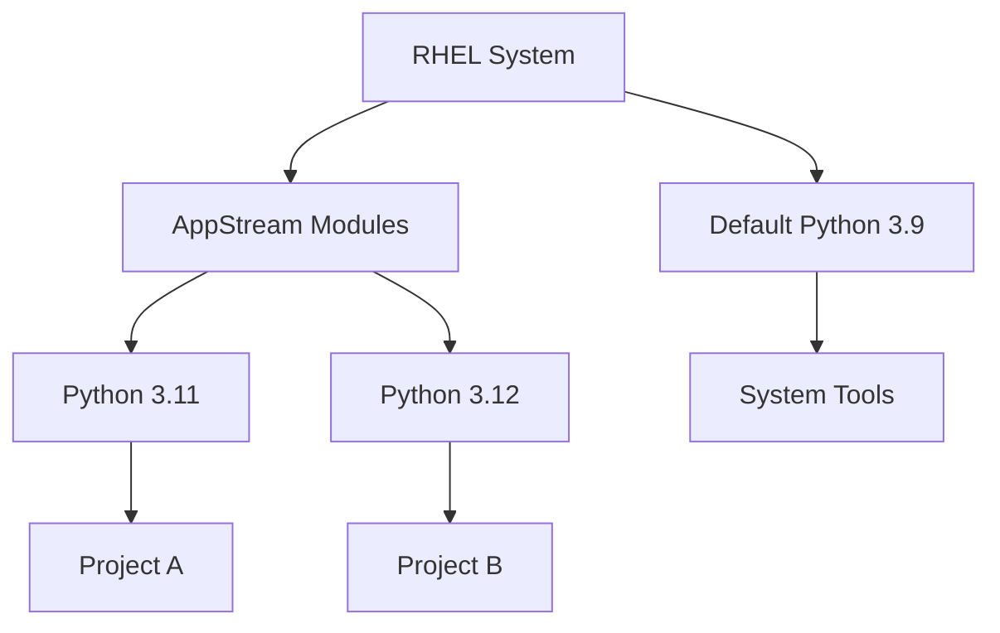

# How to Install Multiple Python Versions on RHEL Using Software Collections

Author: [nawazdhandala](https://www.github.com/nawazdhandala)

Tags: RHEL, Python, Software Collections, Linux, Development

Description: Learn how to install and manage multiple Python versions side by side on RHEL using Software Collections and the AppStream module system.

---

Running multiple Python versions on a single RHEL system is a common requirement. You might need Python 3.9 for one project and Python 3.12 for another. RHEL makes this possible through its AppStream module system, which replaced the older Software Collections approach.

## Understanding RHEL AppStream Modules

RHEL ships Python 3.9 as the default system Python. Additional versions are available through AppStream modules. This modular approach lets you install multiple interpreters without conflicts.



## Checking Available Python Versions

Start by listing the Python modules available in your RHEL repositories.

```bash
# List all available Python module streams
sudo dnf module list python*

# Check what Python packages are already installed
rpm -qa | grep python3
```

## Installing the Default Python 3.9

Python 3.9 comes pre-installed on most RHEL systems, but if you need to install it manually:

```bash
# Install the default Python 3.9
sudo dnf install -y python3

# Verify the installation
python3 --version
# Output: Python 3.9.x
```

## Installing Python 3.11

Python 3.11 is available as an additional package in the RHEL AppStream repository.

```bash
# Install Python 3.11
sudo dnf install -y python3.11

# Verify the installation
python3.11 --version
# Output: Python 3.11.x

# Install pip for Python 3.11
sudo dnf install -y python3.11-pip

# Install development headers (needed for compiling C extensions)
sudo dnf install -y python3.11-devel
```

## Installing Python 3.12

Python 3.12 is also available on RHEL.4 and later.

```bash
# Install Python 3.12
sudo dnf install -y python3.12

# Verify the installation
python3.12 --version
# Output: Python 3.12.x

# Install pip and development headers for Python 3.12
sudo dnf install -y python3.12-pip python3.12-devel
```

## Managing Multiple Versions with alternatives

The `alternatives` system provides a clean way to switch the default `python3` command between versions.

```bash
# Register each Python version with the alternatives system
# Syntax: alternatives --install <link> <name> <path> <priority>
sudo alternatives --install /usr/bin/python3 python3 /usr/bin/python3.9 1
sudo alternatives --install /usr/bin/python3 python3 /usr/bin/python3.11 2
sudo alternatives --install /usr/bin/python3 python3 /usr/bin/python3.12 3

# Interactively select the default version
sudo alternatives --config python3
```

When you run `alternatives --config python3`, you will see a menu like this:

```bash
There are 3 programs which provide 'python3'.

  Selection    Command
-----------------------------------------------
   1           /usr/bin/python3.9
   2           /usr/bin/python3.11
*+ 3           /usr/bin/python3.12

Enter to keep the current selection[+], or type selection number:
```

## Using Version-Specific Commands Directly

You do not have to change the system default. You can always call a specific version directly.

```bash
# Run scripts with a specific Python version
python3.9 my_script.py
python3.11 my_script.py
python3.12 my_script.py

# Install packages for a specific version
python3.11 -m pip install requests
python3.12 -m pip install flask
```

## Creating Virtual Environments per Version

The best practice is to create isolated virtual environments tied to specific Python versions.

```bash
# Create a virtual environment using Python 3.11
python3.11 -m venv ~/projects/app1/venv

# Create a virtual environment using Python 3.12
python3.12 -m venv ~/projects/app2/venv

# Activate and use them independently
source ~/projects/app1/venv/bin/activate
python --version  # Python 3.11.x
deactivate

source ~/projects/app2/venv/bin/activate
python --version  # Python 3.12.x
deactivate
```

## Verifying All Installed Versions

```bash
# Quick check of all installed Python interpreters
for py in python3 python3.9 python3.11 python3.12; do
    if command -v "$py" &> /dev/null; then
        echo "$py: $($py --version 2>&1)"
    else
        echo "$py: not installed"
    fi
done
```

## Important Considerations

- Never remove or replace the system Python 3.9 that ships with RHEL. Many system tools depend on it.
- Each Python version has its own pip and site-packages directory, so installed libraries do not conflict.
- If you need a Python version not available in the RHEL repositories, consider compiling from source (covered in a separate guide).

## Summary

RHEL provides a straightforward way to run multiple Python versions through the AppStream repository. Install additional versions with `dnf`, use the `alternatives` system or direct version commands to pick which one runs, and rely on virtual environments to keep project dependencies isolated.
