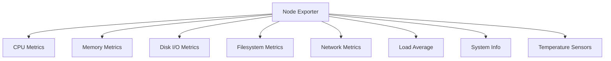

# How to Install Node Exporter for Prometheus on RHEL

Author: [nawazdhandala](https://www.github.com/nawazdhandala)

Tags: RHEL, Prometheus, Node Exporter, Monitoring, Linux

Description: Learn how to install and configure Prometheus Node Exporter on RHEL to expose system-level metrics like CPU, memory, disk, and network for Prometheus scraping.

---

Node Exporter is the standard way to expose Linux system metrics to Prometheus. It runs as a lightweight daemon on each server and provides a `/metrics` endpoint that Prometheus scrapes at regular intervals. On RHEL, you install it from a pre-built binary and run it as a systemd service.

## What Node Exporter Monitors



## Step 1: Create a System User

```bash
# Create a dedicated user for Node Exporter
sudo useradd --no-create-home --shell /bin/false node_exporter
```

## Step 2: Download and Install Node Exporter

```bash
# Download the latest Node Exporter
NODE_EXPORTER_VERSION="1.7.0"
cd /tmp
curl -LO "https://github.com/prometheus/node_exporter/releases/download/v${NODE_EXPORTER_VERSION}/node_exporter-${NODE_EXPORTER_VERSION}.linux-amd64.tar.gz"

# Extract the archive
tar xvf "node_exporter-${NODE_EXPORTER_VERSION}.linux-amd64.tar.gz"

# Copy the binary to /usr/local/bin
sudo cp "node_exporter-${NODE_EXPORTER_VERSION}.linux-amd64/node_exporter" /usr/local/bin/

# Set ownership
sudo chown node_exporter:node_exporter /usr/local/bin/node_exporter

# Clean up
rm -rf "node_exporter-${NODE_EXPORTER_VERSION}.linux-amd64"*
```

## Step 3: Create a Systemd Service

```bash
sudo vi /etc/systemd/system/node_exporter.service
```

```ini
[Unit]
Description=Prometheus Node Exporter
Documentation=https://prometheus.io/docs/guides/node-exporter/
Wants=network-online.target
After=network-online.target

[Service]
User=node_exporter
Group=node_exporter
Type=simple

# Start Node Exporter with default collectors
ExecStart=/usr/local/bin/node_exporter \
    --web.listen-address=:9100 \
    --collector.systemd \
    --collector.processes

# Restart on failure
Restart=always
RestartSec=5

# Security hardening
ProtectSystem=full
NoNewPrivileges=true

[Install]
WantedBy=multi-user.target
```

## Step 4: Start Node Exporter

```bash
# Reload systemd
sudo systemctl daemon-reload

# Start Node Exporter
sudo systemctl start node_exporter

# Enable it to start on boot
sudo systemctl enable node_exporter

# Check the status
sudo systemctl status node_exporter
```

## Step 5: Verify the Metrics Endpoint

```bash
# Check that Node Exporter is listening
curl -s http://localhost:9100/metrics | head -20

# Check specific metrics
curl -s http://localhost:9100/metrics | grep "node_cpu_seconds_total" | head -5
curl -s http://localhost:9100/metrics | grep "node_memory_MemTotal"
curl -s http://localhost:9100/metrics | grep "node_filesystem_size_bytes"
```

## Step 6: Configure the Firewall

```bash
# Allow Prometheus to scrape Node Exporter
sudo firewall-cmd --permanent --add-port=9100/tcp
sudo firewall-cmd --reload
```

For better security, restrict access to only the Prometheus server:

```bash
# Allow only the Prometheus server IP to access port 9100
sudo firewall-cmd --permanent --add-rich-rule='
    rule family="ipv4"
    source address="192.168.1.100/32"
    port protocol="tcp" port="9100"
    accept'
sudo firewall-cmd --reload
```

## Step 7: Add Node Exporter to Prometheus

On your Prometheus server, edit the configuration:

```bash
sudo vi /etc/prometheus/prometheus.yml
```

Add the Node Exporter target:

```yaml
scrape_configs:
  - job_name: "node"
    scrape_interval: 15s
    static_configs:
      - targets:
          - "server1.example.com:9100"
          - "server2.example.com:9100"
          - "server3.example.com:9100"
        labels:
          environment: "production"
```

Reload Prometheus:

```bash
# Reload Prometheus configuration
curl -X POST http://localhost:9090/-/reload
```

## Key Metrics from Node Exporter

### CPU Metrics

```promql
# Overall CPU usage percentage
100 - (avg by(instance) (rate(node_cpu_seconds_total{mode="idle"}[5m])) * 100)

# CPU usage by mode
rate(node_cpu_seconds_total[5m])

# CPU count
count without(cpu, mode) (node_cpu_seconds_total{mode="idle"})
```

### Memory Metrics

```promql
# Memory usage percentage
(1 - node_memory_MemAvailable_bytes / node_memory_MemTotal_bytes) * 100

# Total memory in GB
node_memory_MemTotal_bytes / 1024 / 1024 / 1024

# Available memory in GB
node_memory_MemAvailable_bytes / 1024 / 1024 / 1024

# Swap usage
node_memory_SwapTotal_bytes - node_memory_SwapFree_bytes
```

### Disk Metrics

```promql
# Filesystem usage percentage
(1 - node_filesystem_avail_bytes{fstype!="tmpfs"} / node_filesystem_size_bytes{fstype!="tmpfs"}) * 100

# Disk I/O read rate (bytes per second)
rate(node_disk_read_bytes_total[5m])

# Disk I/O write rate
rate(node_disk_written_bytes_total[5m])

# Disk I/O utilization
rate(node_disk_io_time_seconds_total[5m]) * 100
```

### Network Metrics

```promql
# Network receive rate (bits per second)
rate(node_network_receive_bytes_total{device!="lo"}[5m]) * 8

# Network transmit rate
rate(node_network_transmit_bytes_total{device!="lo"}[5m]) * 8

# Network errors
rate(node_network_receive_errs_total[5m])
rate(node_network_transmit_errs_total[5m])
```

### System Metrics

```promql
# System load average
node_load1
node_load5
node_load15

# System uptime in days
(time() - node_boot_time_seconds) / 86400

# Number of running processes
node_procs_running
```

## Enabling Additional Collectors

Node Exporter has many collectors. Enable specific ones as needed:

```bash
# Edit the service file to add collectors
sudo vi /etc/systemd/system/node_exporter.service
```

```ini
ExecStart=/usr/local/bin/node_exporter \
    --web.listen-address=:9100 \
    --collector.systemd \
    --collector.processes \
    --collector.tcpstat \
    --collector.textfile \
    --collector.textfile.directory=/var/lib/node_exporter/textfile
```

Create the textfile collector directory:

```bash
sudo mkdir -p /var/lib/node_exporter/textfile
sudo chown node_exporter:node_exporter /var/lib/node_exporter/textfile
```

The textfile collector lets you expose custom metrics by writing them to files:

```bash
# Example: write a custom metric
echo 'myapp_last_backup_timestamp_seconds 1709528400' | \
    sudo tee /var/lib/node_exporter/textfile/backup.prom
```

```bash
# Restart Node Exporter
sudo systemctl daemon-reload
sudo systemctl restart node_exporter
```

## Troubleshooting

```bash
# Check Node Exporter logs
sudo journalctl -u node_exporter --no-pager -n 20

# Verify Node Exporter is responding
curl -s http://localhost:9100/metrics | wc -l

# Check which collectors are enabled
curl -s http://localhost:9100/metrics | grep "^# HELP node_" | wc -l

# Test from the Prometheus server
curl -s http://target-server:9100/metrics | head -5
```

## Summary

Node Exporter is the essential companion to Prometheus for monitoring RHEL systems. Install the binary, run it as a systemd service, and add the target to your Prometheus configuration. It exposes hundreds of system metrics out of the box, covering CPU, memory, disk, network, and more. Enable additional collectors like systemd and textfile for deeper visibility into your infrastructure.
