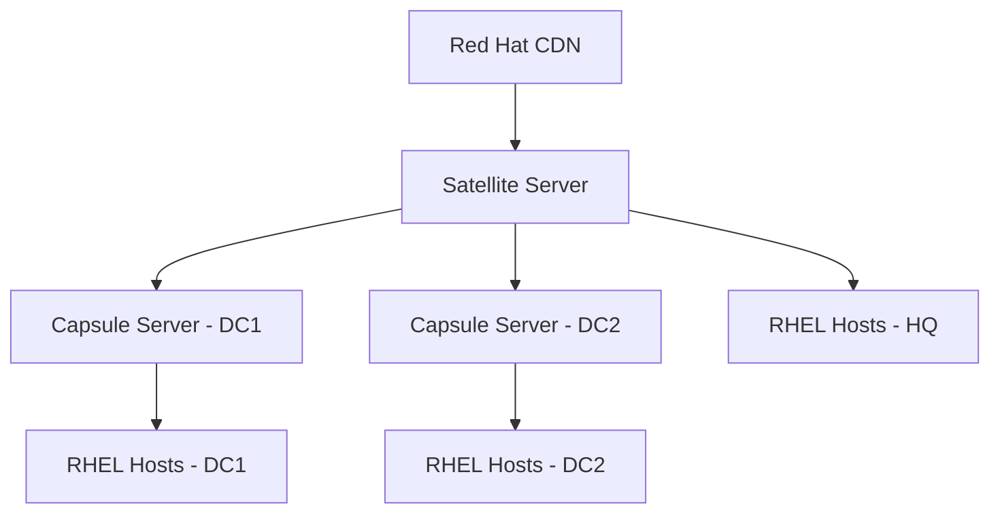

# How to Install Red Hat Satellite Server 6 on RHEL 9

Author: [nawazdhandala](https://www.github.com/nawazdhandala)

Tags: RHEL, Satellite, Patch Management, Systems Management, Linux

Description: A complete walkthrough for installing Red Hat Satellite Server 6 on RHEL 9, covering prerequisites, storage, and initial configuration.

---

Red Hat Satellite Server is the centralized management platform for RHEL infrastructure. It handles content management, patching, provisioning, and configuration across hundreds or thousands of RHEL hosts. Installing it requires careful planning because Satellite has significant hardware and network requirements.

## Architecture Overview



## Prerequisites and Hardware Requirements

```bash
# Minimum hardware requirements for Satellite Server:
# - 4 CPU cores (8+ recommended for production)
# - 20 GB RAM (32+ recommended)
# - 500 GB disk for /var (content storage grows significantly)
# - Static IP address and FQDN

# Verify hostname is set correctly - Satellite is very picky about this
hostnamectl set-hostname satellite.example.com
hostname -f
# Must return the FQDN: satellite.example.com

# Verify forward and reverse DNS resolution
dig satellite.example.com +short
dig -x $(hostname -I | awk '{print $1}') +short
# Both must resolve correctly

# Check available disk space
df -h /var
# Needs at least 500 GB for /var
```

## Preparing the System

```bash
# Register the system with Red Hat
sudo subscription-manager register --username YOUR_USERNAME --password YOUR_PASSWORD

# Attach the Satellite subscription
sudo subscription-manager list --available --matches='*Satellite*'
sudo subscription-manager attach --pool=POOL_ID_FROM_ABOVE

# Disable all repositories and enable only what Satellite needs
sudo subscription-manager repos --disable '*'
sudo subscription-manager repos \
    --enable=rhel-9-for-x86_64-baseos-rpms \
    --enable=rhel-9-for-x86_64-appstream-rpms \
    --enable=satellite-6.15-for-rhel-9-x86_64-rpms \
    --enable=satellite-maintenance-6.15-for-rhel-9-x86_64-rpms

# Update the system
sudo dnf update -y

# Configure the firewall
sudo firewall-cmd --add-port={53/udp,67-69/udp,80/tcp,443/tcp,5647/tcp,8000/tcp,8140/tcp,8443/tcp,9090/tcp} --permanent
sudo firewall-cmd --reload

# Disable and stop any conflicting services
sudo systemctl disable --now named dhcpd 2>/dev/null
```

## Installing Satellite

```bash
# Install the Satellite packages
sudo dnf install -y satellite

# Run the Satellite installer
# This process takes 20-45 minutes depending on hardware
sudo satellite-installer --scenario satellite \
    --foreman-initial-admin-username admin \
    --foreman-initial-admin-password 'YourSecurePassword123!' \
    --foreman-initial-organization "My Organization" \
    --foreman-initial-location "Main Datacenter" \
    --certs-cname satellite.example.com

# The installer will display a summary when complete
# Save the output - it contains important URLs and credentials
```

## Post-Installation Configuration

```bash
# Verify the installation
sudo satellite-maintain health check

# Access the web UI at:
# https://satellite.example.com
# Login with the admin credentials you specified

# Configure a manifest for content access
# Download a manifest from access.redhat.com
# Then import it:
sudo hammer subscription upload \
    --file /path/to/manifest.zip \
    --organization "My Organization"

# Enable RHEL 9 repositories
sudo hammer repository-set enable \
    --organization "My Organization" \
    --product "Red Hat Enterprise Linux for x86_64" \
    --name "Red Hat Enterprise Linux 9 for x86_64 - BaseOS (RPMs)" \
    --basearch x86_64 \
    --releasever 9

sudo hammer repository-set enable \
    --organization "My Organization" \
    --product "Red Hat Enterprise Linux for x86_64" \
    --name "Red Hat Enterprise Linux 9 for x86_64 - AppStream (RPMs)" \
    --basearch x86_64 \
    --releasever 9

# Synchronize the repositories (this takes a while - potentially hours)
sudo hammer product synchronize \
    --organization "My Organization" \
    --name "Red Hat Enterprise Linux for x86_64" \
    --async
```

## Verifying the Installation

```bash
# Check all Satellite services
sudo satellite-maintain service status

# Verify the hammer CLI works
hammer ping

# Check synchronization status
hammer task list --search "state=running"

# List available products
hammer product list --organization "My Organization"
```

## Conclusion

Installing Red Hat Satellite Server 6 on RHEL 9 is a straightforward but resource-intensive process. The critical steps are getting the hostname and DNS right, ensuring adequate storage, and properly configuring the subscription manifest. Once the initial sync is complete, you have a fully functional content management and provisioning platform for your entire RHEL infrastructure. The next steps are creating Content Views, setting up Lifecycle Environments, and registering your managed hosts.
