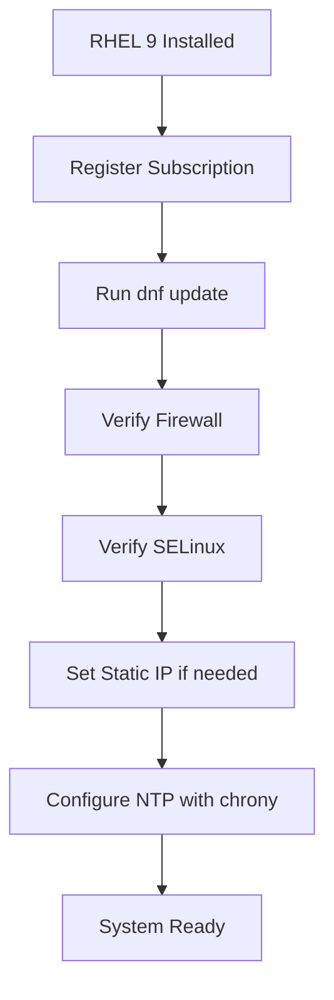

# How to Install Red Hat Enterprise Linux 9 from Installation Media Step by Step

Author: [nawazdhandala](https://github.com/nawazdhandala)

Tags: RHEL, Linux, Installation, Red Hat, System Administration

Description: A complete walkthrough for installing RHEL 9 from ISO media, covering everything from downloading the image and creating a bootable USB to completing the Anaconda installer and performing first boot tasks.

---

If you have been running CentOS, Fedora, or an older RHEL release, upgrading or fresh-installing RHEL 9 is pretty straightforward once you know the steps. This guide walks through the entire process from grabbing the ISO to logging in for the first time. No hand-waving, just the actual steps you will follow on real hardware or a VM.

## Downloading the RHEL 9 ISO

Head to the Red Hat Customer Portal at https://access.redhat.com/downloads and log in with your Red Hat account. If you do not have a subscription, the Red Hat Developer Subscription gives you a free license for development and testing.

You will see two ISO options:

- **Boot ISO** (about 900 MB) - a minimal image that pulls packages from a network repository during installation.
- **DVD ISO** (about 9 GB) - contains the full package set, good for offline or air-gapped installs.

For most cases, the DVD ISO is the safer choice. Download it and verify the checksum:

```bash
# Verify the SHA-256 checksum of the downloaded ISO
sha256sum rhel-9.4-x86_64-dvd.iso
```

Compare the output against the checksum listed on the download page. If they match, you are good to go.

## Creating a Bootable USB Drive

On a Linux workstation, plug in a USB drive (8 GB minimum for the DVD ISO) and identify the device name:

```bash
# List block devices to find your USB drive
lsblk
```

Look for the USB drive by size. It will be something like `/dev/sdb`. Make absolutely sure you have the right device, because the next command will wipe it.

```bash
# Write the ISO directly to the USB device (replace /dev/sdX with your device)
sudo dd if=rhel-9.4-x86_64-dvd.iso of=/dev/sdX bs=4M status=progress oflag=sync
```

On macOS, you can use the same `dd` approach, but the device path will look like `/dev/diskN`. On Windows, use a tool like Rufus or Fedora Media Writer.

## Booting from the USB Drive

Insert the USB drive into the target machine and reboot. You need to access the boot menu or BIOS/UEFI settings:

- **Legacy BIOS**: press F12, F2, or Del during POST (varies by manufacturer).
- **UEFI**: same keys usually work, or go through the firmware settings.

Select the USB drive as the boot device. If you are running UEFI with Secure Boot enabled, RHEL 9 supports it out of the box, so you do not need to disable it.

Once the USB boots, you will see the GRUB menu with options like "Install Red Hat Enterprise Linux 9" and "Test this media & install." The media test takes a few minutes but catches corrupted ISOs before you waste time on a failed install.

## Walking Through the Anaconda Installer

### Language and Localization

The first screen asks for your language and keyboard layout. Pick your language and click Continue. You land on the Installation Summary screen, which is the hub for all configuration.

### Installation Destination (Disk Partitioning)

Click "Installation Destination" and select the disk where RHEL will be installed.

You have two choices:

- **Automatic** - Anaconda creates a default layout using LVM with `/boot`, `/`, and swap. This is fine for most servers and workstations.
- **Custom** - You control the partition layout. This is what you want for production servers where you need separate `/var`, `/home`, `/tmp`, or specific volume group sizing.

For a custom layout using LVM, a reasonable starting point for a 100 GB disk looks like this:

```
/boot     - 1 GiB   (ext4, standard partition)
/boot/efi - 600 MiB (EFI System Partition, only on UEFI systems)
swap      - 4 GiB   (or match your RAM for hibernation)
/         - 20 GiB  (xfs, logical volume)
/var      - 30 GiB  (xfs, logical volume)
/home     - 20 GiB  (xfs, logical volume)
/tmp      - 5 GiB   (xfs, logical volume)
```

Leave some space unallocated in the volume group so you can extend partitions later with `lvextend` and `xfs_growfs`.

### Network and Hostname

Click "Network & Host Name" and configure your network interface. Toggle the interface to ON and set the hostname. For static IP configuration, click Configure and set the IPv4/IPv6 settings under the appropriate tab.

For servers, always set a static IP. DHCP is fine for workstations.

### Time and Date

Click "Time & Date" and set your timezone. Enable NTP if the machine has network access. RHEL 9 uses `chrony` as the default NTP client.

### Software Selection

Click "Software Selection" to choose what gets installed. Common base environments include:

- **Minimal Install** - bare bones, great for servers where you install only what you need.
- **Server** - includes common server packages.
- **Server with GUI** - adds GNOME desktop on top of the server packages.
- **Workstation** - full desktop environment for development machines.

For most server deployments, go with Minimal Install and add packages later. Less software means fewer things to patch and a smaller attack surface.

### Root Password and User Creation

Click "Root Password" to set the root password. In RHEL 9, you can optionally disable root login and rely entirely on a regular user with sudo access, which is the recommended practice.

Click "User Creation" to add your everyday user account. Check "Make this user administrator" to add them to the `wheel` group, which grants sudo access.

### Begin Installation

Once all sections show a green checkmark (or at least no warning icons), click "Begin Installation." The installer partitions the disk, formats filesystems, and copies packages. On a modern SSD with the DVD ISO, this takes 5 to 15 minutes.

When it finishes, click "Reboot System."

## First Boot Tasks

After the reboot, remove the USB drive. The system should boot from the disk into RHEL 9. Log in with the user you created.

### Register the System

```bash
# Register with Red Hat Subscription Manager
sudo subscription-manager register --username your-rh-username --password your-rh-password

# Attach a subscription automatically
sudo subscription-manager attach --auto
```

### Update All Packages

```bash
# Pull the latest package updates
sudo dnf update -y
```

### Verify the Release

```bash
# Check the installed RHEL version
cat /etc/redhat-release
```

You should see something like "Red Hat Enterprise Linux release 9.4 (Plow)".

### Enable the Firewall

The firewall should be running by default, but verify:

```bash
# Check firewall status
sudo firewall-cmd --state

# List active zones and rules
sudo firewall-cmd --list-all
```

### Set SELinux to Enforcing

RHEL 9 ships with SELinux in enforcing mode by default. Verify it:

```bash
# Check current SELinux status
getenforce
```

If it says "Enforcing," you are set. Never disable SELinux in production - learn to write policies instead.

## Quick Post-Install Checklist

Here is a quick summary of what to verify after installation:



## Tips from the Field

- Always verify ISO checksums. A corrupted image can cause weird install failures that waste hours of troubleshooting.
- If you plan to deploy many machines, do not repeat this manual process. Use Kickstart for automation (covered in a separate post).
- Keep the DVD ISO around. It is useful as a local repository for air-gapped environments.
- Use Minimal Install for production servers. You can always add packages with `dnf`, but removing unnecessary ones after the fact is more work.
- Document your partition layout. Future you will appreciate knowing why `/var` is 30 GiB when you need to extend it at 3 AM.

That covers the full RHEL 9 installation from media. Once the system is up and registered, you are ready to start configuring services, hardening the OS, and deploying workloads.
