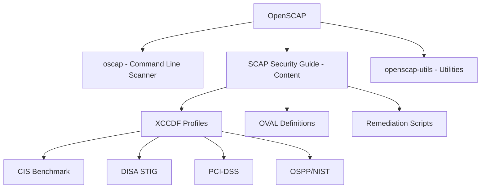

# How to Install and Run OpenSCAP on RHEL 9 for Compliance Scanning

Author: [nawazdhandala](https://www.github.com/nawazdhandala)

Tags: RHEL, OpenSCAP, Compliance, Scanning, Linux

Description: Get started with OpenSCAP on RHEL 9 for automated compliance scanning, from installation to running your first scan and interpreting the results.

---

OpenSCAP is the open-source implementation of the SCAP (Security Content Automation Protocol) standard. It is the go-to tool for compliance scanning on RHEL 9, and it is backed by Red Hat. If you need to prove that your servers meet a specific security standard, OpenSCAP is how you do it.

## Install OpenSCAP

```bash
# Install the OpenSCAP scanner
dnf install -y openscap-scanner

# Install the SCAP Security Guide (provides compliance profiles)
dnf install -y scap-security-guide

# Optional: Install utilities for generating remediation
dnf install -y openscap-utils

# Verify the installation
oscap --version
```

## Understand the Components



## Explore Available Content

```bash
# List all available RHEL 9 content files
ls /usr/share/xml/scap/ssg/content/ssg-rhel9*

# The key file is the datastream:
# ssg-rhel9-ds.xml - Contains all profiles in one file

# Show detailed information about available profiles
oscap info /usr/share/xml/scap/ssg/content/ssg-rhel9-ds.xml
```

This will list all available profiles, including CIS, STIG, PCI-DSS, OSPP, and others.

## Run Your First Scan

### Basic scan with console output

```bash
# Run a quick scan against the STIG profile
oscap xccdf eval \
  --profile xccdf_org.ssgproject.content_profile_stig \
  /usr/share/xml/scap/ssg/content/ssg-rhel9-ds.xml
```

### Scan with HTML report output

```bash
# Create a directory for compliance reports
mkdir -p /var/log/compliance

# Run a scan with results and HTML report
oscap xccdf eval \
  --profile xccdf_org.ssgproject.content_profile_stig \
  --results /var/log/compliance/stig-results.xml \
  --report /var/log/compliance/stig-report.html \
  /usr/share/xml/scap/ssg/content/ssg-rhel9-ds.xml
```

The exit code tells you the overall result:
- 0: All rules passed
- 1: An error occurred
- 2: At least one rule failed

## Interpret the Results

### Read the HTML report

The HTML report is the most user-friendly way to review results. Transfer it to your workstation and open it in a browser. It shows:

- Overall compliance score
- Pass/fail breakdown by rule
- Rule descriptions and remediation guidance

### Get a command-line summary

```bash
# Count pass/fail from the results XML
echo "=== Compliance Summary ==="
echo "Passed: $(grep -c 'result="pass"' /var/log/compliance/stig-results.xml)"
echo "Failed: $(grep -c 'result="fail"' /var/log/compliance/stig-results.xml)"
echo "N/A:    $(grep -c 'result="notapplicable"' /var/log/compliance/stig-results.xml)"
```

## Scan Against Different Profiles

```bash
# CIS Level 1 Server
oscap xccdf eval \
  --profile xccdf_org.ssgproject.content_profile_cis_server_l1 \
  --report /var/log/compliance/cis-l1.html \
  /usr/share/xml/scap/ssg/content/ssg-rhel9-ds.xml || true

# PCI-DSS
oscap xccdf eval \
  --profile xccdf_org.ssgproject.content_profile_pci-dss \
  --report /var/log/compliance/pci-dss.html \
  /usr/share/xml/scap/ssg/content/ssg-rhel9-ds.xml || true
```

## Generate Remediation Scripts

OpenSCAP can generate fix scripts based on scan results:

```bash
# Generate a bash remediation script
oscap xccdf generate fix \
  --fix-type bash \
  --result-id "" \
  --output /tmp/remediation.sh \
  /var/log/compliance/stig-results.xml

# Generate an Ansible playbook
oscap xccdf generate fix \
  --fix-type ansible \
  --result-id "" \
  --output /tmp/remediation.yml \
  /var/log/compliance/stig-results.xml

# Review the scripts before running them
cat /tmp/remediation.sh | head -50
```

## Run an OVAL Vulnerability Scan

Besides XCCDF policy compliance, OpenSCAP can also run OVAL vulnerability scans:

```bash
# Check for available OVAL content
ls /usr/share/xml/scap/ssg/content/ssg-rhel9-oval.xml

# Run an OVAL scan
oscap oval eval \
  --results /var/log/compliance/oval-results.xml \
  --report /var/log/compliance/oval-report.html \
  /usr/share/xml/scap/ssg/content/ssg-rhel9-oval.xml
```

## Automate Regular Scans

```bash
# Create a scanning script
cat > /usr/local/bin/compliance-scan.sh << 'SCRIPT'
#!/bin/bash
DATE=$(date +%Y%m%d)
HOSTNAME=$(hostname -s)
REPORT_DIR="/var/log/compliance"
CONTENT="/usr/share/xml/scap/ssg/content/ssg-rhel9-ds.xml"
PROFILE="xccdf_org.ssgproject.content_profile_stig"

mkdir -p "$REPORT_DIR"

oscap xccdf eval \
  --profile "$PROFILE" \
  --results "${REPORT_DIR}/${HOSTNAME}-${DATE}.xml" \
  --report "${REPORT_DIR}/${HOSTNAME}-${DATE}.html" \
  "$CONTENT" 2>/dev/null || true

PASS=$(grep -c 'result="pass"' "${REPORT_DIR}/${HOSTNAME}-${DATE}.xml")
FAIL=$(grep -c 'result="fail"' "${REPORT_DIR}/${HOSTNAME}-${DATE}.xml")

logger "Compliance scan complete: $PASS passed, $FAIL failed"

# Cleanup old reports (keep 90 days)
find "$REPORT_DIR" -name "*.html" -mtime +90 -delete
find "$REPORT_DIR" -name "*.xml" -mtime +90 -delete
SCRIPT
chmod +x /usr/local/bin/compliance-scan.sh

# Schedule weekly scans
echo "0 3 * * 0 root /usr/local/bin/compliance-scan.sh" >> /etc/crontab
```

## Troubleshooting OpenSCAP

### Common issues

```bash
# If oscap fails with XML parsing errors
oscap info --fetch-remote-resources \
  /usr/share/xml/scap/ssg/content/ssg-rhel9-ds.xml

# If scan runs out of memory on large systems
# Increase the timeout and memory limits
oscap xccdf eval --fetch-remote-resources \
  --profile xccdf_org.ssgproject.content_profile_stig \
  /usr/share/xml/scap/ssg/content/ssg-rhel9-ds.xml

# Check OpenSCAP debug output
OSCAP_PROBE_ROOT=/ oscap xccdf eval --verbose INFO \
  --profile xccdf_org.ssgproject.content_profile_stig \
  /usr/share/xml/scap/ssg/content/ssg-rhel9-ds.xml 2>/tmp/oscap-debug.log
```

OpenSCAP is the foundation of compliance scanning on RHEL 9. Install it on every server, pick the right profile for your compliance requirements, run regular scans, and use the generated remediation to fix what is broken. It is straightforward, well-documented, and backed by the same people who build the operating system.
