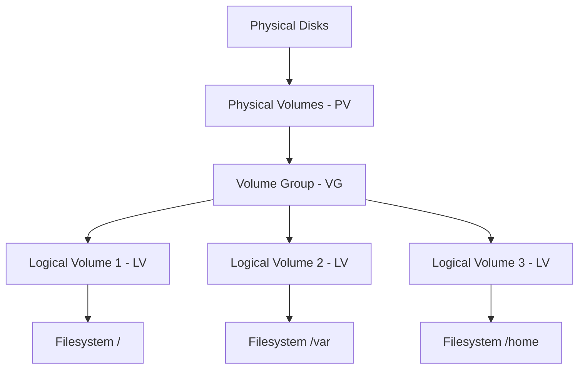

# How to Install and Set Up LVM on RHEL 9 from Scratch

Author: [nawazdhandala](https://www.github.com/nawazdhandala)

Tags: RHEL, LVM, Storage, Linux

Description: A complete guide to installing and setting up Logical Volume Manager (LVM) on RHEL 9, from preparing disks to creating your first logical volumes.

---

Managing storage on Linux servers gets complicated fast. You start with a single disk, then you need more space, then you need to resize partitions, then you realize you should have used LVM from the start. LVM (Logical Volume Manager) adds a layer of abstraction between your physical disks and your filesystems, making storage management far more flexible.

## Why Use LVM

Without LVM, you are stuck with the partition sizes you chose during installation. Need more space on /var? Too bad, you need to shrink another partition or add a new disk and move data around. With LVM, you can:

- Resize volumes on the fly
- Span volumes across multiple physical disks
- Take snapshots for backups
- Move data between disks without downtime

## LVM Architecture



Physical disks are initialized as Physical Volumes (PVs), grouped into Volume Groups (VGs), and then carved into Logical Volumes (LVs) where you create filesystems.

## Prerequisites

You need one or more unpartitioned disks or unused partitions. Check what is available:

```bash
# List all block devices
lsblk

# Check for unused disks
lsblk -f
```

For this guide, we will use `/dev/sdb` and `/dev/sdc` as our example disks.

## Step 1: Install LVM Tools

LVM tools are included in the base RHEL 9 installation, but verify:

```bash
# Ensure LVM packages are installed
sudo dnf install lvm2 -y
```

## Step 2: Create Physical Volumes

Initialize your disks as LVM physical volumes:

```bash
# Create physical volumes on the disks
sudo pvcreate /dev/sdb /dev/sdc

# Verify the physical volumes
sudo pvs
sudo pvdisplay
```

## Step 3: Create a Volume Group

Combine the physical volumes into a volume group:

```bash
# Create a volume group named "datavg"
sudo vgcreate datavg /dev/sdb /dev/sdc

# Verify the volume group
sudo vgs
sudo vgdisplay datavg
```

## Step 4: Create Logical Volumes

Create logical volumes from the volume group:

```bash
# Create a 50GB logical volume for data
sudo lvcreate -L 50G -n datalv datavg

# Create a 20GB logical volume for logs
sudo lvcreate -L 20G -n logslv datavg

# Create a logical volume using all remaining space
sudo lvcreate -l 100%FREE -n backuplv datavg

# Verify the logical volumes
sudo lvs
sudo lvdisplay
```

## Step 5: Create Filesystems

```bash
# Create XFS filesystems on the logical volumes
sudo mkfs.xfs /dev/datavg/datalv
sudo mkfs.xfs /dev/datavg/logslv
sudo mkfs.xfs /dev/datavg/backuplv
```

## Step 6: Mount the Filesystems

```bash
# Create mount points
sudo mkdir -p /data /logs /backup

# Mount the filesystems
sudo mount /dev/datavg/datalv /data
sudo mount /dev/datavg/logslv /logs
sudo mount /dev/datavg/backuplv /backup

# Verify
df -h /data /logs /backup
```

## Step 7: Make Mounts Persistent

Add entries to /etc/fstab:

```bash
# Add fstab entries for persistence across reboots
echo '/dev/datavg/datalv /data xfs defaults 0 0' | sudo tee -a /etc/fstab
echo '/dev/datavg/logslv /logs xfs defaults 0 0' | sudo tee -a /etc/fstab
echo '/dev/datavg/backuplv /backup xfs defaults 0 0' | sudo tee -a /etc/fstab

# Test the fstab entries
sudo mount -a
```

## Verifying the Complete Setup

```bash
# View the full LVM layout
sudo pvs
sudo vgs
sudo lvs

# Check mounted filesystems
df -hT /data /logs /backup

# View the block device tree
lsblk
```

You now have a fully functional LVM setup. The real power becomes apparent when you need to resize volumes, add disks, or take snapshots - all without unmounting or losing data.
