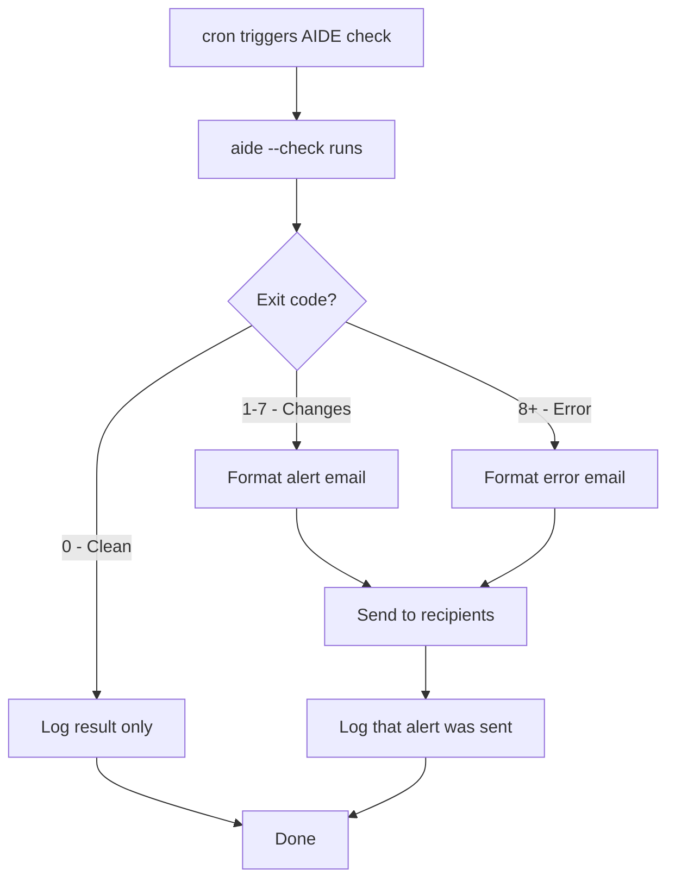

# How to Integrate AIDE Alerts with Email Notifications on RHEL 9

Author: [nawazdhandala](https://www.github.com/nawazdhandala)

Tags: RHEL, AIDE, Email Alerts, Linux

Description: Configure email notifications for AIDE file integrity alerts on RHEL 9 so your team gets immediate notice when unauthorized filesystem changes are detected.

---

Running AIDE checks on a schedule is only half the battle. If the results sit in a log file that nobody reads, you might as well not be running checks at all. Email notifications ensure that someone actually sees the results, especially when changes are detected. This guide walks through setting up email alerts for AIDE on RHEL 9.

## Prerequisites

You need a working mail setup on your RHEL 9 system. The simplest approach is using the `mailx` command with either a local MTA or an external SMTP relay.

```bash
# Install mailx if not already present
sudo dnf install mailx -y

# Verify it is installed
rpm -q mailx
```

For sending mail through an external relay, you will also need Postfix configured as a relay:

```bash
# Install postfix if needed
sudo dnf install postfix -y
sudo systemctl enable --now postfix
```

Configure Postfix to use an SMTP relay by editing `/etc/postfix/main.cf`:

```bash
# Set the relay host (replace with your mail server)
sudo postconf -e "relayhost = [smtp.example.com]:587"
sudo postconf -e "smtp_use_tls = yes"
sudo postconf -e "smtp_sasl_auth_enable = yes"
sudo postconf -e "smtp_sasl_password_maps = hash:/etc/postfix/sasl_passwd"
sudo postconf -e "smtp_sasl_security_options = noanonymous"
```

Create the credentials file:

```bash
# Add SMTP credentials
sudo tee /etc/postfix/sasl_passwd << 'EOF'
[smtp.example.com]:587 username:password
EOF

sudo chmod 600 /etc/postfix/sasl_passwd
sudo postmap /etc/postfix/sasl_passwd
sudo systemctl restart postfix
```

## Basic Email Alert Script

Create a wrapper script that sends email when AIDE detects changes:

```bash
# Create the alert script
sudo tee /usr/local/sbin/aide-alert.sh << 'SCRIPT'
#!/bin/bash
# AIDE check with email alerting
# Sends email only when changes are detected

RECIPIENTS="sysadmin@example.com,security@example.com"
HOSTNAME=$(hostname -f)
LOGDIR="/var/log/aide"
TIMESTAMP=$(date +%Y%m%d-%H%M%S)
LOGFILE="${LOGDIR}/aide-check-${TIMESTAMP}.log"
TMPFILE=$(mktemp)

mkdir -p "${LOGDIR}"

# Run AIDE check
/usr/sbin/aide --check > "${TMPFILE}" 2>&1
EXIT_CODE=$?

# Save to log file
cp "${TMPFILE}" "${LOGFILE}"

# Determine action based on exit code
case ${EXIT_CODE} in
    0)
        # No changes - log it but do not email
        echo "$(date): AIDE check clean" >> "${LOGDIR}/aide-summary.log"
        ;;
    1|2|3|4|5|6|7)
        # Changes detected - send alert
        SUBJECT="[AIDE ALERT] File changes detected on ${HOSTNAME}"
        {
            echo "AIDE has detected filesystem changes on ${HOSTNAME}"
            echo "Date: $(date)"
            echo "Exit Code: ${EXIT_CODE}"
            echo ""
            echo "=== Full Report ==="
            echo ""
            cat "${TMPFILE}"
        } | mail -s "${SUBJECT}" "${RECIPIENTS}"
        echo "$(date): AIDE changes detected, alert sent" >> "${LOGDIR}/aide-summary.log"
        ;;
    *)
        # Error condition - send different alert
        SUBJECT="[AIDE ERROR] Check failed on ${HOSTNAME}"
        {
            echo "AIDE check encountered an error on ${HOSTNAME}"
            echo "Date: $(date)"
            echo "Exit Code: ${EXIT_CODE}"
            echo ""
            cat "${TMPFILE}"
        } | mail -s "${SUBJECT}" "${RECIPIENTS}"
        echo "$(date): AIDE error, alert sent" >> "${LOGDIR}/aide-summary.log"
        ;;
esac

# Cleanup
rm -f "${TMPFILE}"

# Rotate old logs
find "${LOGDIR}" -name "aide-check-*.log" -mtime +90 -delete

exit ${EXIT_CODE}
SCRIPT

sudo chmod 700 /usr/local/sbin/aide-alert.sh
```

## Schedule with cron

```bash
# Add the cron job
sudo tee /etc/cron.d/aide-alert << 'EOF'
# AIDE file integrity check with email alerts - daily at 3 AM
SHELL=/bin/bash
PATH=/sbin:/bin:/usr/sbin:/usr/bin
0 3 * * * root /usr/local/sbin/aide-alert.sh
EOF

sudo chmod 644 /etc/cron.d/aide-alert
```

## Enhanced Email with HTML Formatting

For better readability, you can send HTML-formatted emails:

```bash
# Create an enhanced alert script with HTML email
sudo tee /usr/local/sbin/aide-alert-html.sh << 'SCRIPT'
#!/bin/bash
# AIDE check with HTML email alerts

RECIPIENTS="sysadmin@example.com"
HOSTNAME=$(hostname -f)
LOGDIR="/var/log/aide"
TIMESTAMP=$(date +%Y%m%d-%H%M%S)
LOGFILE="${LOGDIR}/aide-check-${TIMESTAMP}.log"
TMPFILE=$(mktemp)
HTMLFILE=$(mktemp)

mkdir -p "${LOGDIR}"

/usr/sbin/aide --check > "${TMPFILE}" 2>&1
EXIT_CODE=$?
cp "${TMPFILE}" "${LOGFILE}"

if [ ${EXIT_CODE} -ne 0 ] && [ ${EXIT_CODE} -lt 14 ]; then
    # Build HTML email
    cat > "${HTMLFILE}" << HTMLEOF
Content-Type: text/html
Subject: [AIDE ALERT] Changes on ${HOSTNAME}
To: ${RECIPIENTS}

<html><body>
<h2 style="color: #cc0000;">AIDE File Integrity Alert</h2>
<p><strong>Host:</strong> ${HOSTNAME}</p>
<p><strong>Date:</strong> $(date)</p>
<p><strong>Exit Code:</strong> ${EXIT_CODE}</p>
<hr>
<h3>Report Details</h3>
<pre style="background: #f5f5f5; padding: 15px; border: 1px solid #ddd;">
$(cat "${TMPFILE}")
</pre>
</body></html>
HTMLEOF

    sendmail "${RECIPIENTS}" < "${HTMLFILE}"
fi

rm -f "${TMPFILE}" "${HTMLFILE}"
exit ${EXIT_CODE}
SCRIPT

sudo chmod 700 /usr/local/sbin/aide-alert-html.sh
```

## Sending Alerts to Multiple Channels

For teams that use more than email, you can extend the script to send alerts to other systems:

```bash
# Add a webhook notification (for Slack, Teams, etc.)
send_webhook() {
    local message="$1"
    local webhook_url="https://hooks.example.com/your-webhook-url"

    curl -s -X POST "${webhook_url}" \
        -H "Content-Type: application/json" \
        -d "{\"text\": \"${message}\"}"
}
```

## Alert Flow Overview



## Testing Email Delivery

Always test that emails actually get delivered:

```bash
# Test basic mail delivery
echo "AIDE email test from $(hostname)" | mail -s "AIDE Test" sysadmin@example.com

# Create a change to trigger a real alert
sudo touch /etc/aide-email-test

# Run the alert script manually
sudo /usr/local/sbin/aide-alert.sh

# Clean up
sudo rm /etc/aide-email-test
```

Check that the email arrived in the target inbox. If it did not, check the mail logs:

```bash
# Check postfix mail log
sudo journalctl -u postfix --since "10 minutes ago"

# Check the mail queue
sudo mailq
```

## Reducing Alert Fatigue

Too many alerts will get ignored. To reduce noise:

```bash
# In the alert script, add a threshold check
# Only send email if changes exceed a threshold
CHANGE_COUNT=$(grep -c "^[fdl]" "${TMPFILE}")
if [ "${CHANGE_COUNT}" -gt 0 ]; then
    # Send the alert
    mail -s "${SUBJECT}" "${RECIPIENTS}" < "${TMPFILE}"
fi
```

Also consider excluding known-noisy paths in `/etc/aide.conf` rather than filtering them out of alerts. Prevention is better than suppression.

## Daily Summary Emails

Instead of immediate alerts, some teams prefer a daily summary:

```bash
# Send a daily summary regardless of whether changes were found
SUBJECT="[AIDE] Daily Report for ${HOSTNAME} - $(date +%Y-%m-%d)"
{
    echo "AIDE Daily Summary for ${HOSTNAME}"
    echo "Date: $(date)"
    echo ""
    if [ ${EXIT_CODE} -eq 0 ]; then
        echo "Status: CLEAN - No filesystem changes detected."
    else
        echo "Status: CHANGES DETECTED"
        echo ""
        cat "${TMPFILE}"
    fi
} | mail -s "${SUBJECT}" "${RECIPIENTS}"
```

This way, the absence of an email is itself an alert that something is wrong with the monitoring.
