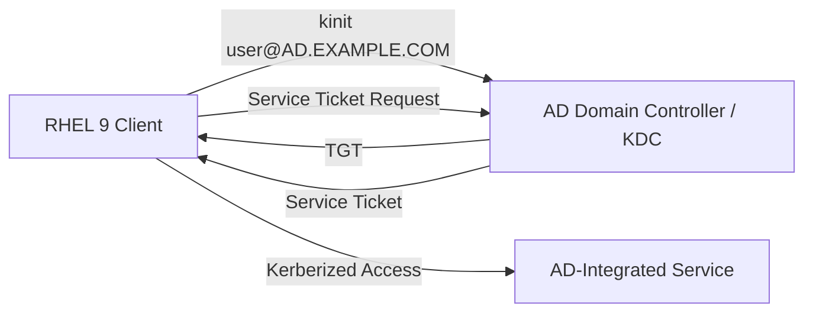

# How to Integrate RHEL 9 with Active Directory Using Kerberos

Author: [nawazdhandala](https://www.github.com/nawazdhandala)

Tags: RHEL, Kerberos, Active Directory, Integration, Linux

Description: A guide to integrating RHEL 9 with Active Directory using Kerberos for authentication, covering krb5.conf configuration, keytab creation, and kerberized service setup.

---

Active Directory is fundamentally a Kerberos realm. Every AD domain controller is a KDC. This means RHEL 9 can use Kerberos directly for authentication against AD without any third-party software, just the built-in MIT Kerberos client. While most AD integrations use SSSD with realmd for a complete solution, understanding the raw Kerberos integration underneath helps when you need to kerberize specific services or troubleshoot authentication issues.

## How RHEL Kerberos Talks to AD



## Step 1 - Configure Kerberos for the AD Realm

```bash
# Install Kerberos client tools
sudo dnf install krb5-workstation -y

# Edit the Kerberos configuration
sudo vi /etc/krb5.conf
```

```ini
[libdefaults]
  default_realm = AD.EXAMPLE.COM
  dns_lookup_realm = true
  dns_lookup_kdc = true
  ticket_lifetime = 24h
  renew_lifetime = 7d
  forwardable = true
  rdns = false

[realms]
  AD.EXAMPLE.COM = {
    kdc = dc1.ad.example.com
    kdc = dc2.ad.example.com
    admin_server = dc1.ad.example.com
  }

[domain_realm]
  .ad.example.com = AD.EXAMPLE.COM
  ad.example.com = AD.EXAMPLE.COM
```

The realm name must be uppercase and match the AD domain name.

## Step 2 - Verify DNS Resolution

AD Kerberos relies on DNS SRV records to find domain controllers.

```bash
# Check SRV records for Kerberos
dig _kerberos._tcp.ad.example.com SRV

# Check SRV records for LDAP
dig _ldap._tcp.ad.example.com SRV

# Verify DC name resolution
host dc1.ad.example.com

# Make sure the RHEL system uses AD DNS or a DNS server that forwards to AD
cat /etc/resolv.conf
```

## Step 3 - Test Kerberos Authentication

```bash
# Authenticate against AD
kinit aduser@AD.EXAMPLE.COM

# Verify the ticket
klist

# Request a service ticket for a specific AD service
kvno cifs/fileserver.ad.example.com@AD.EXAMPLE.COM
```

The realm name in `kinit` must be uppercase. The username is case-insensitive.

## Step 4 - Create a Computer Account and Keytab

To run kerberized services on the RHEL system, you need a computer account in AD and a keytab.

### Using adcli (Recommended)

```bash
# Install adcli
sudo dnf install adcli -y

# Join the machine to AD (creates a computer account)
sudo adcli join ad.example.com --login-user=Administrator

# This creates /etc/krb5.keytab with the host principal
sudo klist -kt /etc/krb5.keytab
```

### Using msktutil

```bash
# Install msktutil
sudo dnf install msktutil -y

# Create the computer account and keytab
kinit Administrator@AD.EXAMPLE.COM
sudo msktutil -c -b "CN=Computers" \
  -s host/rhel-server.ad.example.com \
  -k /etc/krb5.keytab \
  --computer-name RHEL-SERVER \
  --upn host/rhel-server.ad.example.com \
  --server dc1.ad.example.com \
  --verbose
```

### Adding Service Principals

If you need additional service principals (for HTTP, NFS, etc.):

```bash
# Add an HTTP SPN to the computer account
sudo msktutil --update \
  -s HTTP/rhel-server.ad.example.com \
  -k /etc/krb5.keytab \
  --server dc1.ad.example.com

# Verify the keytab
sudo klist -kt /etc/krb5.keytab
```

Or use adcli:

```bash
# Add a service principal
sudo adcli add-service --domain=ad.example.com HTTP/rhel-server.ad.example.com
```

## Step 5 - Configure Kerberized SSH Against AD

With the host keytab in place, configure SSH for GSSAPI authentication.

On the RHEL server:

```bash
sudo vi /etc/ssh/sshd_config
```

```
GSSAPIAuthentication yes
GSSAPICleanupCredentials yes
```

```bash
sudo systemctl restart sshd
```

Test from a client:

```bash
# Get an AD ticket
kinit aduser@AD.EXAMPLE.COM

# SSH without a password
ssh -o GSSAPIAuthentication=yes rhel-server.ad.example.com
```

## Step 6 - Kerberize a Web Application

Configure Apache to use Kerberos authentication with AD.

```bash
# Install mod_auth_gssapi
sudo dnf install mod_auth_gssapi -y

# Create a keytab for the HTTP service (if not already done)
# The keytab should contain HTTP/rhel-server.ad.example.com
```

Configure Apache:

```bash
sudo vi /etc/httpd/conf.d/kerberos.conf
```

```apache
<Location /secure>
  AuthType GSSAPI
  AuthName "AD Kerberos Login"
  GssapiCredStore keytab:/etc/httpd/krb5.keytab
  GssapiAllowedMech krb5
  Require valid-user
</Location>
```

```bash
# Copy the HTTP keytab to the Apache-accessible location
sudo cp /etc/krb5.keytab /etc/httpd/krb5.keytab
sudo chown apache:apache /etc/httpd/krb5.keytab
sudo chmod 600 /etc/httpd/krb5.keytab

sudo systemctl restart httpd
```

## Step 7 - Keytab Rotation

AD computer account passwords expire by default (every 30 days). The keytab must be updated before the password expires.

```bash
# Update the keytab (rotate the password)
sudo adcli update --domain=ad.example.com

# Or with msktutil
sudo msktutil --auto-update --verbose
```

Set up automatic rotation with a cron job:

```bash
# Rotate the keytab weekly
echo "0 3 * * 0 root /usr/sbin/adcli update --domain=ad.example.com" | sudo tee /etc/cron.d/keytab-rotate
```

## Troubleshooting

### kinit Fails Against AD

```bash
# Enable tracing
KRB5_TRACE=/dev/stderr kinit aduser@AD.EXAMPLE.COM

# Check DNS
dig _kerberos._tcp.ad.example.com SRV

# Check time sync
chronyc tracking
```

### Service Ticket Request Fails

```bash
# Check if the SPN exists in AD
# From a Windows machine with AD tools:
# setspn -L RHEL-SERVER$

# Check the keytab on the RHEL side
sudo klist -kte /etc/krb5.keytab
```

### Encryption Type Mismatch

```bash
# Check what encryption types the KDC supports
KRB5_TRACE=/dev/stderr kinit aduser@AD.EXAMPLE.COM 2>&1 | grep "Selected etype"

# Check the keytab encryption types
sudo klist -kte /etc/krb5.keytab
```

Direct Kerberos integration with AD is the foundation that tools like SSSD and realmd build upon. Understanding these mechanics helps when you need to kerberize custom applications, troubleshoot authentication failures, or set up service principals that go beyond basic login.
