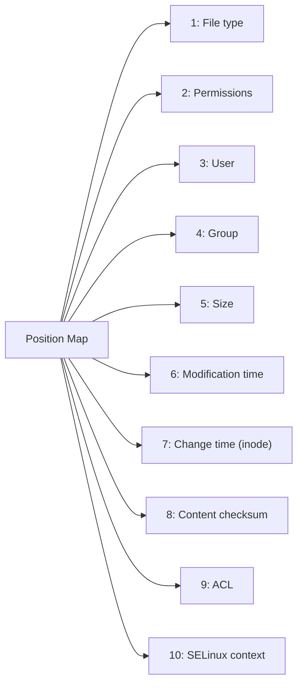
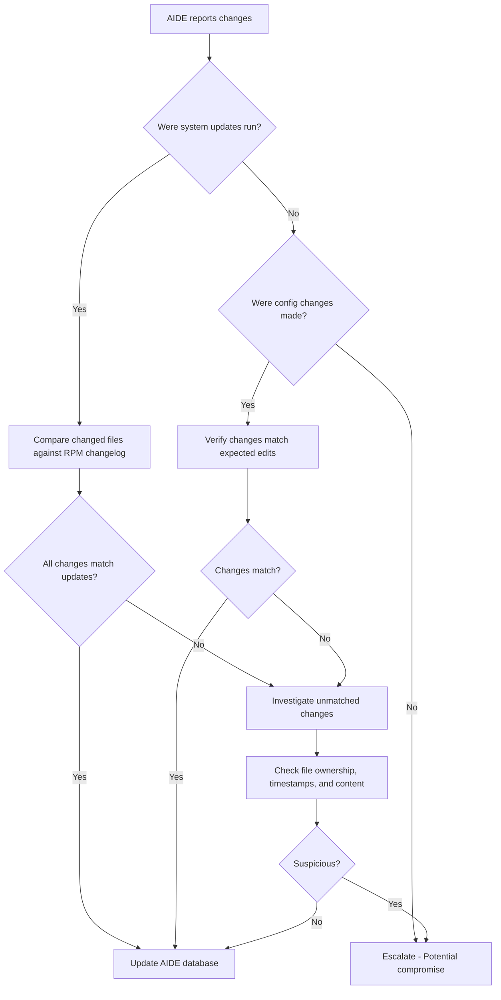

# How to Interpret and Act on AIDE File Change Reports on RHEL 9

Author: [nawazdhandala](https://www.github.com/nawazdhandala)

Tags: RHEL, AIDE, Reports, Security, Linux

Description: Learn how to read and interpret AIDE file change reports on RHEL 9, understand the different change types, and take appropriate action when changes are detected.

---

AIDE generates detailed reports when it detects filesystem changes, but those reports can be dense and hard to parse if you are not familiar with the format. Knowing how to quickly read a report, separate legitimate changes from suspicious ones, and take the right next step is essential for effective file integrity monitoring.

## Understanding AIDE Exit Codes

When AIDE runs a check, it returns an exit code that tells you what happened at a high level:

| Exit Code | Meaning |
|-----------|---------|
| 0 | No changes detected |
| 1 | New files added |
| 2 | Files removed |
| 3 | Files added and removed |
| 4 | Files changed |
| 5 | Files added and changed |
| 6 | Files removed and changed |
| 7 | Files added, removed, and changed |
| 14+ | Write error or configuration issue |

You can check the exit code after running AIDE:

```bash
# Run the check and capture the exit code
sudo aide --check
echo "Exit code: $?"
```

## Anatomy of an AIDE Report

A typical AIDE report has several sections. Here is what a full report looks like when changes are detected:

```bash
# Run a check and save the full report
sudo aide --check > /tmp/aide-report.txt 2>&1
```

The report starts with a summary:

```
AIDE found differences between database and filesystem!!
Start timestamp: 2026-03-04 03:00:01 -0500 (AIDE 0.16)

Summary:
  Total number of entries:     54832
  Added entries:               2
  Removed entries:             1
  Changed entries:             5
```

After the summary comes the detailed section listing each affected file.

## Reading Added File Entries

Added files appear under a section like this:

```
Added entries:
---------------------------------------------------
f++++++++++++++++: /etc/new-config-file.conf
f++++++++++++++++: /usr/local/bin/mystery-script
```

The `f` at the beginning indicates it is a regular file. The plus signs mean all attributes are new since nothing existed before. Pay close attention to added files in system directories - legitimate software installs will add files, but so will attackers.

## Reading Removed File Entries

Removed files look similar:

```
Removed entries:
---------------------------------------------------
f-----------------: /etc/old-config.conf
```

Files do not just disappear on their own. If you did not remove them intentionally, investigate immediately.

## Reading Changed File Entries

Changed file entries are the most detailed. They show exactly which attributes changed:

```
Changed entries:
---------------------------------------------------
f   ...    .C... : /etc/ssh/sshd_config
f >b.....   ...A. : /usr/sbin/httpd

Detailed information about changes:

File: /etc/ssh/sshd_config
  SHA512   : old_hash_here
           : new_hash_here
  CTime    : 2026-02-15 10:23:45 -0500
           : 2026-03-03 14:17:22 -0500
```

The change indicators use a positional format where each position represents a different attribute:



The symbols at each position mean:

- `.` = no change
- Letter (like `C`, `S`, `A`) = that attribute changed
- `>` = size increased
- `<` = size decreased
- `+` = attribute was added
- `-` = attribute was removed

## Common Change Indicators

Here are the most common attribute change letters:

| Letter | Attribute |
|--------|-----------|
| `S` | Size |
| `M` | Modification time |
| `C` | Change time (inode change) |
| `s` | SHA checksum |
| `p` | Permissions |
| `u` | User ownership |
| `g` | Group ownership |
| `a` | ACL |
| `A` | SELinux context |
| `x` | Extended attributes |

## Filtering Reports for Quick Triage

When a report is large, filter for the most critical changes first:

```bash
# Show only the summary and file paths
sudo aide --check 2>&1 | grep -E "^(f|d|l|Summary|Added|Removed|Changed|AIDE)"

# Show only changed files (not added/removed)
sudo aide --check 2>&1 | grep "^f "

# Show only entries in critical system directories
sudo aide --check 2>&1 | grep -E "/(bin|sbin|lib|lib64)/"
```

## Triage Decision Process

When you see changes, work through them systematically:



## Correlating Changes with Package Updates

After patching, many files will change. Verify they are legitimate by checking against RPM:

```bash
# Check if a changed file belongs to an RPM package
rpm -qf /usr/sbin/httpd

# Verify the file against the RPM database
rpm -V httpd

# Check what was recently updated
sudo dnf history info last
```

If `rpm -V` shows the same changes as AIDE, the changes are from a package update and can be accepted.

## Investigating Suspicious Changes

For changes that do not match known activity:

```bash
# Check the file modification time
stat /path/to/suspicious/file

# Look at recent logins around that time
last -t $(date -d "2026-03-03 14:17" +%Y%m%d%H%M)

# Check audit logs for file access
ausearch -f /path/to/suspicious/file -ts recent

# Compare with the RPM original if it is a package file
rpm -V $(rpm -qf /path/to/suspicious/file)
```

## Generating Reports in Different Formats

AIDE can output reports in different levels of detail:

```bash
# Verbose report showing all details
sudo aide --check --verbose=255

# Summary only
sudo aide --check --verbose=0

# Report with specific level of detail (0-255)
sudo aide --check --verbose=20
```

## Documenting Your Findings

For compliance and audit purposes, document each AIDE alert:

```bash
# Save the report with a timestamp
sudo aide --check > /var/log/aide/investigation-$(date +%Y%m%d-%H%M%S).log 2>&1
```

Include in your documentation: the date of the report, the files that changed, the root cause of each change, and who authorized the change if it was legitimate. This documentation trail is critical for audits and incident response reviews.
