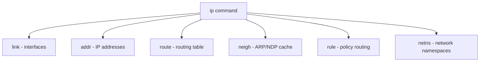

# How to Use the ip Command for Network Interface Management on RHEL

Author: [nawazdhandala](https://www.github.com/nawazdhandala)

Tags: RHEL, Ip Command, Networking, Linux

Description: A thorough guide to using the ip command on RHEL for managing network interfaces, addresses, routes, and neighbors, replacing the legacy ifconfig and route commands.

---

The `ip` command from the iproute2 package is the standard tool for network configuration on RHEL. It replaced `ifconfig`, `route`, and `arp` years ago, and knowing it well is essential. It's more powerful, more consistent, and it's what every modern tutorial and documentation uses.

## The ip Command Structure

The `ip` command follows a consistent pattern: `ip [options] OBJECT COMMAND`. The main objects are:



## Managing Interfaces (ip link)

```bash
# Show all interfaces
ip link show

# Show a specific interface
ip link show dev ens192

# Show only UP interfaces
ip link show up

# Bring an interface up
sudo ip link set ens192 up

# Bring an interface down
sudo ip link set ens192 down

# Change the MTU
sudo ip link set ens192 mtu 9000

# Set promiscuous mode
sudo ip link set ens192 promisc on
```

## Managing IP Addresses (ip addr)

```bash
# Show all addresses
ip addr show

# Show addresses for one interface
ip addr show dev ens192

# Show only IPv4 addresses
ip -4 addr show

# Show only IPv6 addresses
ip -6 addr show

# Add an IP address
sudo ip addr add 192.168.1.100/24 dev ens192

# Add an IPv6 address
sudo ip addr add 2001:db8:1::100/64 dev ens192

# Remove an IP address
sudo ip addr del 192.168.1.100/24 dev ens192

# Flush all addresses from an interface
sudo ip addr flush dev ens192
```

Important: Changes made with `ip addr` are temporary. They don't survive a reboot. Use `nmcli` for persistent configuration.

## Managing Routes (ip route)

```bash
# Show the routing table
ip route show

# Show IPv6 routes
ip -6 route show

# Show the route to a specific destination
ip route get 8.8.8.8

# Add a static route
sudo ip route add 10.0.0.0/8 via 192.168.1.1

# Add a route through a specific interface
sudo ip route add 172.16.0.0/12 dev ens224

# Add a default route
sudo ip route add default via 192.168.1.1

# Delete a route
sudo ip route del 10.0.0.0/8

# Replace a route (add if not exists, update if exists)
sudo ip route replace 10.0.0.0/8 via 192.168.1.254
```

## Managing the Neighbor Table (ip neigh)

This replaces the `arp` command.

```bash
# Show the neighbor (ARP/NDP) table
ip neigh show

# Show neighbors for a specific interface
ip neigh show dev ens192

# Add a static ARP entry
sudo ip neigh add 192.168.1.50 lladdr 00:11:22:33:44:55 dev ens192

# Delete a neighbor entry
sudo ip neigh del 192.168.1.50 dev ens192

# Flush the neighbor cache
sudo ip neigh flush dev ens192
```

## Useful Output Formatting

```bash
# Show output in JSON format (great for scripting)
ip -j addr show | python3 -m json.tool

# Show brief output (one line per interface)
ip -br addr show

# Brief output showing interface status
ip -br link show

# Show statistics
ip -s link show dev ens192

# Show detailed statistics
ip -s -s link show dev ens192

# Color output
ip -c addr show
```

## Working with VLANs

```bash
# Create a VLAN interface
sudo ip link add link ens192 name ens192.100 type vlan id 100

# Bring it up and add an address
sudo ip link set ens192.100 up
sudo ip addr add 10.100.0.10/24 dev ens192.100

# Remove a VLAN interface
sudo ip link del ens192.100
```

## Working with Bridge Interfaces

```bash
# Create a bridge
sudo ip link add name br0 type bridge

# Add an interface to the bridge
sudo ip link set ens224 master br0

# Show bridge members
ip link show master br0

# Remove an interface from the bridge
sudo ip link set ens224 nomaster

# Delete the bridge
sudo ip link del br0
```

## Policy Routing (ip rule)

```bash
# Show current routing rules
ip rule show

# Add a rule to use a different routing table for a source
sudo ip rule add from 10.0.0.0/8 table 100

# Add a route to the custom table
sudo ip route add default via 192.168.2.1 table 100

# Delete a rule
sudo ip rule del from 10.0.0.0/8 table 100
```

## Monitoring Network Events

```bash
# Watch for address changes in real time
ip monitor address

# Watch for link state changes
ip monitor link

# Watch for route changes
ip monitor route

# Watch everything
ip monitor all
```

## Common Troubleshooting Patterns

**Check if an interface is up and has an address:**

```bash
ip -br addr show dev ens192
```

**Find which interface a route uses:**

```bash
ip route get 10.0.0.50
```

**Check for duplicate addresses:**

```bash
# Look for "tentative" flags on IPv6 addresses
ip -6 addr show | grep tentative
```

**Check interface errors and drops:**

```bash
ip -s link show dev ens192
# Look for RX/TX errors and dropped counts
```

## ip Command Quick Reference

| Old Command | New Command |
|-------------|-------------|
| `ifconfig` | `ip addr show` |
| `ifconfig eth0 up` | `ip link set eth0 up` |
| `ifconfig eth0 192.168.1.10` | `ip addr add 192.168.1.10/24 dev eth0` |
| `route -n` | `ip route show` |
| `route add default gw 192.168.1.1` | `ip route add default via 192.168.1.1` |
| `arp -n` | `ip neigh show` |

## Wrapping Up

The `ip` command is the single most important networking tool on RHEL. It covers interfaces, addresses, routes, neighbors, and more in a consistent syntax. Remember that changes made with `ip` are ephemeral - use `nmcli` when you need persistence. And get into the habit of using `-br` for quick status checks and `-j` for scriptable JSON output.
