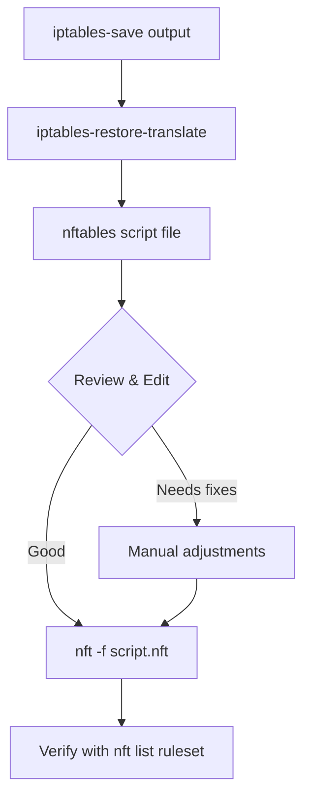

# How to Use iptables-restore-translate for nftables Migration on RHEL

Author: [nawazdhandala](https://www.github.com/nawazdhandala)

Tags: RHEL, nftables, iptables, Migration, Linux

Description: Learn how to use iptables-restore-translate to bulk-convert your existing iptables rulesets into nftables format on RHEL, with tips for handling edge cases.

---

When you have hundreds of iptables rules accumulated over years of production use, translating them one by one with `iptables-translate` is not realistic. That's where `iptables-restore-translate` comes in. It takes a full iptables-save dump and converts the entire thing to nftables syntax in one shot.

## What iptables-restore-translate Does

This tool reads an iptables-save formatted file and produces equivalent nftables commands. It handles tables, chains, and rules, mapping them to the nftables equivalents. It's not perfect for every edge case, but it gets you 90-95% of the way there.



## Prerequisites

Make sure you have the iptables-nft package installed:

```bash
dnf install iptables-nft -y
```

Verify the translate tool is available:

```bash
which iptables-restore-translate
```

## Exporting Your Current Rules

First, save your current iptables rules in the standard format:

```bash
iptables-save > /root/iptables-v4.rules
ip6tables-save > /root/iptables-v6.rules
```

Take a look at the output to understand what you're working with:

```bash
wc -l /root/iptables-v4.rules
```

## Running the Translation

Convert the IPv4 rules:

```bash
iptables-restore-translate -f /root/iptables-v4.rules > /root/nft-v4.nft
```

Convert the IPv6 rules:

```bash
ip6tables-restore-translate -f /root/iptables-v6.rules > /root/nft-v6.nft
```

## Understanding the Output

The translated file will contain nft commands that create tables, chains, and rules. Here's what a typical output looks like:

```bash
# Sample translated output
add table ip filter
add chain ip filter INPUT { type filter hook input priority 0; policy accept; }
add chain ip filter FORWARD { type filter hook forward priority 0; policy accept; }
add chain ip filter OUTPUT { type filter hook output priority 0; policy accept; }
add rule ip filter INPUT ct state established,related counter accept
add rule ip filter INPUT iifname "lo" counter accept
add rule ip filter INPUT tcp dport 22 counter accept
add rule ip filter INPUT counter drop
```

Notice how the tool maps iptables concepts directly:
- The `filter` table stays as `filter`
- Chain policies are set in the chain definition
- Connection tracking (`-m state --state`) becomes `ct state`
- Interface matching (`-i lo`) becomes `iifname "lo"`

## Handling Translation Warnings

Sometimes the tool will print warnings to stderr when it encounters rules it can't translate directly. Capture these:

```bash
iptables-restore-translate -f /root/iptables-v4.rules > /root/nft-v4.nft 2> /root/translate-warnings.log
cat /root/translate-warnings.log
```

Common issues include:
- Custom match modules that don't have nftables equivalents
- Certain target extensions
- Complex string matching rules

## Reviewing and Fixing the Output

Always review the translated file before applying it. Look for any lines that seem off or incomplete.

Open the file and check for issues:

```bash
grep -n "# " /root/nft-v4.nft
```

The translator will sometimes insert comments where it couldn't do a clean translation. You'll need to handle those manually.

## Merging IPv4 and IPv6 Rules

If you want a unified ruleset, you can use the inet family in nftables which handles both IPv4 and IPv6. However, the translate tool produces separate ip and ip6 family rules. You can manually merge them:

Create a combined file with inet family:

```bash
cat > /root/nft-combined.nft << 'EOF'
flush ruleset

table inet filter {
    chain input {
        type filter hook input priority 0; policy drop;

        # Allow established connections
        ct state established,related accept

        # Allow loopback
        iifname "lo" accept

        # Allow SSH
        tcp dport 22 accept

        # Allow HTTP and HTTPS
        tcp dport { 80, 443 } accept
    }

    chain forward {
        type filter hook forward priority 0; policy drop;
    }

    chain output {
        type filter hook output priority 0; policy accept;
    }
}
EOF
```

## Applying the Translated Rules

Load the translated ruleset:

```bash
nft -f /root/nft-v4.nft
```

If you get errors, the `-c` flag lets you do a dry run:

```bash
nft -c -f /root/nft-v4.nft
```

This checks syntax without actually applying anything.

## Verifying the Migration

List the loaded rules and compare them to your original iptables output:

```bash
nft list ruleset
```

Check that rule counters are working:

```bash
nft list ruleset | grep counter
```

Test connectivity to your critical services:

```bash
ss -tlnp
```

## Making Rules Persistent

Save the working ruleset:

```bash
nft list ruleset > /etc/nftables/migrated.nft
```

Update the nftables service configuration:

```bash
echo 'include "/etc/nftables/migrated.nft"' >> /etc/sysconfig/nftables.conf
```

Enable the nftables service:

```bash
systemctl enable nftables
systemctl restart nftables
```

## Tips for Large Rulesets

If you have a very large ruleset, consider breaking the translation into logical chunks. You can split your iptables-save output by table (filter, nat, mangle) and translate each one separately. This makes review and debugging much easier.

Count rules per table:

```bash
grep -c "^-A" /root/iptables-v4.rules
```

The translation is straightforward for most standard rules. Where it gets tricky is with custom modules and complex matching. For those cases, rewriting the rules in native nftables syntax is usually the better approach than trying to force-translate them.
