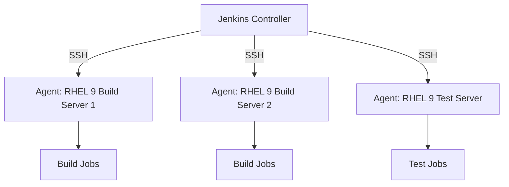

# How to Configure Jenkins Agents with SSH on RHEL 9

Author: [nawazdhandala](https://www.github.com/nawazdhandala)

Tags: RHEL, Jenkins, Agents, SSH, CI/CD, Linux

Description: Set up Jenkins SSH agents on RHEL 9 to distribute build jobs across multiple machines for parallel execution.

---

A single Jenkins server can only handle so many builds. SSH agents let you distribute build jobs to dedicated RHEL 9 machines, spreading the load and providing different build environments.

## Architecture



## Prepare the Agent Machine

On each RHEL 9 machine that will be a Jenkins agent:

```bash
# Create a jenkins user
sudo useradd -m -d /var/lib/jenkins -s /bin/bash jenkins

# Install Java 17 (required for the agent)
sudo dnf install -y java-17-openjdk

# Create a workspace directory
sudo mkdir -p /var/lib/jenkins/workspace
sudo chown -R jenkins:jenkins /var/lib/jenkins

# Install any build tools you need
sudo dnf install -y git gcc make rpm-build
```

## Set Up SSH Key Authentication

On the Jenkins controller:

```bash
# Generate an SSH key pair for Jenkins
sudo -u jenkins ssh-keygen -t ed25519 -f /var/lib/jenkins/.ssh/id_ed25519 -N ""

# Copy the public key
sudo cat /var/lib/jenkins/.ssh/id_ed25519.pub
```

On each agent machine:

```bash
# Create the .ssh directory for the jenkins user
sudo mkdir -p /var/lib/jenkins/.ssh
sudo chmod 700 /var/lib/jenkins/.ssh

# Add the controller's public key
echo "PASTE_PUBLIC_KEY_HERE" | sudo tee /var/lib/jenkins/.ssh/authorized_keys
sudo chmod 600 /var/lib/jenkins/.ssh/authorized_keys
sudo chown -R jenkins:jenkins /var/lib/jenkins/.ssh
```

Test the connection from the controller:

```bash
# Test SSH from the controller to the agent
sudo -u jenkins ssh -i /var/lib/jenkins/.ssh/id_ed25519 jenkins@agent-hostname
```

## Add SSH Credentials in Jenkins

1. Go to Manage Jenkins > Credentials > System > Global credentials
2. Click "Add Credentials"
3. Kind: SSH Username with private key
4. ID: `jenkins-agent-ssh`
5. Username: `jenkins`
6. Private Key: Enter the contents of `/var/lib/jenkins/.ssh/id_ed25519`

## Add the Agent Node in Jenkins

1. Go to Manage Jenkins > Nodes > New Node
2. Node name: `rhel9-agent-01`
3. Type: Permanent Agent
4. Configure:
   - Remote root directory: `/var/lib/jenkins`
   - Labels: `rhel9 build`
   - Usage: Use this node as much as possible
   - Launch method: Launch agents via SSH
   - Host: IP or hostname of the agent
   - Credentials: Select the SSH credential you created
   - Host Key Verification Strategy: Known hosts file

## Use Agent Labels in Pipelines

```groovy
// Jenkinsfile - Run specific stages on specific agents
pipeline {
    agent none

    stages {
        stage('Build') {
            // Run the build on any agent with the 'rhel9' label
            agent { label 'rhel9' }
            steps {
                sh 'cat /etc/redhat-release'
                sh 'gcc --version'
                sh 'make build'
            }
        }

        stage('Test') {
            // Run tests on the test agent
            agent { label 'test' }
            steps {
                sh 'make test'
            }
        }

        stage('Package') {
            agent { label 'rhel9 && build' }
            steps {
                sh 'rpmbuild -ba myapp.spec'
            }
        }
    }
}
```

## Monitor Agent Status

```bash
# Check agent connectivity from Jenkins CLI
java -jar jenkins-cli.jar -s http://localhost:8080/ \
  get-node rhel9-agent-01

# List all nodes
java -jar jenkins-cli.jar -s http://localhost:8080/ \
  list-nodes
```

## Troubleshoot Connection Issues

```bash
# On the agent, check if SSH is running
sudo systemctl status sshd

# Check firewall
sudo firewall-cmd --list-services

# Test SSH manually from the controller
sudo -u jenkins ssh -v jenkins@agent-hostname

# Check the Jenkins agent log in the web UI
# Go to Manage Jenkins > Nodes > rhel9-agent-01 > Log
```

Jenkins SSH agents on RHEL 9 let you scale your CI/CD infrastructure horizontally. Each agent can have different tools installed, letting you build and test across different configurations from a single Jenkins controller.
