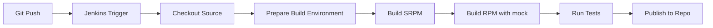

# How to Set Up Jenkins Pipelines for RHEL 9 RPM Builds

Author: [nawazdhandala](https://www.github.com/nawazdhandala)

Tags: RHEL, Jenkins, Pipelines, RPM, CI/CD, Linux

Description: Create Jenkins pipelines that automatically build RPM packages for RHEL 9, including spec file management and repository publishing.

---

Building RPM packages by hand is slow and inconsistent. A Jenkins pipeline automates the entire process: pull the source, build the RPM, run tests, and publish to your repository. This guide walks through setting up that pipeline on RHEL 9.

## Pipeline Overview



## Install Build Prerequisites on Jenkins

```bash
# Install RPM build tools
sudo dnf install -y rpm-build rpmdevtools rpmlint mock createrepo

# Add the jenkins user to the mock group
sudo usermod -aG mock jenkins

# Restart Jenkins to pick up the group change
sudo systemctl restart jenkins
```

## Sample Spec File

```spec
# myapp.spec - RPM spec file for a sample application
Name:           myapp
Version:        1.0.0
Release:        1%{?dist}
Summary:        My sample application for RHEL 9

License:        MIT
URL:            https://github.com/example/myapp
Source0:        %{name}-%{version}.tar.gz

BuildRequires:  gcc, make
Requires:       glibc

%description
A sample application packaged as an RPM for RHEL 9.

%prep
%setup -q

%build
make %{?_smp_mflags}

%install
make install DESTDIR=%{buildroot}

%files
%license LICENSE
%doc README.md
/usr/local/bin/myapp

%changelog
* Tue Mar 04 2026 Developer <dev@example.com> - 1.0.0-1
- Initial package
```

## Jenkins Pipeline (Jenkinsfile)

```groovy
// Jenkinsfile - RPM build pipeline for RHEL 9
pipeline {
    agent any

    environment {
        // RPM build directories
        RPM_BUILD_DIR = "${WORKSPACE}/rpmbuild"
        SPEC_FILE     = "myapp.spec"
        APP_NAME      = "myapp"
        APP_VERSION   = "1.0.0"
    }

    stages {
        stage('Checkout') {
            steps {
                // Pull the latest source code
                checkout scm
            }
        }

        stage('Prepare Build Environment') {
            steps {
                // Set up the rpmbuild directory structure
                sh '''
                    mkdir -p ${RPM_BUILD_DIR}/{BUILD,RPMS,SOURCES,SPECS,SRPMS}

                    # Create the source tarball
                    tar czf ${RPM_BUILD_DIR}/SOURCES/${APP_NAME}-${APP_VERSION}.tar.gz \
                        --transform "s,^,${APP_NAME}-${APP_VERSION}/," \
                        --exclude='.git' \
                        --exclude='rpmbuild' \
                        .

                    # Copy the spec file
                    cp ${SPEC_FILE} ${RPM_BUILD_DIR}/SPECS/
                '''
            }
        }

        stage('Lint Spec File') {
            steps {
                // Check the spec file for common errors
                sh "rpmlint ${RPM_BUILD_DIR}/SPECS/${SPEC_FILE}"
            }
        }

        stage('Build SRPM') {
            steps {
                // Build the source RPM
                sh '''
                    rpmbuild -bs \
                        --define "_topdir ${RPM_BUILD_DIR}" \
                        ${RPM_BUILD_DIR}/SPECS/${SPEC_FILE}
                '''
            }
        }

        stage('Build RPM with mock') {
            steps {
                // Build the binary RPM in a clean chroot
                sh '''
                    SRPM=$(find ${RPM_BUILD_DIR}/SRPMS -name "*.src.rpm" | head -1)
                    mock -r rocky-9-x86_64 --rebuild "$SRPM" \
                        --resultdir=${RPM_BUILD_DIR}/RPMS/
                '''
            }
        }

        stage('Test RPM') {
            steps {
                // Verify the RPM can be installed
                sh '''
                    RPM=$(find ${RPM_BUILD_DIR}/RPMS -name "*.x86_64.rpm" | head -1)

                    # Check RPM metadata
                    rpm -qpi "$RPM"

                    # List files in the RPM
                    rpm -qpl "$RPM"

                    # Run rpmlint on the built package
                    rpmlint "$RPM" || true
                '''
            }
        }

        stage('Publish to Repository') {
            when {
                branch 'main'
            }
            steps {
                // Copy RPM to the local repository and update metadata
                sh '''
                    REPO_DIR="/var/www/html/rpm-repo"
                    RPM=$(find ${RPM_BUILD_DIR}/RPMS -name "*.x86_64.rpm" | head -1)

                    sudo mkdir -p ${REPO_DIR}
                    sudo cp "$RPM" ${REPO_DIR}/
                    sudo createrepo --update ${REPO_DIR}/
                '''
            }
        }
    }

    post {
        success {
            // Archive the built RPMs
            archiveArtifacts artifacts: 'rpmbuild/RPMS/**/*.rpm', fingerprint: true
        }

        always {
            // Clean up the build directory
            sh "rm -rf ${RPM_BUILD_DIR}"
        }
    }
}
```

## Configure the Pipeline in Jenkins

1. Create a new Pipeline job in Jenkins
2. Under Pipeline, select "Pipeline script from SCM"
3. Set the SCM to Git and enter your repository URL
4. Set the Script Path to `Jenkinsfile`
5. Save and run the build

## Set Up the Local RPM Repository

```bash
# Install a web server to host the repository
sudo dnf install -y httpd

# Create the repository directory
sudo mkdir -p /var/www/html/rpm-repo

# Initialize the repository metadata
sudo createrepo /var/www/html/rpm-repo/

# Start the web server
sudo systemctl enable --now httpd
sudo firewall-cmd --permanent --add-service=http
sudo firewall-cmd --reload
```

Clients can add your repository:

```bash
# On client machines, add the custom repo
sudo tee /etc/yum.repos.d/custom.repo << 'EOF'
[custom]
name=Custom RPM Repository
baseurl=http://jenkins-server/rpm-repo/
gpgcheck=0
enabled=1
EOF

# Install your package
sudo dnf install myapp
```

With this pipeline in place, every push to your repository triggers an automated RPM build on RHEL 9. Packages are tested and published consistently every time.
