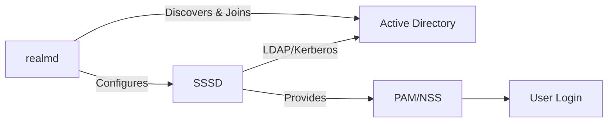

# How to Join a RHEL System to an Active Directory Domain Using SSSD and realmd

Author: [nawazdhandala](https://www.github.com/nawazdhandala)

Tags: RHEL, Active Directory, SSSD, Realmd, Linux

Description: A step-by-step guide to joining a RHEL system to an Active Directory domain using realmd and SSSD, including prerequisites, domain discovery, join process, and login configuration.

---

Joining RHEL to Active Directory is one of the most common tasks in mixed Linux/Windows environments. The combination of realmd for domain discovery and joining, plus SSSD for ongoing authentication and user lookups, makes this process reliable and maintainable. This guide covers the full workflow from preparation through verification.

## How the Components Fit Together



realmd handles the one-time domain join operation. SSSD handles the ongoing authentication, user/group lookups, and credential caching. After the join, you rarely interact with realmd again.

## Prerequisites

Before joining, make sure these are in place:

- DNS resolution to AD domain controllers (critical)
- Time synchronized between RHEL and AD (Kerberos requires this)
- An AD account with permission to join computers to the domain
- Network connectivity to AD on ports 53, 88, 389, 636, 3268, and 445

```bash
# Verify DNS resolution to AD
host ad.example.com
nslookup _ldap._tcp.example.com

# Verify time sync
chronyc tracking
timedatectl

# Make sure the RHEL system's DNS points to AD DNS
cat /etc/resolv.conf
```

## Step 1 - Install Required Packages

```bash
# Install realmd, SSSD, and related packages
sudo dnf install realmd sssd oddjob oddjob-mkhomedir adcli samba-common-tools -y
```

## Step 2 - Discover the Domain

Use realmd to discover the AD domain and verify connectivity.

```bash
# Discover the AD domain
realm discover example.com
```

The output shows the domain details, required packages, and join method. It should look something like:

```bash
example.com
  type: kerberos
  realm-name: EXAMPLE.COM
  domain-name: example.com
  configured: no
  server-software: active-directory
  client-software: sssd
  required-package: sssd-tools
  required-package: sssd
  required-package: adcli
  required-package: samba-common-tools
```

## Step 3 - Join the Domain

```bash
# Join the domain with an AD admin account
sudo realm join example.com -U Administrator

# You will be prompted for the Administrator password
```

If the default OU is not correct, specify where to create the computer account:

```bash
# Join and place the computer object in a specific OU
sudo realm join example.com -U Administrator \
  --computer-ou="OU=Linux Servers,DC=example,DC=com"
```

Verify the join:

```bash
# Check domain membership
realm list

# Verify SSSD is running
sudo systemctl status sssd
```

## Step 4 - Configure Login Access

By default, all AD users can log in to the RHEL system. You probably want to restrict this.

```bash
# Deny all AD users by default
sudo realm deny --all

# Permit specific AD users
sudo realm permit user1@example.com user2@example.com

# Permit an AD group
sudo realm permit -g "Linux Admins@example.com"
```

## Step 5 - Test Authentication

```bash
# Look up an AD user
id administrator@example.com

# Test login
su - administrator@example.com

# Test Kerberos ticket
kinit administrator@example.com
klist
```

## Step 6 - Configure Home Directory Creation

AD users need home directories on the RHEL system.

```bash
# Enable automatic home directory creation
sudo authselect enable-feature with-mkhomedir

# Ensure oddjobd is running
sudo systemctl enable --now oddjobd
```

## Step 7 - Simplify Usernames

By default, AD users log in with the full domain format (user@example.com). You can configure SSSD to allow short names.

```bash
# Edit SSSD configuration
sudo vi /etc/sssd/sssd.conf
```

Add or modify in the domain section:

```ini
[domain/example.com]
use_fully_qualified_names = False
fallback_homedir = /home/%u
```

Restart SSSD:

```bash
sudo systemctl restart sssd
```

Now users can log in with just their username:

```bash
id jsmith
# Instead of: id jsmith@example.com
```

## Step 8 - Configure Sudo for AD Groups

Grant sudo privileges to an AD group:

```bash
# Create a sudoers file for the AD group
echo '%linux\ admins ALL=(ALL) ALL' | sudo tee /etc/sudoers.d/ad-admins
sudo chmod 440 /etc/sudoers.d/ad-admins
```

Note the backslash before the space in the group name. AD group names often contain spaces.

## Leaving the Domain

If you need to unjoin:

```bash
# Leave the AD domain
sudo realm leave example.com

# Verify
realm list
```

## Troubleshooting

### DNS Issues

```bash
# Verify SRV records
dig _ldap._tcp.example.com SRV
dig _kerberos._tcp.example.com SRV
```

### Join Fails with "Insufficient permissions"

Make sure the account has the right to join computers to the domain, or pre-create the computer object in AD.

### User Lookup Fails After Join

```bash
# Clear SSSD cache
sudo sss_cache -E
sudo systemctl restart sssd

# Check SSSD logs
sudo journalctl -u sssd -f
```

### Time Sync Issues

```bash
# Force time sync
sudo chronyc makestep

# Verify
timedatectl
```

The realmd/SSSD combination is the recommended approach for AD integration on RHEL. It handles the complexity of Kerberos and LDAP behind clean, manageable interfaces. Get DNS and time sync right, and the rest follows smoothly.
