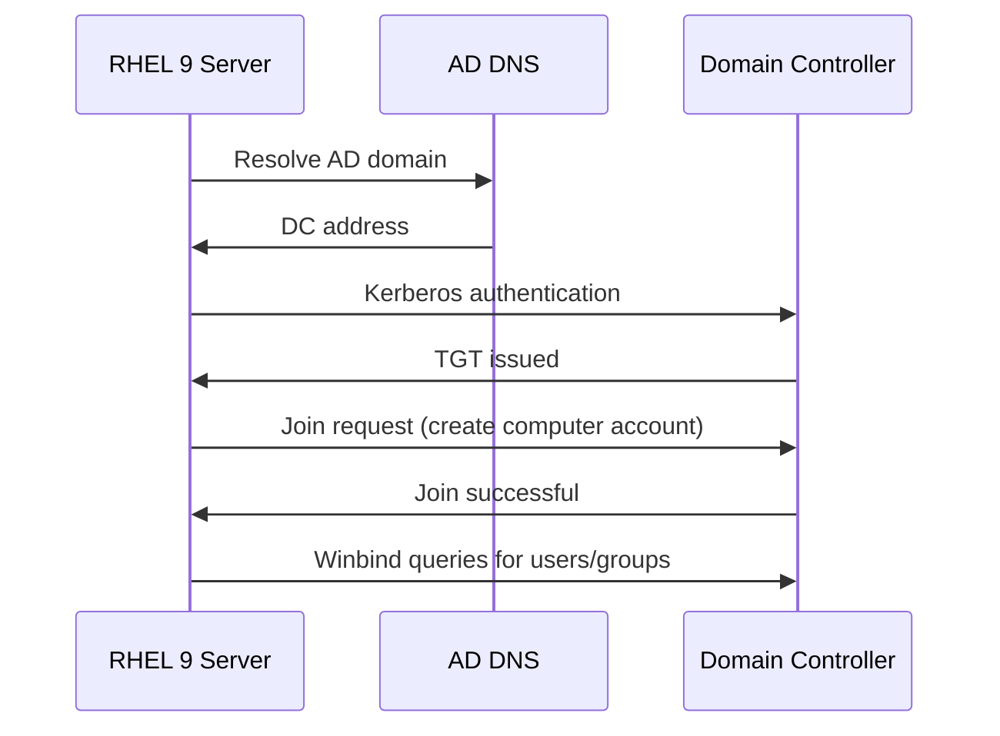

# How to Join a RHEL 9 Samba Server to an Active Directory Domain

Author: [nawazdhandala](https://www.github.com/nawazdhandala)

Tags: RHEL, Samba, Active Directory, Linux

Description: Join a RHEL 9 Samba file server to a Windows Active Directory domain using realm and Samba's net ads commands for integrated authentication.

---

## Why Join AD?

Joining your Samba server to Active Directory means users authenticate with their existing AD credentials. No separate Samba password database, no duplicate accounts. Users access Linux-hosted shares the same way they access Windows shares, with their domain username and password.

## Prerequisites

- RHEL 9 server with Samba installed
- A Windows Active Directory domain
- DNS configured to resolve the AD domain (the RHEL server should use the AD DNS server)
- Time synchronized with the AD domain controller
- An AD account with permissions to join computers to the domain

## Step 1 - Install Required Packages

```bash
# Install Samba, AD integration, and Kerberos packages
sudo dnf install -y samba samba-client samba-winbind samba-winbind-clients \
    krb5-workstation realmd oddjob oddjob-mkhomedir sssd adcli
```

## Step 2 - Configure DNS

The RHEL server must resolve the AD domain:

```bash
# Set DNS to point to the AD domain controller
sudo nmcli connection modify ens192 ipv4.dns "192.168.1.5"
sudo nmcli connection modify ens192 ipv4.dns-search "example.com"
sudo nmcli connection up ens192

# Test DNS resolution
host example.com
host _ldap._tcp.example.com
```

## Step 3 - Configure Time Synchronization

Kerberos requires clocks to be within 5 minutes of each other:

```bash
# Configure chronyd to sync with the AD server
echo "server dc1.example.com iburst" | sudo tee -a /etc/chrony.conf
sudo systemctl restart chronyd

# Verify time sync
chronyc sources
```

## Step 4 - Discover the Domain

```bash
# Discover the AD domain
sudo realm discover example.com
```

This shows information about the domain, including the required packages and join method.

## Step 5 - Join the Domain

```bash
# Join the domain (you will be prompted for an AD admin password)
sudo realm join --membership-software=samba --client-software=winbind example.com
```

Alternatively, using Samba's net command:

```bash
# Join using net ads
sudo net ads join -U administrator
```

Verify the join:

```bash
# Check the machine account
sudo net ads testjoin
# Should output: "Join is OK"
```

## Step 6 - Configure Samba for AD

Edit /etc/samba/smb.conf:

```ini
[global]
    workgroup = EXAMPLE
    realm = EXAMPLE.COM
    security = ads

    # ID mapping configuration
    idmap config * : backend = tdb
    idmap config * : range = 10000-19999
    idmap config EXAMPLE : backend = rid
    idmap config EXAMPLE : range = 20000-99999

    # Winbind settings
    winbind use default domain = yes
    winbind enum users = yes
    winbind enum groups = yes

    # Template settings for AD users
    template homedir = /home/%U
    template shell = /bin/bash

[shared]
    path = /srv/samba/shared
    writable = yes
    valid users = @"EXAMPLE\Domain Users"
```

## Step 7 - Start Services

```bash
# Enable and start winbind and Samba
sudo systemctl enable --now winbind smb

# Verify winbind can talk to AD
wbinfo -t    # Test trust relationship
wbinfo -u    # List domain users
wbinfo -g    # List domain groups
```

## Step 8 - Test Authentication

```bash
# Authenticate as a domain user
wbinfo -a 'EXAMPLE\jdoe%password'

# Or test with smbclient
smbclient //localhost/shared -U 'jdoe' -W EXAMPLE
```

## Domain Join Flow



## Automatic Home Directory Creation

Create home directories automatically when AD users log in:

```bash
# Enable automatic home directory creation
sudo authselect select sssd with-mkhomedir --force
sudo systemctl enable --now oddjobd
```

## SELinux and Firewall

```bash
# SELinux booleans
sudo setsebool -P samba_enable_home_dirs on
sudo setsebool -P samba_export_all_rw on

# Firewall
sudo firewall-cmd --permanent --add-service=samba
sudo firewall-cmd --reload
```

## Troubleshooting

```bash
# Check if the domain join is still valid
sudo net ads testjoin

# View Kerberos tickets
klist

# Check winbind status
sudo systemctl status winbind

# Debug winbind
wbinfo -t    # Trust check
wbinfo -p    # Ping winbind daemon

# Check Samba logs
sudo tail -f /var/log/samba/log.smbd
```

Common issues:
- DNS not resolving the domain name
- Clock skew too large for Kerberos
- Incorrect realm or workgroup in smb.conf
- Missing ID mapping configuration

## Wrap-Up

Joining a RHEL 9 Samba server to Active Directory gives you seamless authentication for file sharing. Users log in with their domain credentials, and permissions map to AD groups. The key steps are DNS configuration, time sync, domain join, and proper ID mapping in smb.conf. Once configured, the Samba server behaves as a member server in the AD domain, just like a Windows file server would.
