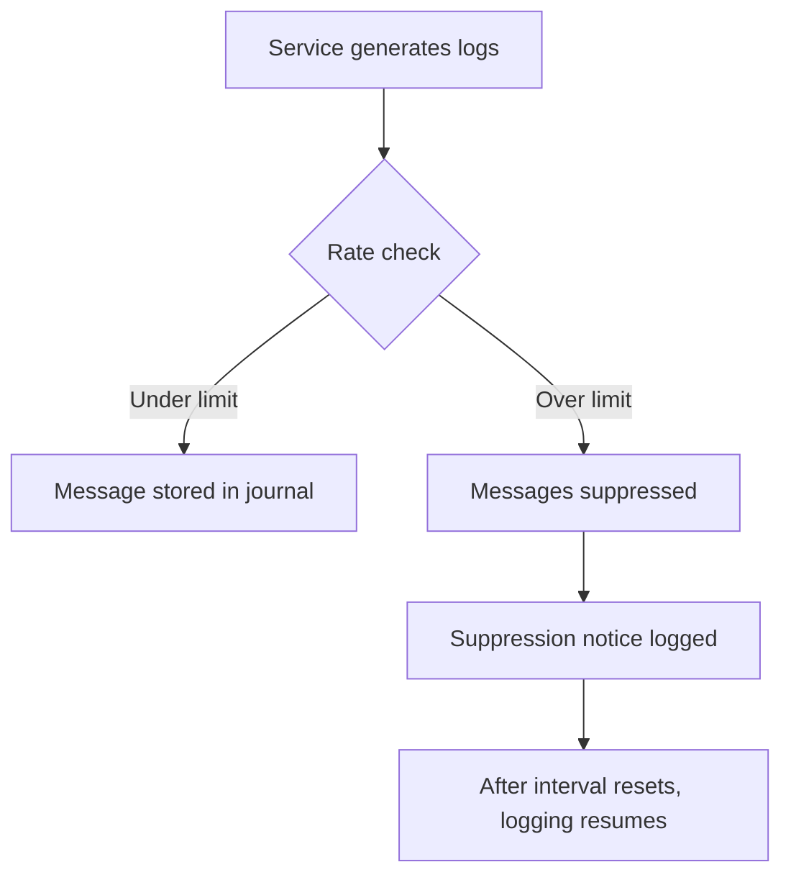
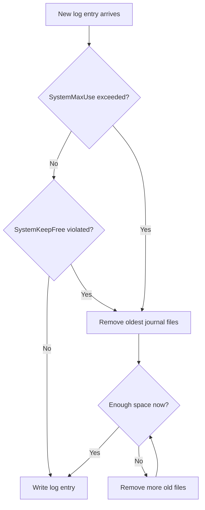

# How to Set Up journald Rate Limiting and Storage Quotas on RHEL 9

Author: [nawazdhandala](https://www.github.com/nawazdhandala)

Tags: RHEL, journald, systemd, Logging, Linux

Description: Learn how to configure journald rate limiting and storage quotas on RHEL 9 to prevent log flooding from consuming system resources while keeping important logs available.

---

A misbehaving service can flood your journal with thousands of messages per second, consuming CPU, disk I/O, and storage. journald on RHEL 9 includes built-in rate limiting and storage quota features that protect your system from this kind of log abuse while making sure important messages still get through.

## How Rate Limiting Works



journald rate limiting works per-service. It counts how many messages a given service (identified by its unit name or syslog identifier) sends within a time window. If the count exceeds the threshold, further messages are dropped until the next interval.

## Step 1: Configure Rate Limiting

Edit the journald configuration:

```bash
# Open the journald configuration file
sudo vi /etc/systemd/journald.conf
```

Add or modify these settings:

```ini
[Journal]
# Maximum number of messages a service can log per interval
# Default: 10000
RateLimitIntervalSec=30s

# Maximum burst of messages within the interval
# Default: 10000
RateLimitBurst=1000
```

With these settings, each service can log up to 1000 messages every 30 seconds. After that, journald suppresses additional messages and logs a notice like:

```
Suppressed 4523 messages from myapp.service
```

### Disabling Rate Limiting for Specific Services

Some services legitimately produce high volumes of logs. You can override rate limiting per service:

```bash
# Create an override for a specific service
sudo systemctl edit myapp.service
```

Add the following:

```ini
[Service]
# Disable rate limiting for this service
LogRateLimitIntervalSec=0
LogRateLimitBurst=0
```

Or set higher limits instead of disabling entirely:

```ini
[Service]
# Allow higher log rate for this service
LogRateLimitIntervalSec=30s
LogRateLimitBurst=10000
```

### Disabling Rate Limiting Globally

Not recommended for production, but useful for debugging:

```ini
[Journal]
# Disable rate limiting entirely (not recommended)
RateLimitIntervalSec=0
RateLimitBurst=0
```

## Step 2: Configure Storage Quotas

Storage quotas control how much disk space journal logs can use.

```bash
# Edit the journald configuration
sudo vi /etc/systemd/journald.conf
```

```ini
[Journal]
# Enable persistent storage
Storage=persistent

# ---- Persistent Storage Quotas ----

# Maximum total disk space for journal files
# Default: 10% of filesystem, capped at 4G
SystemMaxUse=2G

# Minimum free disk space to leave on the filesystem
# If free space drops below this, oldest logs are removed
# Default: 15% of filesystem, capped at 4G
SystemKeepFree=1G

# Maximum size of individual journal files
# Smaller files allow more granular cleanup
# Default: 1/8 of SystemMaxUse
SystemMaxFileSize=128M

# Maximum number of journal files to retain
# Default: 100
SystemMaxFiles=50

# ---- Runtime (Memory) Storage Quotas ----

# Maximum RAM usage for volatile logs
# Default: 10% of RAM, capped at 4G
RuntimeMaxUse=200M

# Minimum free RAM to maintain
RuntimeKeepFree=100M

# Maximum size of individual runtime journal files
RuntimeMaxFileSize=50M
```

## Step 3: Apply Changes

```bash
# Restart journald to apply the new settings
sudo systemctl restart systemd-journald

# Verify the service is running
sudo systemctl status systemd-journald
```

## Step 4: Verify Settings

```bash
# Check current journal disk usage
journalctl --disk-usage

# Show journal statistics
journalctl --header | head -40

# Check for rate limiting messages in the journal
journalctl -u systemd-journald --no-pager -n 20

# Look for suppression notices
journalctl --grep="Suppressed" --no-pager -n 20
```

## Understanding the Interaction Between Quotas



The quotas work together:

1. `SystemMaxUse` sets the hard ceiling on total journal size
2. `SystemKeepFree` ensures the filesystem always has breathing room
3. `SystemMaxFileSize` controls the granularity of cleanup (smaller files mean more precise cleanup)
4. `SystemMaxFiles` provides an absolute cap on file count

journald uses whichever limit is reached first.

## Step 5: Manual Cleanup Commands

When you need to free space immediately:

```bash
# Remove journal entries older than 14 days
sudo journalctl --vacuum-time=14d

# Reduce journal to a maximum of 500MB
sudo journalctl --vacuum-size=500M

# Keep only the 10 most recent journal files
sudo journalctl --vacuum-files=10

# Rotate current journal file first, then vacuum
sudo journalctl --rotate
sudo journalctl --vacuum-time=7d
```

## Step 6: Monitor Rate Limiting in Action

Create a script that generates log flood and observe rate limiting:

```bash
#!/bin/bash
# /tmp/test-rate-limit.sh
# Generate a burst of log messages to test rate limiting

echo "Sending 2000 log messages..."
for i in $(seq 1 2000); do
    logger -t ratetest "Test message number $i"
done
echo "Done. Check for suppression notices."
```

```bash
# Run the test
chmod +x /tmp/test-rate-limit.sh
/tmp/test-rate-limit.sh

# Check for suppression notices
journalctl -t ratetest --no-pager | tail -20
journalctl --grep="Suppressed.*ratetest" --no-pager
```

## Per-Service Storage Quotas with LogNamespace

RHEL 9 supports log namespaces, which provide isolated journal storage for specific services:

```bash
# Create a namespace configuration
sudo mkdir -p /etc/systemd/journald@myapp.conf.d/
sudo vi /etc/systemd/journald@myapp.conf
```

```ini
[Journal]
# Separate storage quota for this namespace
SystemMaxUse=500M
SystemMaxFileSize=64M
```

Assign a service to the namespace:

```bash
sudo systemctl edit myapp.service
```

```ini
[Service]
LogNamespace=myapp
```

```bash
# Restart the service
sudo systemctl restart myapp.service

# View logs from the namespace
journalctl --namespace=myapp
```

## Recommended Settings for Different Scenarios

### Small Server (10GB disk)

```ini
[Journal]
Storage=persistent
SystemMaxUse=500M
SystemKeepFree=2G
SystemMaxFileSize=64M
RateLimitIntervalSec=30s
RateLimitBurst=500
MaxRetentionSec=7day
```

### Medium Server (100GB disk)

```ini
[Journal]
Storage=persistent
SystemMaxUse=2G
SystemKeepFree=5G
SystemMaxFileSize=128M
RateLimitIntervalSec=30s
RateLimitBurst=2000
MaxRetentionSec=30day
```

### High-Traffic Server (500GB+ disk)

```ini
[Journal]
Storage=persistent
SystemMaxUse=10G
SystemKeepFree=20G
SystemMaxFileSize=256M
SystemMaxFiles=100
RateLimitIntervalSec=30s
RateLimitBurst=10000
MaxRetentionSec=90day
```

## Troubleshooting

```bash
# Check journald status and configuration
systemctl status systemd-journald

# Check actual disk usage vs limits
journalctl --disk-usage
df -h /var/log/journal/

# Verify the configuration was loaded
systemd-analyze cat-config systemd/journald.conf

# Check for rate limiting in effect
journalctl --grep="Suppressed" -n 50 --no-pager
```

## Summary

Rate limiting and storage quotas in journald on RHEL 9 protect your system from log flooding and disk exhaustion. Set `RateLimitBurst` and `RateLimitIntervalSec` to control per-service log rates, use `SystemMaxUse` and `SystemKeepFree` to manage disk consumption, and override settings per-service when needed. Regular use of `journalctl --vacuum-time` and `journalctl --vacuum-size` helps with manual cleanup.
