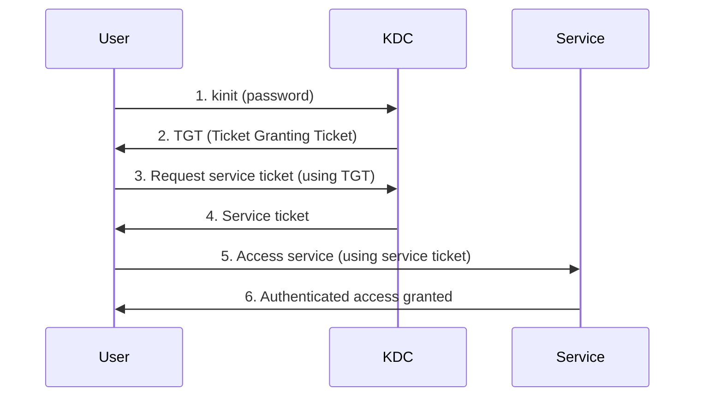

# How to Set Up Kerberos Authentication for Single Sign-On on RHEL

Author: [nawazdhandala](https://www.github.com/nawazdhandala)

Tags: RHEL, Kerberos, SSO, Authentication, Linux

Description: A comprehensive guide to setting up Kerberos authentication for single sign-on across Linux services on RHEL, covering KDC basics, ticket management, and kerberized service integration.

---

Kerberos gives you single sign-on (SSO). You authenticate once, get a ticket-granting ticket (TGT), and that ticket lets you access kerberized services (SSH, NFS, web applications) without entering your password again. On RHEL, Kerberos is baked into the system, whether you use it through IdM, Active Directory, or a standalone KDC. This guide explains how to set up and use Kerberos SSO effectively.

## How Kerberos SSO Works



The user authenticates once to the KDC and receives a TGT. When they access a service, the client automatically requests a service ticket from the KDC using the TGT. The service verifies the ticket without needing the user's password.

## Prerequisites

- A functioning Kerberos realm (via IdM, AD, or standalone KDC)
- DNS properly configured (Kerberos relies heavily on DNS)
- Time synchronized across all systems (within 5 minutes)
- Network access to the KDC on port 88 (TCP and UDP)

## Step 1 - Install Kerberos Client Packages

```bash
# Install Kerberos client tools
sudo dnf install krb5-workstation -y
```

## Step 2 - Configure the Kerberos Client

Edit the Kerberos configuration file.

```bash
sudo vi /etc/krb5.conf
```

```ini
[libdefaults]
  default_realm = EXAMPLE.COM
  dns_lookup_realm = true
  dns_lookup_kdc = true
  ticket_lifetime = 24h
  renew_lifetime = 7d
  forwardable = true
  rdns = false
  default_ccache_name = KCM:

[realms]
  EXAMPLE.COM = {
    kdc = kdc.example.com
    admin_server = kdc.example.com
  }

[domain_realm]
  .example.com = EXAMPLE.COM
  example.com = EXAMPLE.COM
```

Key settings:
- `default_ccache_name = KCM:` uses the KCM credential cache (managed by sssd-kcm), which persists across logins
- `forwardable = true` allows tickets to be forwarded to remote services
- `dns_lookup_kdc = true` discovers KDCs through DNS SRV records

## Step 3 - Obtain a Kerberos Ticket

```bash
# Get a TGT
kinit username@EXAMPLE.COM

# Verify the ticket
klist

# Check ticket flags (forwardable, renewable, etc.)
klist -f
```

The output shows your TGT and its expiration time. As you access kerberized services, additional service tickets appear in the cache.

## Step 4 - Configure SSH for Kerberos SSO

SSH with GSSAPI authentication is the most common Kerberos SSO use case.

On the SSH server:

```bash
# Edit SSH server configuration
sudo vi /etc/ssh/sshd_config
```

Enable GSSAPI:

```
GSSAPIAuthentication yes
GSSAPICleanupCredentials yes
```

```bash
sudo systemctl restart sshd
```

On the SSH client, configure GSSAPI in the client configuration:

```bash
# Edit SSH client configuration
sudo vi /etc/ssh/ssh_config.d/gssapi.conf
```

```
Host *.example.com
  GSSAPIAuthentication yes
  GSSAPIDelegateCredentials yes
```

Now test SSO:

```bash
# Get a ticket first
kinit username@EXAMPLE.COM

# SSH without entering a password
ssh server.example.com
# Should log in without a password prompt
```

## Step 5 - Configure NFS with Kerberos

Kerberized NFS provides both authentication and encryption for file sharing.

On the NFS server:

```bash
# Create a service keytab for the NFS server
# (This is usually done through IdM or the KDC admin)
kadmin -q "addprinc -randkey nfs/nfsserver.example.com"
kadmin -q "ktadd -k /etc/krb5.keytab nfs/nfsserver.example.com"

# Export with Kerberos security
# In /etc/exports:
# /shared *.example.com(rw,sync,sec=krb5p)

sudo exportfs -ra
```

On the NFS client:

```bash
# Mount with Kerberos security
sudo mount -t nfs4 -o sec=krb5p nfsserver.example.com:/shared /mnt/shared
```

The `sec=krb5p` option provides authentication, integrity checking, and encryption.

## Step 6 - Ticket Renewal and Management

### Renew a Ticket

```bash
# Renew the current ticket (if it is renewable)
kinit -R

# Check remaining ticket lifetime
klist
```

### Destroy Tickets

```bash
# Destroy all tickets (log out of Kerberos)
kdestroy -A
```

### Automatic Ticket Renewal

For long-running sessions, set up automatic ticket renewal:

```bash
# Use krenew or k5start for automatic renewal
# Install from EPEL or use a simple cron job
# Renew the ticket every 6 hours
echo "0 */6 * * * username kinit -R" | sudo tee /etc/cron.d/krb5-renew
```

## Step 7 - Credential Cache Types

RHEL supports several credential cache types:

```bash
# Check the current cache type
klist

# KCM (recommended on RHEL) - managed by sssd-kcm
# Persists across logins, supports multiple principals
default_ccache_name = KCM:

# FILE (traditional) - stored in /tmp
default_ccache_name = FILE:/tmp/krb5cc_%{uid}

# KEYRING (kernel keyring) - session-based
default_ccache_name = KEYRING:persistent:%{uid}
```

## Debugging Kerberos SSO

### Trace Kerberos Operations

```bash
# Enable Kerberos tracing
KRB5_TRACE=/dev/stderr kinit username@EXAMPLE.COM

# Trace an SSH connection
KRB5_TRACE=/dev/stderr ssh server.example.com
```

### Common SSO Issues

| Issue | Check |
|-------|-------|
| SSH asks for password despite valid ticket | Verify GSSAPIAuthentication is yes on both sides |
| Clock skew too great | Sync time with chronyc |
| Service ticket not found | Verify the service principal exists in the KDC |
| Cannot find KDC | Check DNS SRV records or /etc/krb5.conf |
| Ticket not forwardable | Check `forwardable = true` in krb5.conf |

```bash
# Verify DNS SRV records for the KDC
dig _kerberos._tcp.example.com SRV
dig _kerberos._udp.example.com SRV
```

Kerberos SSO is one of those technologies that works transparently once configured properly. The initial setup requires attention to DNS, time sync, and keytab management, but once those are right, users authenticate once and access everything seamlessly.
