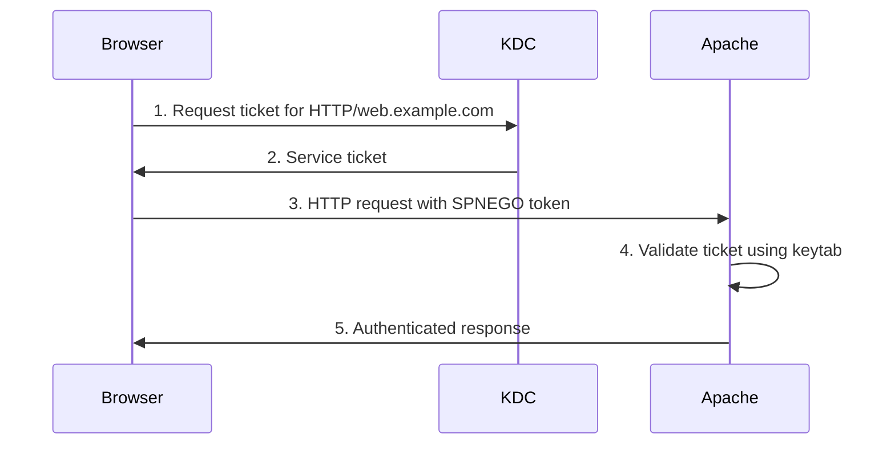

# How to Enable Kerberos Single Sign-On for Web Applications on RHEL

Author: [nawazdhandala](https://www.github.com/nawazdhandala)

Tags: RHEL, Kerberos, SSO, Web Applications, Linux

Description: A practical guide to enabling Kerberos-based single sign-on for web applications on RHEL using mod_auth_gssapi with Apache, including browser configuration and troubleshooting.

---

Kerberos SSO for web applications means users who are already logged into their desktop (and have a Kerberos ticket) can access internal web applications without entering their password again. The browser sends the Kerberos ticket to the web server, the web server validates it, and the user is authenticated transparently. This is the same mechanism that Windows uses for "Windows Integrated Authentication" in Internet Explorer and Edge.

## How Web-Based Kerberos SSO Works



The browser uses SPNEGO (Simple and Protected GSSAPI Negotiation Mechanism) to negotiate Kerberos authentication with the web server. The web server uses mod_auth_gssapi to validate the ticket.

## Prerequisites

- A working Kerberos realm (IdM or AD)
- An HTTP service principal and keytab for the web server
- Apache httpd installed on the web server
- Users with valid Kerberos tickets on their workstations

## Step 1 - Install Apache and mod_auth_gssapi

```bash
# Install Apache and the GSSAPI module
sudo dnf install httpd mod_auth_gssapi -y

# Enable and start Apache
sudo systemctl enable --now httpd
```

## Step 2 - Create the HTTP Service Principal

### For FreeIPA/IdM

```bash
# Create the HTTP service principal
ipa service-add HTTP/web.example.com

# Retrieve the keytab
sudo ipa-getkeytab -s idm.example.com \
  -p HTTP/web.example.com \
  -k /etc/httpd/http.keytab
```

### For Active Directory

```bash
# Using adcli
sudo adcli add-service --domain=ad.example.com HTTP/web.example.com

# Or using msktutil
kinit Administrator@AD.EXAMPLE.COM
sudo msktutil --update \
  -s HTTP/web.example.com \
  -k /etc/httpd/http.keytab \
  --server dc1.ad.example.com
```

### For Standalone KDC

```bash
# On the KDC
sudo kadmin.local
kadmin.local: addprinc -randkey HTTP/web.example.com@EXAMPLE.COM
kadmin.local: ktadd -k /tmp/http.keytab HTTP/web.example.com@EXAMPLE.COM
kadmin.local: quit

# Copy to the web server
scp /tmp/http.keytab root@web.example.com:/etc/httpd/http.keytab
```

Set proper permissions on the keytab:

```bash
sudo chown apache:apache /etc/httpd/http.keytab
sudo chmod 600 /etc/httpd/http.keytab
```

## Step 3 - Configure Apache for GSSAPI Authentication

Create an Apache configuration file for Kerberos-protected content.

```bash
sudo vi /etc/httpd/conf.d/kerberos-sso.conf
```

```apache
# Kerberos SSO configuration
<Location /secure>
    AuthType GSSAPI
    AuthName "Kerberos SSO Login"
    GssapiCredStore keytab:/etc/httpd/http.keytab
    GssapiAllowedMech krb5
    GssapiNegotiateOnce On
    Require valid-user

    # Pass the authenticated username to the application
    RequestHeader set REMOTE_USER expr=%{REMOTE_USER}
</Location>

# Optional: protect the entire site
# <Location />
#     AuthType GSSAPI
#     AuthName "Kerberos SSO"
#     GssapiCredStore keytab:/etc/httpd/http.keytab
#     GssapiAllowedMech krb5
#     GssapiBasicAuth Off
#     Require valid-user
# </Location>
```

### Allow Fallback to Basic Auth

If some users do not have Kerberos tickets (external users, for example), allow fallback to basic auth:

```apache
<Location /secure>
    AuthType GSSAPI
    AuthName "Login"
    GssapiCredStore keytab:/etc/httpd/http.keytab
    GssapiAllowedMech krb5
    GssapiBasicAuth On
    GssapiBasicAuthMech krb5
    Require valid-user
</Location>
```

Restart Apache:

```bash
sudo systemctl restart httpd
```

## Step 4 - Configure the Firewall and SELinux

```bash
# Open HTTP/HTTPS ports
sudo firewall-cmd --permanent --add-service=http
sudo firewall-cmd --permanent --add-service=https
sudo firewall-cmd --reload

# Allow Apache to read the keytab (SELinux)
sudo setsebool -P allow_httpd_mod_auth_pam on

# If SELinux blocks access to the keytab, set the context
sudo semanage fcontext -a -t httpd_keytab_t "/etc/httpd/http.keytab"
sudo restorecon -v /etc/httpd/http.keytab
```

## Step 5 - Configure the Browser

Browsers need to be configured to send Kerberos tickets to the web server.

### Firefox

1. Open `about:config`
2. Set `network.negotiate-auth.trusted-uris` to `.example.com`
3. Set `network.negotiate-auth.delegation-uris` to `.example.com` (if ticket delegation is needed)

Or configure via a central policy:

```bash
# Create a Firefox enterprise policy
sudo mkdir -p /etc/firefox/policies
sudo tee /etc/firefox/policies/policies.json << 'EOF'
{
  "policies": {
    "Authentication": {
      "SPNEGO": [".example.com"],
      "Delegated": [".example.com"]
    }
  }
}
EOF
```

### Chrome/Chromium

```bash
# Configure Chrome Kerberos delegation
sudo tee /etc/opt/chrome/policies/managed/kerberos.json << 'EOF'
{
  "AuthServerAllowlist": "*.example.com",
  "AuthNegotiateDelegateAllowlist": "*.example.com"
}
EOF
```

## Step 6 - Test the Setup

From a workstation with a valid Kerberos ticket:

```bash
# Verify you have a ticket
klist

# Test with curl (supports GSSAPI)
curl --negotiate -u : http://web.example.com/secure/

# The -u : tells curl to use the Kerberos ticket
# --negotiate enables SPNEGO negotiation
```

Open a browser and navigate to `http://web.example.com/secure/`. If everything is configured correctly, you should be authenticated without seeing a login prompt.

## Step 7 - Pass Authentication to Backend Applications

If Apache is a reverse proxy, pass the authenticated username to the backend.

```apache
<Location /app>
    AuthType GSSAPI
    AuthName "SSO"
    GssapiCredStore keytab:/etc/httpd/http.keytab
    GssapiAllowedMech krb5
    Require valid-user

    # Forward the authenticated username to the backend
    RequestHeader set X-Remote-User expr=%{REMOTE_USER}

    ProxyPass http://localhost:8080/app
    ProxyPassReverse http://localhost:8080/app
</Location>
```

The backend application reads the `X-Remote-User` header to identify the authenticated user.

## Troubleshooting

### 401 Unauthorized

```bash
# Check Apache error logs
sudo tail -f /var/log/httpd/error_log

# Verify the keytab
sudo klist -kt /etc/httpd/http.keytab

# Test the keytab
sudo kinit -kt /etc/httpd/http.keytab HTTP/web.example.com@EXAMPLE.COM
```

### Browser Not Sending SPNEGO Token

- Verify the browser's trusted URI configuration includes the domain
- Verify you have a valid Kerberos ticket (`klist`)
- Check that the URL uses the FQDN, not an IP address

### SELinux Denials

```bash
sudo ausearch -m avc -ts recent | grep httpd
```

Web-based Kerberos SSO provides a seamless authentication experience for internal applications. The setup is not complicated, but every piece (keytab, DNS, browser configuration, SELinux) needs to be right. Test each piece independently before putting it all together.
