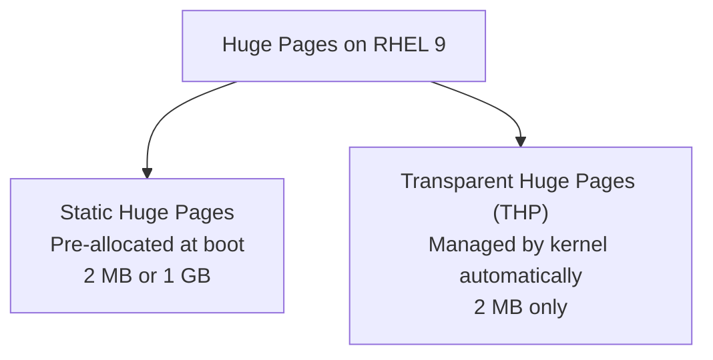

# How to Configure Kernel Huge Pages for Database and VM Performance on RHEL 9

Author: [nawazdhandala](https://www.github.com/nawazdhandala)

Tags: RHEL, Huge Pages, Kernel, Performance, Linux

Description: Learn how to configure huge pages on RHEL 9 to improve performance for databases like PostgreSQL and Oracle, as well as KVM virtual machines, by reducing TLB misses and memory overhead.

---

## Why Huge Pages Matter

By default, Linux uses 4 KB memory pages. Every page requires an entry in the Translation Lookaside Buffer (TLB), which is a small CPU cache that maps virtual addresses to physical addresses. When an application uses gigabytes of RAM, the TLB fills up quickly and the CPU spends cycles walking page tables to resolve addresses. This is called a TLB miss, and on memory-intensive workloads it can measurably hurt performance.

Huge pages solve this by using larger page sizes, typically 2 MB or 1 GB. Fewer pages means fewer TLB entries needed, which means fewer misses. Databases like PostgreSQL, Oracle, and MySQL benefit significantly, as do KVM virtual machines.

## Types of Huge Pages on RHEL 9



| Type | Size | Allocation | Best For |
|------|------|-----------|----------|
| Static Huge Pages | 2 MB or 1 GB | Manual, at boot | Databases, KVM |
| Transparent Huge Pages | 2 MB | Automatic, at runtime | General workloads |

For databases, static huge pages are almost always the right choice. THP can cause latency spikes due to background compaction and defragmentation, which is why most database vendors recommend disabling it.

## Checking Current Huge Page Status

```bash
# View current huge page configuration
grep Huge /proc/meminfo

# Sample output:
# AnonHugePages:    2048 kB
# ShmemHugePages:   0 kB
# HugePages_Total:  0
# HugePages_Free:   0
# HugePages_Rsvd:   0
# HugePages_Surp:   0
# Hugepagesize:     2048 kB

# Check THP status
cat /sys/kernel/mm/transparent_hugepage/enabled
```

## Configuring Static Huge Pages

### Calculating How Many Pages You Need

If your database uses a 16 GB shared buffer pool and your page size is 2 MB:

```bash
# Calculate: 16 GB / 2 MB = 8192 pages
# Add 5-10% overhead
echo "Scale: 16 GB needs approximately 8500 huge pages"

# Check the default huge page size
grep Hugepagesize /proc/meminfo
```

### Allocating Huge Pages at Runtime

```bash
# Allocate 8500 huge pages of 2 MB each (17 GB total)
sudo sysctl -w vm.nr_hugepages=8500

# Verify allocation
grep HugePages_Total /proc/meminfo
```

### Making Huge Pages Persistent

```bash
# Create a sysctl drop-in file
sudo tee /etc/sysctl.d/90-hugepages.conf <<EOF
# Allocate 8500 x 2MB huge pages for database shared memory
vm.nr_hugepages = 8500
EOF

# Apply immediately
sudo sysctl -p /etc/sysctl.d/90-hugepages.conf
```

For guaranteed allocation at boot (before memory gets fragmented), set the parameter on the kernel command line.

```bash
# Add huge page allocation to GRUB kernel parameters
sudo grubby --update-kernel=ALL --args="hugepages=8500"

# Verify the change
sudo grubby --info=ALL | grep hugepages
```

## Configuring 1 GB Huge Pages

1 GB pages must be allocated at boot through kernel command-line parameters because they require contiguous physical memory that is only available during early boot.

```bash
# Allocate 16 x 1GB huge pages at boot
sudo grubby --update-kernel=ALL --args="hugepagesz=1G hugepages=16"

# Regenerate GRUB config
sudo grub2-mkconfig -o /boot/grub2/grub.cfg
```

After rebooting, verify.

```bash
# Check 1 GB huge page allocation
grep -i huge /proc/meminfo
cat /sys/kernel/mm/hugepages/hugepages-1048576kB/nr_hugepages
```

## Mounting the hugetlbfs Filesystem

Applications access huge pages through the hugetlbfs filesystem.

```bash
# Create a mount point
sudo mkdir -p /dev/hugepages

# Mount hugetlbfs (this is usually auto-mounted on RHEL 9)
sudo mount -t hugetlbfs nodev /dev/hugepages

# Make it persistent in fstab
echo "nodev /dev/hugepages hugetlbfs defaults 0 0" | sudo tee -a /etc/fstab
```

## Configuring PostgreSQL to Use Huge Pages

```bash
# Edit PostgreSQL configuration
sudo vi /var/lib/pgsql/data/postgresql.conf
```

Set the following parameters:

```
# Enable huge pages in PostgreSQL
huge_pages = on
shared_buffers = 16GB
```

```bash
# Restart PostgreSQL to pick up the change
sudo systemctl restart postgresql
```

## Disabling Transparent Huge Pages for Databases

THP causes latency spikes in database workloads. Most database vendors recommend disabling it.

```bash
# Disable THP at runtime
echo never | sudo tee /sys/kernel/mm/transparent_hugepage/enabled
echo never | sudo tee /sys/kernel/mm/transparent_hugepage/defrag

# Verify
cat /sys/kernel/mm/transparent_hugepage/enabled
# Output should show: always madvise [never]
```

To make this persistent, create a systemd service or use the kernel command line.

```bash
# Disable THP via kernel command line
sudo grubby --update-kernel=ALL --args="transparent_hugepage=never"
```

## Configuring Huge Pages for KVM Virtual Machines

KVM guests benefit from huge pages by reducing hypervisor overhead on memory translation.

```bash
# Allocate huge pages for KVM (example: 32 GB for VMs)
sudo sysctl -w vm.nr_hugepages=16384

# In the VM XML definition, add the memory backing section
# Use virsh edit <vmname> and add:
```

```xml
<memoryBacking>
  <hugepages/>
</memoryBacking>
```

## Monitoring Huge Page Usage

```bash
# Watch huge page usage in real time
watch -n 2 'grep Huge /proc/meminfo'

# Check NUMA-aware huge page allocation
cat /sys/devices/system/node/node0/hugepages/hugepages-2048kB/nr_hugepages
cat /sys/devices/system/node/node1/hugepages/hugepages-2048kB/nr_hugepages
```

## Troubleshooting

If the kernel cannot allocate the requested number of huge pages, memory fragmentation is usually the cause.

```bash
# Check how many were actually allocated vs requested
grep HugePages /proc/meminfo

# If HugePages_Total is less than requested, try allocating right after boot
# or use the kernel command line method for guaranteed allocation

# Check memory fragmentation
cat /proc/buddyinfo
```

## Wrapping Up

Huge pages are one of the most effective memory optimizations for database and virtualization workloads on RHEL 9. The key decisions are how many pages to allocate and whether to use 2 MB or 1 GB pages. For databases, disable THP and use static huge pages. For KVM, match huge page allocation to your total VM memory. Always test performance before and after to confirm the improvement matches your expectations.
