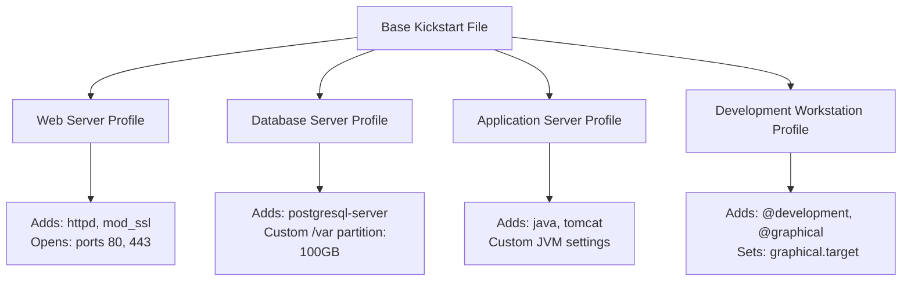
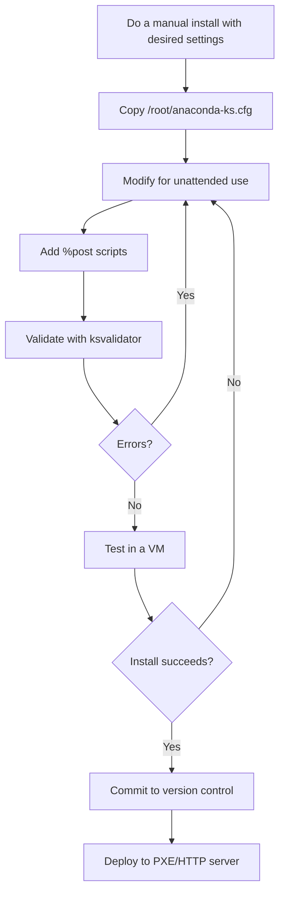

# How to Use the Kickstart Generator to Build Custom Installation Profiles on RHEL

Author: [nawazdhandala](https://www.github.com/nawazdhandala)

Tags: RHEL, Kickstart Generator, Installation Profiles, Automation, Linux

Description: Learn how to use Anaconda's generated Kickstart files and available tools to build and customize installation profiles for repeatable RHEL deployments.

---

Writing Kickstart files from scratch is fine when you know every directive by heart, but most of us do not. The fastest way to get a working Kickstart file is to let Anaconda generate one for you during a manual installation, then modify it to fit your needs. RHEL also provides tools to help you build and validate these files. Here is the practical workflow.

## The Anaconda-Generated Kickstart File

Every time you install RHEL through the graphical or text installer, Anaconda saves a Kickstart file that captures all the choices you made. This file lives at `/root/anaconda-ks.cfg` on the newly installed system.

```bash
# After a fresh RHEL install, check for the generated file
ls -la /root/anaconda-ks.cfg

# View its contents
cat /root/anaconda-ks.cfg
```

This file is a complete, working Kickstart configuration. If you ran that file against the same hardware, you would get an identical installation. That makes it an excellent starting point for building your own profiles.

### What the Generated File Contains

Here is a typical `anaconda-ks.cfg` from a minimal server installation:

```bash
# Generated by Anaconda (example, trimmed for clarity)

# Use graphical install
graphical

# Installation source
repo --name="AppStream" --baseurl=file:///run/install/sources/mount-0000-cdrom/AppStream

# Keyboard and language
keyboard --xlayouts='us'
lang en_US.UTF-8

# Network information
network --bootproto=dhcp --device=ens192 --onboot=on

# Root password (encrypted)
rootpw --iscrypted $6$...

# System timezone
timezone America/New_York --utc

# Bootloader
bootloader --append="crashkernel=1G-4G:192M,4G-64G:256M,64G-:512M" --location=mbr --boot-drive=sda

# Partitioning
autopart

# System services
services --enabled="chronyd"

# Package selection
%packages
@^minimal-environment
%end

# Addon configuration
%addon com_redhat_kdump --enable --reserve-mb='auto'
%end
```

Notice a few things:
- The password is already encrypted, which is good
- The `autopart` directive means Anaconda chose the partitioning automatically
- The `crashkernel` parameter in the bootloader line is set based on the system's RAM
- Package selection reflects what you chose in the Software Selection screen

## Modifying the Generated File

The generated file is a snapshot of one installation. To make it useful as a reusable profile, you need to customize it.

### Step 1: Change the Installation Source

The generated file often references a local mount point. Change it to a network source:

```bash
# Replace the local source with a network repo
# Before:
# repo --name="AppStream" --baseurl=file:///run/install/sources/mount-0000-cdrom/AppStream

# After: use your local mirror or Red Hat CDN
url --url="http://repo-server.example.com/rhel9/BaseOS/"
repo --name="AppStream" --baseurl="http://repo-server.example.com/rhel9/AppStream/"
```

### Step 2: Switch to Text Mode

For unattended installs, text mode uses fewer resources and does not require a display:

```bash
# Replace 'graphical' with 'text'
text
```

### Step 3: Define Explicit Partitioning

Replace `autopart` with explicit partitioning for consistent layouts across servers:

```bash
# Remove the autopart line and replace with explicit layout
clearpart --all --initlabel --drives=sda
ignoredisk --only-use=sda

part /boot --fstype=xfs --size=1024
part /boot/efi --fstype=efi --size=600
part pv.01 --size=1 --grow

volgroup rhel pv.01
logvol / --vgname=rhel --name=root --fstype=xfs --size=20480
logvol /var --vgname=rhel --name=var --fstype=xfs --size=10240
logvol /var/log --vgname=rhel --name=log --fstype=xfs --size=5120
logvol swap --vgname=rhel --name=swap --size=4096
```

### Step 4: Add Post-Install Scripts

The generated file usually does not have a `%post` section. Add one for configuration tasks:

```bash
%post --log=/root/ks-post.log
# Install additional packages
dnf install -y vim tmux wget curl bash-completion

# Enable services
systemctl enable cockpit.socket
systemctl enable firewalld

# Harden SSH
cat > /etc/ssh/sshd_config.d/50-hardening.conf << 'SSHEOF'
PermitRootLogin no
MaxAuthTries 3
SSHEOF

%end
```

### Step 5: Add Reboot Directive

```bash
# Automatically reboot after installation
reboot --eject
```

## Building Multiple Profiles

In most environments, you need different configurations for different server roles. The approach I use is to maintain a base Kickstart file and create role-specific variations.



### Example: Web Server Profile

Start with your base file and modify the package and post sections:

```bash
# Package selection for a web server
%packages
@^minimal-environment
httpd
mod_ssl
php
php-mysqlnd
php-fpm
firewalld
cockpit
%end

%post --log=/root/ks-post.log
# Enable and configure web server services
systemctl enable httpd
systemctl enable php-fpm
systemctl enable firewalld

# Open web server ports
firewall-offline-cmd --add-service=http
firewall-offline-cmd --add-service=https

# Create a basic index page
echo "Server provisioned via Kickstart" > /var/www/html/index.html

%end
```

### Example: Database Server Profile

```bash
# Package selection for a database server
%packages
@^minimal-environment
postgresql-server
postgresql-contrib
firewalld
cockpit
%end

# Use larger /var partition for database storage
clearpart --all --initlabel --drives=sda
ignoredisk --only-use=sda

part /boot --fstype=xfs --size=1024
part /boot/efi --fstype=efi --size=600
part pv.01 --size=1 --grow

volgroup rhel pv.01
logvol / --vgname=rhel --name=root --fstype=xfs --size=20480
logvol /var --vgname=rhel --name=var --fstype=xfs --size=102400
logvol /var/log --vgname=rhel --name=log --fstype=xfs --size=10240
logvol swap --vgname=rhel --name=swap --size=8192

%post --log=/root/ks-post.log
# Initialize PostgreSQL
postgresql-setup --initdb

# Enable services
systemctl enable postgresql
systemctl enable firewalld

# Open PostgreSQL port
firewall-offline-cmd --add-port=5432/tcp

%end
```

## Using pykickstart Tools

The `pykickstart` package provides several useful command-line tools for working with Kickstart files.

### Install pykickstart

```bash
sudo dnf install -y pykickstart
```

### ksvalidator - Validate Syntax

Always validate your Kickstart files before using them:

```bash
# Validate a Kickstart file against RHEL syntax
ksvalidator --version RHEL9 kickstart.cfg
```

If there are no errors, the command produces no output. Errors are printed to stderr with the line number and description.

### ksverdiff - Compare Versions

If you are migrating Kickstart files from an older RHEL version, `ksverdiff` shows what changed:

```bash
# See what changed between RHEL 8 and RHEL Kickstart syntax
ksverdiff --from RHEL8 --to RHEL9
```

This outputs deprecated, removed, and new directives so you know what to update.

### ksflatten - Merge Include Files

Kickstart supports `%include` directives to split configuration across multiple files. `ksflatten` merges everything into a single file:

```bash
# Flatten a Kickstart file that uses %include
ksflatten -c kickstart-with-includes.cfg -o kickstart-flat.cfg
```

This is useful when you maintain modular Kickstart files but need a single file for deployment.

## Using %include for Modular Profiles

Instead of maintaining separate complete Kickstart files for each role, you can use `%include` to share common sections:

```bash
# base.cfg - common settings shared across all profiles
text
lang en_US.UTF-8
keyboard us
timezone UTC --utc
selinux --enforcing
firewall --enabled --ssh
rootpw --iscrypted $6$...
user --name=sysadmin --groups=wheel --iscrypted --password=$6$...
reboot --eject
```

Then in your role-specific file:

```bash
# webserver.cfg
%include /tmp/base.cfg

url --url="http://repo-server/rhel9/BaseOS/"
repo --name="AppStream" --baseurl="http://repo-server/rhel9/AppStream/"

network --bootproto=dhcp --device=ens192 --activate --hostname=web01.example.com

clearpart --all --initlabel --drives=sda
ignoredisk --only-use=sda
# ... partitioning directives ...

%packages
@^minimal-environment
httpd
mod_ssl
%end

%post
systemctl enable httpd
%end
```

For this to work over the network, you need to fetch the include file in a `%pre` script:

```bash
%pre
# Download the base config for inclusion
curl -o /tmp/base.cfg http://repo-server/kickstart/base.cfg
%end
```

## Workflow for Building Profiles

Here is the process I follow when creating a new installation profile:



## Tips for Managing Kickstart Profiles

**Keep them in version control.** Your Kickstart files define your infrastructure. Treat them with the same care as application code.

```bash
# Initialize a repo for your Kickstart files
mkdir ~/kickstart-profiles
cd ~/kickstart-profiles
git init

# Organize by role
mkdir -p roles/{base,webserver,database,appserver}
```

**Document your profiles.** Add comments at the top of each file explaining what the profile is for and when it was last tested.

```bash
# Kickstart Profile: Web Server (RHEL.3)
# Last tested: 2026-03-01
# Author: sysadmin team
# Purpose: Standard web server with Apache, PHP, and SSL
```

**Test after every change.** Even a small typo can break a Kickstart installation. Always validate with `ksvalidator` and test in a VM before deploying.

**Use encrypted passwords.** Never store plain-text passwords in Kickstart files. Generate hashes with `openssl passwd -6` or the Python `crypt` module.

**Log everything in %post.** Use the `--log` option on your `%post` section so you can review what happened. If something fails, the log tells you exactly where.

```bash
%post --log=/root/ks-post.log --erroronfail
# The --erroronfail flag will cause the installer to halt
# if any command in this section returns a non-zero exit code
```

**Use --erroronfail wisely.** Adding `--erroronfail` to your `%post` section means the installation will fail if any post-install command fails. This is great for catching problems early, but make sure your commands are reliable before enabling it.

The combination of Anaconda's generated Kickstart files and the pykickstart tools gives you a solid workflow for building and maintaining installation profiles. Start with a manual install, capture the output, customize it, validate it, and test it. Once a profile is proven, it becomes the reproducible blueprint for every server of that type in your environment.
