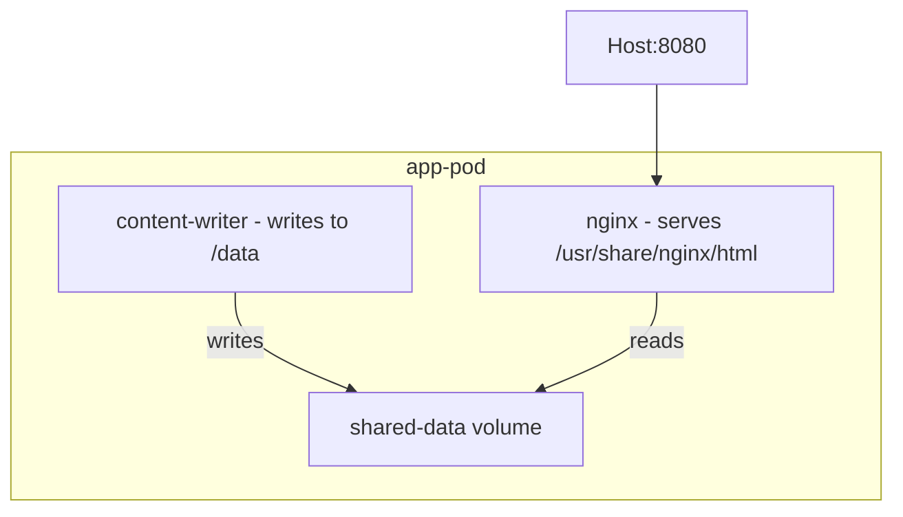

# How to Use Kubernetes YAML with podman kube play on RHEL 9

Author: [nawazdhandala](https://www.github.com/nawazdhandala)

Tags: RHEL, Podman, Kubernetes, YAML, Linux

Description: Learn how to use podman kube play on RHEL 9 to run Kubernetes Pod, Deployment, and Service YAML manifests locally without a Kubernetes cluster.

---

One of Podman's most useful features is `podman kube play`, which takes standard Kubernetes YAML and runs it locally as Podman containers. This bridges the gap between local development and Kubernetes deployment. You write your YAML once and test it on your RHEL 9 workstation before pushing it to a cluster.

## Basic Pod YAML

Start with a simple pod definition:

```bash
cat > simple-pod.yaml << 'EOF'
apiVersion: v1
kind: Pod
metadata:
  name: web-pod
  labels:
    app: web
spec:
  containers:
  - name: nginx
    image: docker.io/library/nginx:latest
    ports:
    - containerPort: 80
      hostPort: 8080
EOF
```

# Run the pod from the YAML
```bash
podman kube play simple-pod.yaml
```

# Verify the pod is running
```bash
podman pod ps
podman ps
```

# Test the web server
```bash
curl http://localhost:8080
```

## Tearing Down a Pod

# Remove the pod and its containers
```bash
podman kube down simple-pod.yaml
```

This stops and removes all containers and pods created from the YAML file.

## Multi-Container Pods

Define multiple containers in a single pod:

```bash
cat > multi-container.yaml << 'EOF'
apiVersion: v1
kind: Pod
metadata:
  name: app-pod
spec:
  containers:
  - name: web
    image: docker.io/library/nginx:latest
    ports:
    - containerPort: 80
      hostPort: 8080
    volumeMounts:
    - name: shared-data
      mountPath: /usr/share/nginx/html
  - name: content-writer
    image: registry.access.redhat.com/ubi9/ubi-minimal
    command: ["/bin/bash", "-c"]
    args:
    - |
      while true; do
        echo "<h1>Updated at $(date)</h1>" > /data/index.html
        sleep 10
      done
    volumeMounts:
    - name: shared-data
      mountPath: /data
  volumes:
  - name: shared-data
    emptyDir: {}
EOF
```

```bash
podman kube play multi-container.yaml
```

Both containers share the `shared-data` volume, and they can communicate over localhost.



## Using Persistent Volumes

Map PersistentVolumeClaims to Podman named volumes:

```bash
cat > pvc-pod.yaml << 'EOF'
apiVersion: v1
kind: PersistentVolumeClaim
metadata:
  name: db-storage
spec:
  accessModes:
  - ReadWriteOnce
  resources:
    requests:
      storage: 1Gi
---
apiVersion: v1
kind: Pod
metadata:
  name: db-pod
spec:
  containers:
  - name: mariadb
    image: docker.io/library/mariadb:latest
    env:
    - name: MYSQL_ROOT_PASSWORD
      value: secret
    - name: MYSQL_DATABASE
      value: myapp
    ports:
    - containerPort: 3306
      hostPort: 3306
    volumeMounts:
    - name: db-data
      mountPath: /var/lib/mysql
  volumes:
  - name: db-data
    persistentVolumeClaim:
      claimName: db-storage
EOF
```

```bash
podman kube play pvc-pod.yaml
```

Podman creates a named volume `db-storage` that persists across pod restarts.

## Environment Variables and ConfigMaps

Use ConfigMaps for configuration:

```bash
cat > configmap-pod.yaml << 'EOF'
apiVersion: v1
kind: ConfigMap
metadata:
  name: app-config
data:
  APP_ENV: production
  LOG_LEVEL: info
  MAX_CONNECTIONS: "100"
---
apiVersion: v1
kind: Pod
metadata:
  name: configured-app
spec:
  containers:
  - name: app
    image: registry.access.redhat.com/ubi9/ubi-minimal
    command: ["sleep", "infinity"]
    envFrom:
    - configMapRef:
        name: app-config
EOF
```

```bash
podman kube play configmap-pod.yaml
```

# Verify the environment variables
```bash
podman exec configured-app-app env | grep -E "APP_ENV|LOG_LEVEL|MAX_CONNECTIONS"
```

## Using Secrets

```bash
cat > secret-pod.yaml << 'EOF'
apiVersion: v1
kind: Secret
metadata:
  name: db-credentials
type: Opaque
stringData:
  username: admin
  password: supersecret
---
apiVersion: v1
kind: Pod
metadata:
  name: secret-app
spec:
  containers:
  - name: app
    image: registry.access.redhat.com/ubi9/ubi-minimal
    command: ["sleep", "infinity"]
    env:
    - name: DB_USER
      valueFrom:
        secretKeyRef:
          name: db-credentials
          key: username
    - name: DB_PASS
      valueFrom:
        secretKeyRef:
          name: db-credentials
          key: password
EOF
```

```bash
podman kube play secret-pod.yaml
```

## Deployment YAML

Podman can also handle basic Deployment YAML:

```bash
cat > deployment.yaml << 'EOF'
apiVersion: apps/v1
kind: Deployment
metadata:
  name: web-deployment
  labels:
    app: web
spec:
  replicas: 3
  selector:
    matchLabels:
      app: web
  template:
    metadata:
      labels:
        app: web
    spec:
      containers:
      - name: nginx
        image: docker.io/library/nginx:latest
        ports:
        - containerPort: 80
EOF
```

```bash
podman kube play deployment.yaml
```

Note that Podman creates pods, not a Deployment controller. The replicas are created as separate pods.

## Replacing Running Pods

Update a running pod without tearing it down first:

# Apply changes, replacing existing pods
```bash
podman kube play --replace simple-pod.yaml
```

## Starting Pods in the Background

```bash
# Play the YAML and start containers in detached mode
podman kube play simple-pod.yaml --start
```

## Integrating with systemd

You can use Quadlet to manage kube-play YAML:

```bash
cat > ~/.config/containers/systemd/webapp.kube << 'EOF'
[Unit]
Description=Web Application from K8s YAML

[Kube]
Yaml=/home/user/manifests/simple-pod.yaml

[Install]
WantedBy=default.target
EOF
```

```bash
systemctl --user daemon-reload
systemctl --user start webapp
```

This runs your Kubernetes YAML as a systemd service.

## Supported Kubernetes Resources

| Resource | Support Level |
|----------|--------------|
| Pod | Full |
| Deployment | Basic (no rolling updates) |
| PersistentVolumeClaim | Mapped to Podman volumes |
| ConfigMap | Supported |
| Secret | Supported |
| Service | Limited |

## Summary

`podman kube play` lets you develop and test Kubernetes YAML locally on RHEL 9 without needing a cluster. Write your manifests, test them with Podman, then deploy the same YAML to Kubernetes or OpenShift. It is not a full Kubernetes implementation, but for validating pod specs and multi-container configurations, it saves a lot of time.
