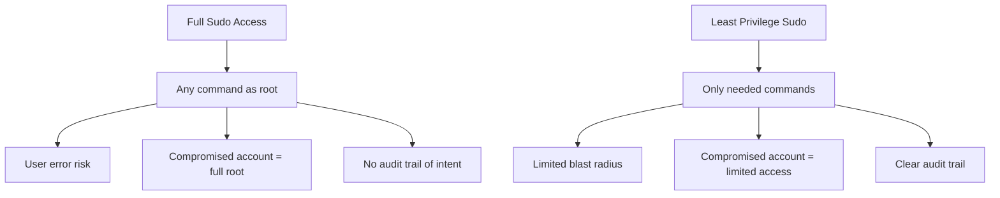

# How to Implement Least-Privilege Sudo Policies on RHEL

Author: [nawazdhandala](https://www.github.com/nawazdhandala)

Tags: RHEL, sudo, Least Privilege, Security, Linux

Description: Design and implement least-privilege sudo policies on RHEL that give users only the specific commands they need, reducing the attack surface.

---

Giving everyone full sudo access is the path of least resistance, and the path to your next security incident. The principle of least privilege means each user gets the minimum access needed to do their job. On RHEL, sudo's granular rule system makes this achievable without making everyone's life miserable.

## The Problem with Full Sudo

When every admin has `ALL=(ALL) ALL`, any compromised account becomes a full root compromise. Even without malice, an accidental `sudo rm -rf /` is one typo away.



## Step 1: Identify Roles and Required Commands

Before writing any rules, document what each role actually needs:

| Role | Typical Tasks | Required Commands |
|---|---|---|
| Web Admin | Manage web services | systemctl for httpd/nginx, edit web configs |
| DB Admin | Manage databases | systemctl for postgresql/mariadb, backup scripts |
| Monitoring | Read system state | journalctl, ss, lsblk, dmidecode |
| Deploy | Deploy applications | deployment scripts, systemctl restart |
| Security | Audit and compliance | auditctl, ausearch, firewall-cmd |

## Step 2: Create Groups

```bash
# Create role-based groups
sudo groupadd webadmins
sudo groupadd dbadmins
sudo groupadd monitoring
sudo groupadd deployers
sudo groupadd secops

# Add users to appropriate groups
sudo usermod -aG webadmins alice
sudo usermod -aG dbadmins bob
sudo usermod -aG deployers charlie
```

## Step 3: Define Command Aliases

```bash
sudo visudo -f /etc/sudoers.d/00-aliases
```

```
# Service management commands
Cmnd_Alias SVC_WEB = /usr/bin/systemctl start httpd, \
                      /usr/bin/systemctl stop httpd, \
                      /usr/bin/systemctl restart httpd, \
                      /usr/bin/systemctl reload httpd, \
                      /usr/bin/systemctl status httpd, \
                      /usr/bin/systemctl start nginx, \
                      /usr/bin/systemctl stop nginx, \
                      /usr/bin/systemctl restart nginx, \
                      /usr/bin/systemctl reload nginx, \
                      /usr/bin/systemctl status nginx

Cmnd_Alias SVC_DB = /usr/bin/systemctl start postgresql, \
                     /usr/bin/systemctl stop postgresql, \
                     /usr/bin/systemctl restart postgresql, \
                     /usr/bin/systemctl status postgresql, \
                     /usr/bin/systemctl start mariadb, \
                     /usr/bin/systemctl stop mariadb, \
                     /usr/bin/systemctl restart mariadb, \
                     /usr/bin/systemctl status mariadb

Cmnd_Alias MONITORING = /usr/bin/journalctl, \
                         /usr/bin/ss, \
                         /usr/bin/lsblk, \
                         /usr/sbin/dmidecode, \
                         /usr/bin/top -b -n 1

Cmnd_Alias SECURITY = /usr/sbin/auditctl, \
                       /usr/sbin/ausearch, \
                       /usr/sbin/aureport, \
                       /usr/bin/firewall-cmd --list-all, \
                       /usr/bin/firewall-cmd --get-active-zones

# Dangerous commands that should never be granted
Cmnd_Alias DANGEROUS = /usr/bin/su, \
                        /usr/bin/bash, \
                        /usr/bin/sh, \
                        /usr/bin/csh, \
                        /usr/sbin/visudo, \
                        /usr/bin/passwd root
```

## Step 4: Create Role-Based Rules

```bash
sudo visudo -f /etc/sudoers.d/10-webadmins
```

```
# Web admins: manage web services and edit web configs
%webadmins ALL=(root) SVC_WEB, \
                       /usr/bin/vi /etc/httpd/conf/*, \
                       /usr/bin/vi /etc/nginx/*, \
                       /usr/bin/apachectl configtest, \
                       /usr/sbin/nginx -t
```

```bash
sudo visudo -f /etc/sudoers.d/10-dbadmins
```

```
# DB admins: manage database services and run backups
%dbadmins ALL=(root) SVC_DB, \
                      /usr/bin/pg_dump, \
                      /usr/bin/pg_restore, \
                      /usr/bin/mysqldump
```

```bash
sudo visudo -f /etc/sudoers.d/10-monitoring
```

```
# Monitoring: read-only system commands, no password required
%monitoring ALL=(root) NOPASSWD: MONITORING
```

```bash
sudo visudo -f /etc/sudoers.d/10-secops
```

```
# Security ops: audit and firewall management
%secops ALL=(root) SECURITY
```

## Step 5: Block Dangerous Escalation Paths

```bash
sudo visudo -f /etc/sudoers.d/90-restrictions
```

```
# Prevent non-wheel users from running shells or dangerous commands
# This rule must come AFTER the allow rules
%webadmins ALL=(root) !DANGEROUS
%dbadmins  ALL=(root) !DANGEROUS
%secops    ALL=(root) !DANGEROUS
```

## Handling Edge Cases

### Users who need to edit specific files

Instead of granting access to `vi` (which allows shell escapes), use `sudoedit`:

```
%webadmins ALL=(root) sudoedit /etc/httpd/conf/httpd.conf, \
                                sudoedit /etc/httpd/conf.d/*
```

`sudoedit` copies the file to a temp location, lets the user edit it with their own editor, then copies it back. No shell escape risk.

### Users who need to run scripts

Create wrapper scripts with fixed parameters:

```bash
sudo vi /usr/local/sbin/restart-webapp.sh
```

```bash
#!/bin/bash
# Restart the web application stack
systemctl restart httpd
systemctl restart php-fpm
echo "Web application stack restarted at $(date)"
```

```bash
sudo chmod 750 /usr/local/sbin/restart-webapp.sh
```

Then grant access to just that script:

```
%webadmins ALL=(root) NOPASSWD: /usr/local/sbin/restart-webapp.sh
```

### Users who need to view logs

Grant read access to specific log files:

```
%webadmins ALL=(root) /usr/bin/tail -f /var/log/httpd/*, \
                       /usr/bin/less /var/log/httpd/*, \
                       /usr/bin/journalctl -u httpd
```

## Verifying Policies

### Check what a user can do

```bash
# As root, check a specific user's privileges
sudo -l -U alice

# As the user, check your own
sudo -l
```

### Test a command

```bash
# As the user, try running an allowed command
sudo systemctl restart httpd

# Try running a denied command
sudo passwd root
# Expected: Sorry, user alice is not allowed to execute...
```

## Auditing Sudo Usage

Enable sudo logging to track who runs what:

```bash
sudo visudo -f /etc/sudoers.d/00-logging
```

```
# Log all sudo commands to a dedicated file
Defaults log_output
Defaults!/usr/bin/sudoreplay !log_output
Defaults logfile="/var/log/sudo.log"
```

Review the log:

```bash
sudo tail -f /var/log/sudo.log
```

## Wrapping Up

Implementing least-privilege sudo takes more upfront work than handing out `ALL=(ALL) ALL`, but it dramatically reduces your attack surface. Start by documenting what each role needs, create groups and command aliases, and use `sudoedit` instead of granting editor access. Review your policies regularly because roles change, and what someone needed six months ago might not be what they need today.
