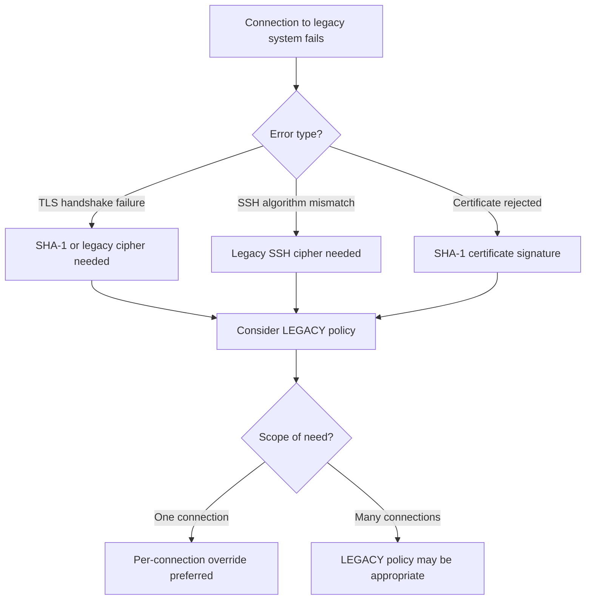

# How to Use the LEGACY Crypto Policy on RHEL 9 for Backward Compatibility

Author: [nawazdhandala](https://www.github.com/nawazdhandala)

Tags: RHEL, Crypto Policies, LEGACY Policy, Backward Compatibility, TLS, Linux

Description: Switch RHEL 9 to the LEGACY crypto policy when you need to communicate with older systems that require deprecated cryptographic algorithms.

---

Sometimes you need your RHEL 9 system to communicate with older systems that do not support modern cryptographic standards. The LEGACY crypto policy relaxes some defaults, such as allowing SHA-1 in digital signatures and certificates and allowing CBC-mode ciphers for SSH, but it does not re-enable everything that older RHEL releases allowed. RHEL 9 still allows only TLS 1.2 and newer and still requires RSA keys and Diffie-Hellman parameters of at least 2048 bits. This guide explains when and how to use it, along with important security considerations.

## When You Need the LEGACY Policy

Common scenarios that require the LEGACY policy:

- Connecting to older servers that require SHA-1 signatures or certificates
- Interacting with legacy hardware devices with outdated firmware
- Using SSH to connect to systems running older OpenSSH versions
- Working with older LDAP servers or directory services
- Accessing legacy web applications that require SHA-1 certificates


```mermaid
flowchart TD
    A[Connection to legacy system fails] --> B{Error type?}
    B -->|TLS handshake failure| C[SHA-1 or legacy cipher needed]
    B -->|SSH algorithm mismatch| D[Legacy SSH cipher needed]
    B -->|Certificate rejected| E[SHA-1 certificate signature]
    C --> F[Consider LEGACY policy]
    D --> F
    E --> F
    F --> G{Scope of need?}
    G -->|One connection| H[Per-connection override preferred]
    G -->|Many connections| I[LEGACY policy may be appropriate]
```

## What the LEGACY Policy Allows

| Setting | DEFAULT | LEGACY |
|---------|---------|--------|
| TLS 1.0 | Disabled | Disabled |
| TLS 1.1 | Disabled | Disabled |
| SHA-1 in digital signatures and certificates | Disabled | Allowed |
| Minimum RSA key | 2048 bits | 2048 bits |
| Minimum DH parameter | 2048 bits | 2048 bits |
| 3DES | Disabled | Disabled |
| CBC mode | Disabled for SSH | Allowed |
| DSA keys | Disabled | Disabled |
| RC4 | Disabled | Disabled |

## Switching to the LEGACY Policy

```bash
# Apply the LEGACY policy

sudo update-crypto-policies --set LEGACY

# Verify the change
update-crypto-policies --show
# Output: LEGACY

# Restart the system so the change fully applies
sudo reboot
```

## Using LEGACY with Targeted Sub-policies

Instead of enabling everything in the LEGACY policy, you can use DEFAULT with specific exceptions:

### Allow SHA-1 Only

```bash
# Apply DEFAULT with the RHEL-provided SHA1 sub-policy
sudo update-crypto-policies --set DEFAULT:SHA1
```

### Allow SSH CBC Ciphers Only

```bash
sudo mkdir -p /etc/crypto-policies/policies/modules/

sudo tee /etc/crypto-policies/policies/modules/ALLOW-SSH-CBC.pmod << 'EOF'
cipher@SSH = AES-256-CBC+ AES-128-CBC+
EOF

sudo update-crypto-policies --set DEFAULT:ALLOW-SSH-CBC
```

### Set the RHEL 9 RSA Minimum Explicitly

```bash
sudo mkdir -p /etc/crypto-policies/policies/modules/

sudo tee /etc/crypto-policies/policies/modules/RSA2048.pmod << 'EOF'
min_rsa_size = 2048
EOF

sudo update-crypto-policies --set DEFAULT:RSA2048
```

## Per-Connection Overrides Instead of System-Wide Change

A safer approach is to override the policy only for specific connections:

### SSH Overrides

```bash
# Connect to an old server with legacy algorithms
ssh -o KexAlgorithms=+diffie-hellman-group14-sha1 \
    -o HostKeyAlgorithms=+ssh-rsa \
    -o PubkeyAcceptedAlgorithms=+ssh-rsa \
    user@legacy-server

# Or add to ~/.ssh/config for a specific host
cat >> ~/.ssh/config << 'EOF'
Host legacy-server
    KexAlgorithms +diffie-hellman-group14-sha1
    HostKeyAlgorithms +ssh-rsa
    PubkeyAcceptedAlgorithms +ssh-rsa
EOF
```

### OpenSSL/curl Overrides

```bash
# Use a weaker OpenSSL security level for a specific curl request
curl --ciphers '@SECLEVEL=0:DEFAULT' https://legacy-server/

# Or for a specific openssl connection
openssl s_client -connect legacy-server:443 -cipher '@SECLEVEL=0:DEFAULT'
```

## Security Risks of the LEGACY Policy

Enabling the LEGACY policy exposes your system to several known risks:

1. **Legacy signature support**: Allowing SHA-1 signatures and SHA-1-signed certificates can weaken integrity guarantees.

2. **SHA-1 collision attacks**: SHA-1 is broken for collision resistance, making it possible to forge digital signatures.

3. **Weaker SSH cipher coverage**: Enabling CBC-mode ciphers for SSH increases the set of algorithms that can be negotiated.

4. **Compatibility over hardening**: The LEGACY policy intentionally has a larger attack surface than DEFAULT.

## Minimizing Exposure

If you must use the LEGACY policy:

```bash
# Set a reminder to switch back
echo "REMINDER: System $(hostname) is on LEGACY crypto policy. Switch back to DEFAULT." | \
    at now + 7 days 2>/dev/null

# Document why the LEGACY policy is needed
sudo tee /etc/crypto-policies/LEGACY_JUSTIFICATION.txt << EOF
LEGACY crypto policy enabled on: $(date)
Reason: Need to communicate with legacy-server.example.com
which requires SHA-1 signatures or SSH CBC ciphers.
Expected remediation date: [date when legacy system will be upgraded]
Approved by: [approver name]
EOF
```

## Creating a Minimal LEGACY Profile

Instead of the full LEGACY policy, create a targeted policy that only loosens what you need:

```bash
sudo mkdir -p /etc/crypto-policies/policies/modules/

sudo tee /etc/crypto-policies/policies/modules/MINIMAL-LEGACY.pmod << 'EOF'
# Only allow what is strictly needed for legacy compatibility
# Allow SHA-1 signatures
sign = RSA-SHA1+ ECDSA-SHA1+

# Allow 2048-bit minimum (not 1024)
min_rsa_size = 2048

# Allow selected SSH CBC ciphers
cipher@SSH = AES-256-CBC+ AES-128-CBC+
EOF

sudo update-crypto-policies --set DEFAULT:MINIMAL-LEGACY
```

## Monitoring While on LEGACY Policy

Track security-related events while using weakened crypto:

```bash
# Monitor for use of weak ciphers in SSH
sudo journalctl -u sshd | grep -i "cipher\|negotiate" | tail -20

# Check the TLS version negotiated with a specific server
openssl s_client -connect legacy-server:443 -brief </dev/null 2>&1 | grep Protocol
```

## Reverting to DEFAULT

When the legacy requirement is resolved:

```bash
# Switch back to DEFAULT
sudo update-crypto-policies --set DEFAULT

# Restart services
sudo reboot

# Verify
update-crypto-policies --show
```

## Summary

The LEGACY crypto policy on RHEL 9 should be used only when you genuinely need to communicate with older systems that require compatibility settings still available in RHEL 9, such as SHA-1 signatures or SSH CBC ciphers. Prefer targeted approaches like per-connection SSH overrides or custom sub-policy modules that only loosen specific restrictions. Always document why the LEGACY policy is needed, set a timeline for returning to DEFAULT, and monitor the system while weaker crypto is enabled. The goal is to minimize both the scope and duration of exposure to legacy algorithms.
