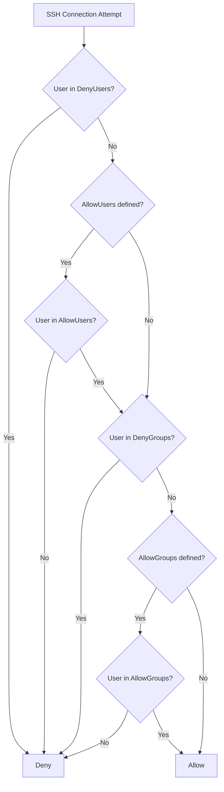

# How to Limit SSH Access with AllowUsers and AllowGroups on RHEL 9

Author: [nawazdhandala](https://www.github.com/nawazdhandala)

Tags: RHEL, SSH, Access Control, Security, Linux

Description: Restrict SSH access on RHEL 9 to specific users and groups using AllowUsers and AllowGroups directives for tighter access control.

---

Even with key-based authentication and root login disabled, any valid user on the system can SSH in by default. If you have service accounts, application users, or people who should only access the system through other means, you need to explicitly control who is allowed to connect via SSH.

## AllowUsers vs AllowGroups

RHEL 9's SSH server supports four directives for controlling access:

| Directive | Effect |
|---|---|
| AllowUsers | Only listed users can log in via SSH |
| AllowGroups | Only members of listed groups can log in via SSH |
| DenyUsers | Listed users are blocked from SSH |
| DenyGroups | Members of listed groups are blocked from SSH |

The processing order is: DenyUsers, AllowUsers, DenyGroups, AllowGroups.



## Using AllowGroups (Recommended)

Groups are easier to manage than user lists. Create an SSH access group and add users to it:

```bash
# Create the SSH access group
sudo groupadd sshusers

# Add users who should have SSH access
sudo usermod -aG sshusers admin
sudo usermod -aG sshusers jsmith
sudo usermod -aG sshusers deploy
```

Configure SSH to only allow this group:

```bash
sudo vi /etc/ssh/sshd_config.d/20-access-control.conf
```

```
# Only allow members of the sshusers group
AllowGroups sshusers
```

```bash
# Validate and restart
sudo sshd -t && sudo systemctl restart sshd
```

Now, granting or revoking SSH access is just a group membership change:

```bash
# Grant SSH access
sudo usermod -aG sshusers newuser

# Revoke SSH access
sudo gpasswd -d leavinguser sshusers
```

## Using AllowUsers

For small environments where you want explicit user control:

```bash
sudo vi /etc/ssh/sshd_config.d/20-access-control.conf
```

```
# Only allow these specific users
AllowUsers admin jsmith deploy
```

### Restrict by source address

You can combine users with source addresses:

```
# admin from anywhere, jsmith only from the office
AllowUsers admin jsmith@10.0.0.0/24 deploy@10.0.100.50
```

## Using DenyUsers and DenyGroups

If you want to keep the default (everyone allowed) but block specific users:

```bash
sudo vi /etc/ssh/sshd_config.d/20-access-control.conf
```

```
# Block service accounts from SSH
DenyUsers nobody apache nginx postgres mysql
```

Or block a group:

```
DenyGroups nologin-users
```

## Combining Directives

You can combine Allow and Deny directives. For example, allow the sshusers group but deny a specific user within it:

```
AllowGroups sshusers
DenyUsers compromised-account
```

## Testing Access Control

### Verify the effective configuration

```bash
# Check that the directives are active
sudo sshd -T | grep -i -E "allowusers|allowgroups|denyusers|denygroups"
```

### Test with an allowed user

```bash
ssh admin@server.example.com
# Should succeed
```

### Test with a denied user

```bash
ssh serviceaccount@server.example.com
# Should fail with: Permission denied
```

### Check the logs

```bash
# See rejected SSH attempts
sudo grep "not allowed" /var/log/secure | tail -10
```

You will see entries like:

```
User serviceaccount from 10.0.1.50 not allowed because not listed in AllowUsers
```

## Handling Multiple Groups

```
# Allow both admin and developer groups
AllowGroups sshusers wheel developers
```

## Common Patterns

### Production servers - tight access

```
AllowGroups sshusers
```

Only users explicitly added to `sshusers` can connect.

### Development servers - broad access with exceptions

```
DenyUsers nobody apache nginx postgres
```

Everyone can connect except service accounts.

### Bastion host - admin only

```
AllowGroups wheel
```

Only members of the wheel (sudo) group can connect.

## Do Not Forget About Yourself

The number one mistake with AllowUsers and AllowGroups is forgetting to include your own account. Before saving the configuration:

1. Make sure your user is in the allowed list or group.
2. Keep your current SSH session open.
3. Test from a new terminal before closing the original session.

```bash
# Double-check before applying
id admin | grep sshusers
```

## Wrapping Up

AllowUsers and AllowGroups are simple but powerful SSH access controls. Use AllowGroups for manageable, scalable access control, as adding or removing SSH access becomes a group membership operation. Always test from a second terminal before closing your existing session, and check `/var/log/secure` if access is unexpectedly denied. Combined with key-based authentication and disabled root login, these directives give you tight control over who can reach your servers via SSH.
