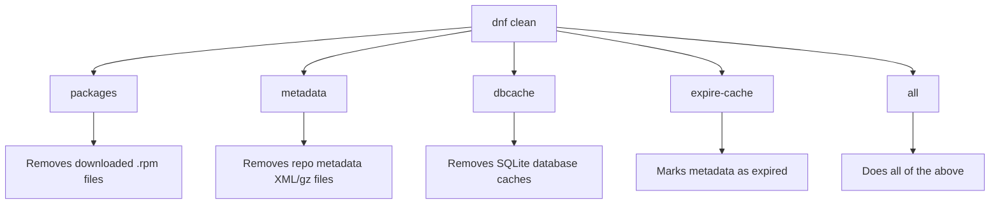

# How to List and Clean the DNF Cache on RHEL

Author: [nawazdhandala](https://www.github.com/nawazdhandala)

Tags: RHEL, DNF, Cache, Package Management, Linux

Description: Learn how to manage the DNF package cache on RHEL, including listing cached data, cleaning metadata and packages, and configuring cache behavior for different environments.

---

DNF caches repository metadata, package headers, and downloaded RPM files locally so it does not have to re-download them every time you run a command. Most of the time this works great and you never think about it. But caches can get stale, eat up disk space, or cause weird errors when metadata gets corrupted. Knowing how to manage the DNF cache is one of those basic sysadmin skills that saves you time when things go sideways.

## Where Does DNF Store Its Cache?

The cache lives under `/var/cache/dnf/`. Each enabled repository gets its own subdirectory.

```bash
# Check the total size of the DNF cache
du -sh /var/cache/dnf/

# List the cache directories for each repo
ls /var/cache/dnf/
```

Inside each repo directory, you will find:
- `repodata/` - Repository metadata (package lists, dependency info)
- `packages/` - Downloaded RPM files (if keepcache is enabled)
- Various SQLite databases and XML files

```bash
# See the breakdown of cache usage per repository
du -sh /var/cache/dnf/*/
```

## Checking Cache Status

Before cleaning anything, it helps to understand what state the cache is in.

```bash
# Show repository metadata expiration info
dnf repolist -v
```

This shows the `Repo-expire` field for each repo, telling you when the cached metadata will be considered stale.

```bash
# Check when the cache was last refreshed
stat /var/cache/dnf/*/repodata/repomd.xml
```

## Cleaning the Cache

DNF provides several targeted cleaning commands. You do not always need to nuke everything.

### Clean Package Files Only

This removes downloaded `.rpm` files from the cache. Useful when disk space is tight.

```bash
# Remove cached package files
sudo dnf clean packages
```

### Clean Metadata Only

This removes the repository metadata (package lists, dependency data). DNF will re-download it on the next operation.

```bash
# Remove cached metadata
sudo dnf clean metadata
```

### Clean Database Cache

This removes the SQLite database files that DNF builds from the metadata.

```bash
# Remove cached database files
sudo dnf clean dbcache
```

### Clean Expire Cache

This marks the metadata as expired so it gets refreshed on the next run, without actually deleting the files.

```bash
# Mark cached metadata as expired
sudo dnf clean expire-cache
```

### Clean Everything

When in doubt, clean it all:

```bash
# Remove all cached data (packages, metadata, dbcache, expire-cache)
sudo dnf clean all
```



## Rebuilding the Cache

After cleaning, rebuild the cache proactively instead of waiting for the next dnf command to do it:

```bash
# Download and cache fresh metadata from all enabled repos
sudo dnf makecache
```

This is especially useful on servers where you want to pre-populate the cache during a maintenance window, so the next `dnf install` or `dnf upgrade` does not spend time downloading metadata.

```bash
# Force a timer-based background cache refresh
sudo dnf makecache --timer
```

The `--timer` option is designed for use with systemd timers. It respects the `metadata_timer_sync` configuration and only refreshes if the cache is older than a certain threshold.

## Configuring Cache Behavior

### The keepcache Option

By default, DNF deletes downloaded RPM files after successful installation. If you want to keep them (useful for offline installs, rollbacks, or sharing packages across servers):

```bash
# Check current keepcache setting
grep keepcache /etc/dnf/dnf.conf
```

To enable it:

```bash
# Edit DNF configuration
sudo vi /etc/dnf/dnf.conf
```

```ini
[main]
# Keep downloaded RPM files after installation
keepcache=1
```

With `keepcache=1`, RPM files accumulate in `/var/cache/dnf/*/packages/`. You will need to clean them periodically or you will run out of disk space.

### Metadata Expiration

Control how long metadata stays fresh before DNF considers it stale:

```ini
[main]
# Metadata expires after 48 hours (default)
metadata_expire=172800

# Or use a human-readable format
# metadata_expire=48h
```

You can also set this per repository in the repo file:

```ini
[myrepo]
name=My Repository
baseurl=https://repo.example.com/rhel9/
# Expire metadata after 1 hour for fast-moving repos
metadata_expire=3600
```

For a local mirror that you control, you might set a shorter expiration. For stable repos that rarely change, a longer expiration reduces network traffic.

### Cache Directory Location

If you want to move the cache to a different filesystem (maybe you have more space on a separate mount):

```ini
[main]
# Custom cache directory
cachedir=/data/dnf-cache
```

## Automating Cache Cleanup

On servers with limited disk space, set up periodic cache cleaning.

### Using a Systemd Timer

```bash
# Create a simple cleanup script
sudo vi /etc/cron.weekly/dnf-cache-clean
```

```bash
#!/bin/bash
# Weekly DNF cache cleanup to free disk space
dnf clean packages
# Log the cleanup
logger "DNF cache cleaned: $(du -sh /var/cache/dnf/ | cut -f1) remaining"
```

```bash
# Make it executable
sudo chmod +x /etc/cron.weekly/dnf-cache-clean
```

### Monitoring Cache Size

If you use a monitoring system, consider tracking the cache directory size:

```bash
# One-liner to check cache size in bytes (useful for monitoring scripts)
du -sb /var/cache/dnf/ | awk '{print $1}'
```

## Common Scenarios

### "Metadata file does not match checksum"

This is the most common reason to clean the cache. The metadata got corrupted or partially downloaded.

```bash
# Fix: clean metadata and rebuild
sudo dnf clean metadata
sudo dnf makecache
```

### Disk Space Running Low on /var

The cache can grow surprisingly large, especially with `keepcache=1`:

```bash
# Check how much space the cache is using
du -sh /var/cache/dnf/

# Clean everything to reclaim space
sudo dnf clean all

# Verify space was freed
df -h /var
```

### Switching Between Repositories

When you enable or disable repositories, the old metadata can cause confusion:

```bash
# After repo changes, clean and refresh
sudo dnf clean all
sudo dnf makecache
```

### Offline Package Installation

If you need to install packages on a server without internet access, use the cache on a connected system:

```bash
# On the connected system, download packages without installing
sudo dnf download httpd --resolve --destdir=/tmp/offline-rpms/

# Transfer the RPMs to the offline system and install
sudo dnf localinstall /tmp/offline-rpms/*.rpm
```

## Cache and dnf-automatic

If you use dnf-automatic for unattended updates, be aware that it uses the same cache. If the cache is stale, dnf-automatic might miss available updates. The systemd timer for dnf-automatic usually handles this, but if you see updates being missed:

```bash
# Check the dnf-automatic timer
systemctl status dnf-automatic.timer

# Manually refresh the cache
sudo dnf makecache
```

## Summary

The DNF cache is a simple concept but managing it well keeps your systems running smoothly. Clean it when you hit metadata errors, when disk space is tight, or after making repository changes. Use `keepcache=1` when you might need to downgrade or reinstall packages. Set appropriate `metadata_expire` values for your repositories. And if `/var` starts filling up, `dnf clean all` is your friend. It is a small thing, but it is one of those fundamentals that prevents a lot of headaches.
