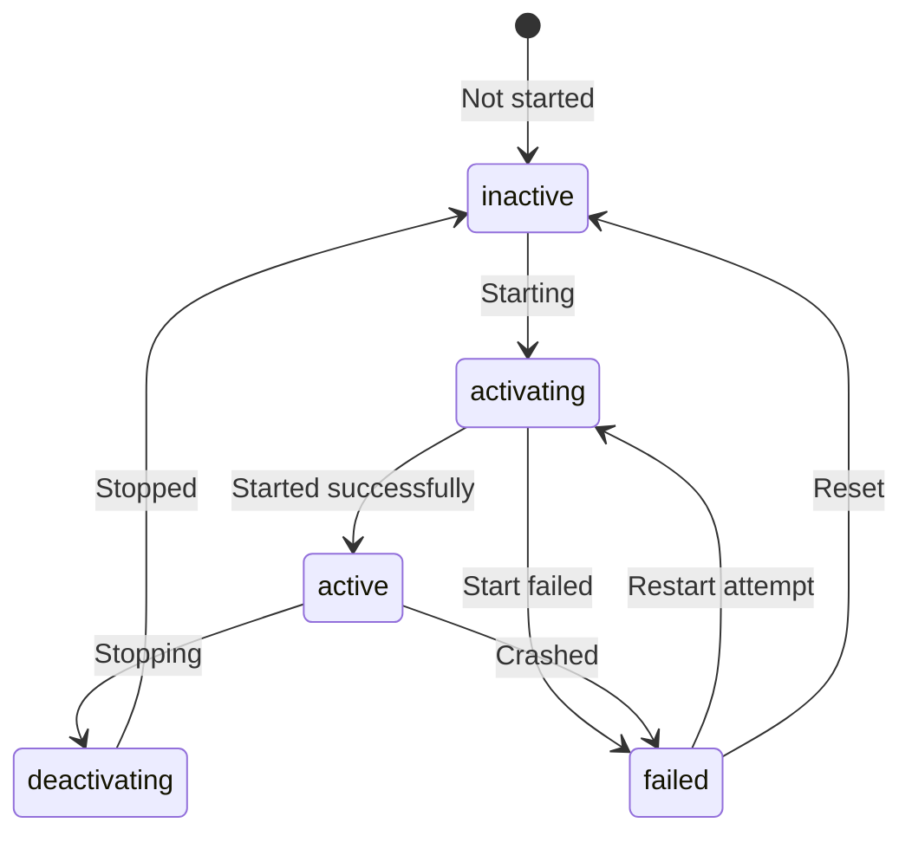

# How to List All Running Services and Their States on RHEL

Author: [nawazdhandala](https://www.github.com/nawazdhandala)

Tags: RHEL, systemd, Services, systemctl, Linux

Description: Learn how to list, filter, and inspect systemd services and their states on RHEL using systemctl, with practical examples for daily sysadmin work.

---

Whether you are auditing a new server, troubleshooting after an incident, or just getting the lay of the land, knowing how to list services and filter by state is fundamental. On RHEL, `systemctl` gives you several ways to view and filter the services running on your system. Some of the options are obvious. Others are buried in the man page. Here are the ones you will actually use.

---

## Listing Active Services

The most basic command shows all currently loaded and active units:

```bash
# List all active services
systemctl list-units --type=service
```

The output includes columns for the unit name, load state, active state, sub-state, and a description:

```bash
UNIT                     LOAD   ACTIVE SUB     DESCRIPTION
auditd.service           loaded active running Security Auditing Service
chronyd.service          loaded active running NTP client/server
crond.service            loaded active running Command Scheduler
dbus-broker.service      loaded active running D-Bus System Message Bus
firewalld.service        loaded active running firewalld - dynamic firewall daemon
httpd.service            loaded active running The Apache HTTP Server
sshd.service             loaded active running OpenSSH server daemon
systemd-journald.service loaded active running Journal Service
systemd-logind.service   loaded active running User Login Management
```

By default, this only shows units that systemd has loaded into memory. To include units that are installed but not loaded, add `--all`:

```bash
# List all services including inactive ones
systemctl list-units --type=service --all
```

---

## Filtering by State

You can narrow the list to specific states:

```bash
# Show only running services
systemctl list-units --type=service --state=running

# Show only failed services
systemctl list-units --type=service --state=failed

# Show services that exited (ran once and finished)
systemctl list-units --type=service --state=exited

# Show inactive services
systemctl list-units --type=service --state=inactive
```

Multiple states work too:

```bash
# Show services that are either running or failed
systemctl list-units --type=service --state=running,failed
```

---

## Understanding the States

Services go through several states during their lifecycle:



The columns in the output tell different things:

- **LOAD** - Whether the unit file was properly parsed (`loaded`, `not-found`, `error`)
- **ACTIVE** - The high-level state (`active`, `inactive`, `failed`, `activating`, `deactivating`)
- **SUB** - The lower-level state that gives more detail (`running`, `exited`, `dead`, `waiting`)

Common SUB states for services:

| SUB State | Meaning |
|-----------|---------|
| running | The service process is actively running |
| exited | The process ran and exited (normal for Type=oneshot) |
| dead | The service is not running |
| waiting | The service is waiting for an event |
| failed | The service crashed or could not start |

---

## Listing Unit Files vs. Running Units

There is an important distinction between `list-units` and `list-unit-files`:

```bash
# list-units: Shows units currently in memory (loaded)
systemctl list-units --type=service

# list-unit-files: Shows all installed unit files on disk
systemctl list-unit-files --type=service
```

Use `list-unit-files` when you want to see every service that is installed, even if it is not currently loaded:

```bash
# Show all installed service unit files with their enablement state
systemctl list-unit-files --type=service
```

The output shows the enablement state (enabled, disabled, static, masked) rather than the runtime state:

```bash
UNIT FILE                    STATE    PRESET
auditd.service               enabled  enabled
bluetooth.service            disabled enabled
chronyd.service              enabled  enabled
cups.service                 disabled disabled
httpd.service                enabled  disabled
```

The PRESET column shows what Red Hat considers the default. If STATE differs from PRESET, someone changed it manually or via configuration management.

### Filtering Unit Files by State

```bash
# Show only enabled services
systemctl list-unit-files --type=service --state=enabled

# Show only disabled services
systemctl list-unit-files --type=service --state=disabled

# Show static services (cannot be enabled directly)
systemctl list-unit-files --type=service --state=static

# Show masked services
systemctl list-unit-files --type=service --state=masked
```

---

## Custom Output Formats

For scripting and reporting, you often want cleaner output:

```bash
# Remove the legend (header and footer) for cleaner parsing
systemctl list-units --type=service --state=running --no-legend

# Combine with awk to extract just service names
systemctl list-units --type=service --state=running --no-legend | awk '{print $1}'
```

Count services by state:

```bash
# Count running services
systemctl list-units --type=service --state=running --no-legend | wc -l

# Count enabled services
systemctl list-unit-files --type=service --state=enabled --no-legend | wc -l
```

---

## Checking for Failed Services

This one deserves its own section because you will use it all the time:

```bash
# Quick way to see all failed units (not just services)
systemctl --failed
```

For just services:

```bash
# List only failed services
systemctl list-units --type=service --state=failed
```

If there are failed services and you want to clear the failed state after fixing the issue:

```bash
# Reset the failed state for a specific service
sudo systemctl reset-failed httpd

# Reset all failed states
sudo systemctl reset-failed
```

---

## Useful One-Liners for Daily Work

Here are some commands I use regularly:

```bash
# Quick system health check: any failed services?
systemctl is-system-running
```

This returns one of: `running` (all good), `degraded` (something failed), `maintenance`, `initializing`, or `stopping`.

```bash
# Show services sorted by startup time (slowest first)
systemd-analyze blame | head -20
```

```bash
# Show services that are enabled but not currently running
comm -23 <(systemctl list-unit-files --type=service --state=enabled --no-legend | awk '{print $1}' | sort) <(systemctl list-units --type=service --state=running --no-legend | awk '{print $1}' | sort)
```

```bash
# Compare enabled services between two servers (run on each, then diff)
systemctl list-unit-files --type=service --state=enabled --no-legend | awk '{print $1}' | sort > /tmp/enabled-services.txt
```

---

## Practical Audit Script

Here is a script that gives you a full service overview on a RHEL system:

```bash
#!/bin/bash
# service-audit.sh - Quick audit of systemd services

echo "=== System Status ==="
systemctl is-system-running

echo ""
echo "=== Failed Services ==="
FAILED=$(systemctl list-units --type=service --state=failed --no-legend | wc -l)
echo "Count: $FAILED"
if [ "$FAILED" -gt 0 ]; then
    systemctl list-units --type=service --state=failed --no-legend
fi

echo ""
echo "=== Running Services ==="
RUNNING=$(systemctl list-units --type=service --state=running --no-legend | wc -l)
echo "Count: $RUNNING"

echo ""
echo "=== Enabled Services ==="
ENABLED=$(systemctl list-unit-files --type=service --state=enabled --no-legend | wc -l)
echo "Count: $ENABLED"

echo ""
echo "=== Masked Services ==="
MASKED=$(systemctl list-unit-files --type=service --state=masked --no-legend | wc -l)
echo "Count: $MASKED"
if [ "$MASKED" -gt 0 ]; then
    systemctl list-unit-files --type=service --state=masked --no-legend
fi

echo ""
echo "=== Top 10 Slowest Services to Start ==="
systemd-analyze blame 2>/dev/null | head -10
```

Make it executable and run it:

```bash
# Make the script executable and run it
chmod +x service-audit.sh
./service-audit.sh
```

---

## Listing Other Unit Types

While this guide focuses on services, the same commands work for other unit types:

```bash
# List all loaded timers
systemctl list-units --type=timer

# List all mount points
systemctl list-units --type=mount

# List all socket units
systemctl list-units --type=socket

# List all target units
systemctl list-units --type=target

# List everything, all types
systemctl list-units
```

---

## Wrapping Up

Knowing how to quickly list and filter services is one of those skills that pays off every day. Use `list-units` for what is running right now, `list-unit-files` for what is installed and configured, and `--state` to filter down to exactly what you need. Build the `systemctl --failed` check into your login routine or your monitoring setup, and you will catch problems before they become incidents.
