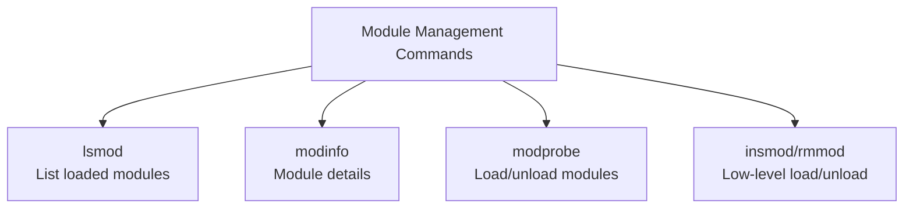

# How to Load and Unload Kernel Modules on RHEL

Author: [nawazdhandala](https://www.github.com/nawazdhandala)

Tags: RHEL, Kernel Modules, Modprobe, Linux

Description: A practical guide to managing kernel modules on RHEL, covering how to list, load, unload, and configure modules using modprobe, lsmod, and modinfo.

---

## What Are Kernel Modules?

Kernel modules are pieces of code that can be loaded into the running kernel on demand without rebooting. They extend the kernel's functionality, adding support for hardware drivers, filesystems, network protocols, and more. Instead of compiling everything into a monolithic kernel, Linux keeps most functionality in modules that load only when needed.

On RHEL, kernel modules live in `/lib/modules/$(uname -r)/` and have the `.ko` (kernel object) or `.ko.xz` (compressed) extension.

## Listing Loaded Modules

```bash
# List all currently loaded modules
lsmod

# Count how many modules are loaded
lsmod | wc -l

# Check if a specific module is loaded
lsmod | grep ext4

# Get detailed information about a module
modinfo ext4
```

The `lsmod` output has three columns: module name, size in bytes, and the number of other modules using it (along with their names).

## Getting Module Information

```bash
# Show detailed module info including description, author, and parameters
modinfo br_netfilter

# List only the parameters a module accepts
modinfo -p snd_hda_intel

# Find where a module file is located
modinfo -n bridge
```



## Loading Modules

The `modprobe` command is the preferred way to load modules because it automatically handles dependencies.

```bash
# Load the bridge module
sudo modprobe bridge

# Load br_netfilter for container networking
sudo modprobe br_netfilter

# Load a module with specific parameters
sudo modprobe bonding mode=4 miimon=100

# Verify the module loaded
lsmod | grep bridge
```

### insmod vs modprobe

`insmod` is the low-level command that loads a single module file without resolving dependencies. You almost never need it.

```bash
# insmod requires the full path and does not handle dependencies
sudo insmod /lib/modules/$(uname -r)/kernel/net/bridge/bridge.ko.xz

# modprobe is smarter - it resolves dependencies automatically
sudo modprobe bridge
```

Stick with `modprobe`. It reads the module dependency database and loads prerequisites first.

## Unloading Modules

```bash
# Unload a module
sudo modprobe -r bridge

# Force removal (use with caution)
sudo modprobe -r --force bridge

# Check if the module is in use before removing
lsmod | grep bridge
```

A module cannot be unloaded if it is in use by another module or if processes are actively using it. The "Used by" column in `lsmod` shows the reference count.

```bash
# See what depends on a module
lsmod | grep snd
# snd_hda_intel   ...   3  snd_hda_codec_hdmi,snd_hda_codec_realtek,...
```

## Loading Modules at Boot

To have a module load automatically at every boot, create a configuration file in `/etc/modules-load.d/`.

```bash
# Load br_netfilter at boot (needed for Kubernetes)
echo "br_netfilter" | sudo tee /etc/modules-load.d/br_netfilter.conf

# Load multiple modules
sudo tee /etc/modules-load.d/k8s.conf <<EOF
br_netfilter
overlay
ip_vs
ip_vs_rr
ip_vs_wrr
ip_vs_sh
EOF
```

These files are read by `systemd-modules-load.service` during boot.

```bash
# Check the status of the module loading service
systemctl status systemd-modules-load

# Manually trigger module loading
sudo systemctl restart systemd-modules-load
```

## Configuring Module Parameters

Some modules accept parameters that modify their behavior. You can set these permanently in `/etc/modprobe.d/`.

```bash
# Set bonding module parameters
sudo tee /etc/modprobe.d/bonding.conf <<EOF
options bonding mode=4 miimon=100 lacp_rate=1
EOF

# Set a parameter for the snd_hda_intel audio module
sudo tee /etc/modprobe.d/snd_hda_intel.conf <<EOF
options snd_hda_intel power_save=1 power_save_controller=Y
EOF
```

To check what parameters a module currently has:

```bash
# View current parameter values for a loaded module
cat /sys/module/bridge/parameters/multicast_igmp_version 2>/dev/null

# List all parameters and current values
for param in /sys/module/bonding/parameters/*; do
    echo "$(basename $param) = $(cat $param)"
done
```

## Module Dependencies

The kernel maintains a dependency database that `modprobe` uses to resolve module requirements.

```bash
# Rebuild the module dependency database
sudo depmod -a

# Show dependencies for a specific module
modprobe --show-depends bridge

# Check the dependency database file
less /lib/modules/$(uname -r)/modules.dep
```

You need to run `depmod -a` when you manually add module files, such as after building a custom module or installing a DKMS package.

## Listing Available Modules

```bash
# List all available modules (not just loaded ones)
find /lib/modules/$(uname -r)/kernel -name "*.ko*" | wc -l

# Search for modules related to a specific topic
find /lib/modules/$(uname -r)/kernel -name "*bridge*"

# Use modprobe to search by alias
modprobe -c | grep "alias.*usb"
```

## Troubleshooting Module Issues

```bash
# Check for module loading errors in the journal
sudo journalctl -b | grep -i "module"

# Verbose module loading for debugging
sudo modprobe -v bridge

# Dry run to see what would happen without actually loading
sudo modprobe -n -v bridge

# Check if a module is built into the kernel (not loadable)
grep CONFIG_EXT4 /boot/config-$(uname -r)
# If set to 'y', it is built-in. If 'm', it is a loadable module.
```

## Working with DKMS Modules

Dynamic Kernel Module Support (DKMS) automatically rebuilds third-party modules when the kernel is updated.

```bash
# Install DKMS
sudo dnf install dkms -y

# Check DKMS module status
dkms status

# Rebuild all DKMS modules for the current kernel
sudo dkms autoinstall
```

## Wrapping Up

Kernel module management on RHEL is mostly about knowing four tools: `lsmod` to see what is loaded, `modinfo` to learn about a module, `modprobe` to load and unload, and the configuration directories under `/etc/modules-load.d/` and `/etc/modprobe.d/` for persistent settings. Use `modprobe` instead of `insmod`, always check dependencies before unloading, and keep your persistent module configurations in clearly named files.
