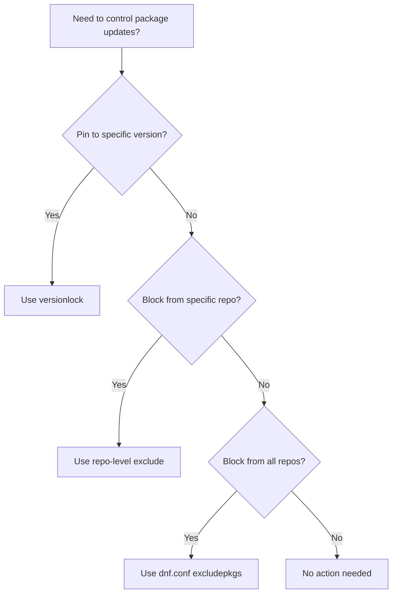

# How to Lock Package Versions and Exclude Packages from Updates on RHEL 9

Author: [nawazdhandala](https://www.github.com/nawazdhandala)

Tags: RHEL, DNF, Version Lock, Package Management, Linux

Description: Learn how to use the DNF versionlock plugin and exclusion rules to prevent specific packages from being updated on RHEL 9, keeping your critical software at tested versions.

---

There are times when you absolutely do not want a package updated. Maybe your application is certified against a specific library version, or a known regression in the latest update breaks something. Whatever the reason, RHEL 9 gives you two mechanisms to control this: the versionlock plugin and package exclusions. This guide covers both approaches and when to use each one.

## Why Lock Package Versions?

A few common scenarios:

- **Application certification.** Your vendor certifies their software against specific versions of Java, PostgreSQL, or OpenSSL. Updating those packages voids the certification.
- **Known regressions.** A new package version introduces a bug. You want to skip it until the fix lands.
- **Regulatory compliance.** Your change management process requires explicit approval before certain packages can be updated.
- **Kernel pinning.** You need to stay on a specific kernel version because of a hardware driver or custom module.

## Method 1: DNF Versionlock Plugin

The versionlock plugin is the cleanest way to pin packages to specific versions. It integrates directly with DNF and prevents both upgrades and downgrades of locked packages.

### Install the Plugin

```bash
# Install the versionlock plugin
sudo dnf install -y python3-dnf-plugin-versionlock
```

### Lock a Package at Its Current Version

```bash
# Lock httpd at whatever version is currently installed
sudo dnf versionlock add httpd
```

This reads the installed version and creates a lock rule for it. The package will not be updated, downgraded, or removed by DNF operations.

### Lock a Package at a Specific Version

If you want to lock to a version that is not currently installed:

```bash
# Lock to a specific version string
sudo dnf versionlock add httpd-2.4.57-5.el9
```

### View Current Locks

```bash
# List all versionlock entries
dnf versionlock list
```

Example output:

```
httpd-0:2.4.57-5.el9.*
openssl-1:3.0.7-20.el9.*
```

### Remove a Lock

When you are ready to allow updates again:

```bash
# Remove the versionlock for a specific package
sudo dnf versionlock delete httpd
```

### Clear All Locks

```bash
# Remove all versionlock entries
sudo dnf versionlock clear
```

### How Versionlock Behaves During Updates

When you run `dnf update` with locks in place, locked packages are silently skipped:

```bash
# Update everything except locked packages
sudo dnf update -y
```

DNF will show the locked packages in the "Skipping packages with versionlock" section of its output. This makes it clear what was held back.

### Versionlock Configuration File

The lock rules are stored in a plain text file:

```bash
# View the versionlock configuration
cat /etc/dnf/plugins/versionlock.list
```

You can edit this file directly if you need to add or modify entries in bulk. The format is the full NEVRA (Name-Epoch:Version-Release.Arch) pattern.

## Method 2: Exclude Packages in dnf.conf

If you want to exclude a package from all DNF operations globally, add it to the `[main]` section of `/etc/dnf/dnf.conf`:

```bash
# Edit the DNF configuration
sudo vi /etc/dnf/dnf.conf
```

Add the `excludepkgs` directive:

```ini
[main]
gpgcheck=1
installonly_limit=3
clean_requirements_on_remove=True
best=True
skip_if_unavailable=False
excludepkgs=kernel* php*
```

### Wildcards in Exclusions

You can use glob patterns to exclude groups of packages:

```ini
# Exclude all kernel-related packages and all php packages
excludepkgs=kernel* php* java-*-openjdk*
```

### Multiple Exclusions

Separate multiple patterns with spaces or commas:

```ini
excludepkgs=kernel*, php*, mariadb*
```

### Temporarily Override Exclusions

If you need to update an excluded package for a specific operation:

```bash
# Override the exclusion for this one command
sudo dnf update --disableexcludes=main kernel
```

The `--disableexcludes` flag accepts:
- `main` - Disable exclusions from `dnf.conf`
- `all` - Disable all exclusions (from dnf.conf and repo files)
- A repo ID - Disable exclusions from a specific repo

## Method 3: Exclude Packages in Repository Files

You can also exclude packages at the repository level. This is useful when you want to get most packages from a repo but block specific ones:

```bash
# Edit a repo file to exclude specific packages
sudo vi /etc/yum.repos.d/epel.repo
```

Add the `exclude` directive to the repo section:

```ini
[epel]
name=Extra Packages for Enterprise Linux 9
metalink=https://mirrors.fedoraproject.org/metalink?repo=epel-9&arch=$basearch
enabled=1
gpgcheck=1
gpgkey=file:///etc/pki/rpm-gpg/RPM-GPG-KEY-EPEL-9
exclude=nagios* collectd*
```

This prevents those packages from being installed or updated from EPEL, while still allowing them from other repos.

## Versionlock vs Exclude: When to Use Which



| Feature | Versionlock | Exclude (dnf.conf) | Exclude (repo file) |
|---------|-------------|-------------------|---------------------|
| Pins to specific version | Yes | No | No |
| Blocks all updates | Yes | Yes | Yes (from that repo) |
| Blocks installation | No (already installed) | Yes | Yes (from that repo) |
| Scope | All repos | All repos | Single repo |
| Easy to list/manage | Yes (dnf versionlock list) | Manual file editing | Manual file editing |
| Per-package granularity | Yes | Yes (with wildcards) | Yes (with wildcards) |

## Practical Scenarios

### Scenario 1: Pin the Kernel Version

Your custom kernel module only works with a specific kernel. Lock it:

```bash
# Lock the current kernel version
sudo dnf versionlock add kernel
sudo dnf versionlock add kernel-core
sudo dnf versionlock add kernel-modules
sudo dnf versionlock add kernel-modules-core

# Verify the locks
dnf versionlock list
```

Now `dnf update` will skip kernel packages entirely.

### Scenario 2: Skip a Broken Update

A new version of OpenSSL has a known bug. Exclude it temporarily:

```bash
# Lock openssl at the current version
sudo dnf versionlock add openssl openssl-libs

# When the fix is released, remove the lock
sudo dnf versionlock delete openssl
sudo dnf versionlock delete openssl-libs

# Then update normally
sudo dnf update openssl openssl-libs
```

### Scenario 3: Block EPEL from Overriding RHEL Packages

You use EPEL but want to make sure it never provides packages that also exist in BaseOS or AppStream:

```bash
# Add exclusions to the EPEL repo file
sudo vi /etc/yum.repos.d/epel.repo
```

```ini
[epel]
# ... existing config ...
exclude=httpd* nginx* openssl* curl*
```

### Scenario 4: Freeze All Packages Before a Compliance Audit

If you need to freeze the entire system state:

```bash
# Lock every installed package (generates a lot of entries)
dnf list installed | awk 'NR>1 {print $1}' | while read pkg; do
    sudo dnf versionlock add "$pkg"
done
```

After the audit, clear all locks:

```bash
# Remove all locks after the audit
sudo dnf versionlock clear
```

## Managing Locks at Scale

If you manage many systems, you will want to standardize your versionlock configuration.

### Using Ansible

```yaml
# Ansible task to lock packages across your fleet
- name: Lock critical packages
  community.general.dnf_versionlock:
    name:
      - kernel-5.14.0-362.8.1.el9_3
      - openssl-3.0.7-24.el9
    state: present
```

### Using a Central Configuration

Distribute the versionlock list file from a configuration management system:

```bash
# The versionlock list is a simple text file
# Push it from your config management to all nodes
/etc/dnf/plugins/versionlock.list
```

### Monitoring Locked Packages

Set up a check that alerts you when locked packages have newer versions available:

```bash
# Check if locked packages have updates available
dnf check-update 2>/dev/null | grep -f <(dnf versionlock list | sed 's/-0:.*//;s/-[0-9]:.*//')
```

This helps you remember to review locks periodically instead of leaving packages pinned indefinitely.

## Common Pitfalls

1. **Forgetting to lock dependencies.** If you lock `httpd` but not `httpd-core` or `mod_ssl`, a system update could pull in mismatched versions. Lock the entire package family.

2. **Leaving locks forever.** Version locks should be temporary. Set a calendar reminder to review them monthly. Outdated locks mean missed security patches.

3. **Not documenting why a lock exists.** The versionlock file does not support comments. Keep a separate document or use your change management system to track why each lock was created.

4. **Excluding too broadly.** A wildcard like `kernel*` also catches `kernel-tools`, `kernel-headers`, and other packages you might actually want to update. Be specific.

5. **Confusing versionlock with exclude.** Versionlock pins to a specific version (the package stays installed but does not change). Exclude hides the package entirely (it cannot be installed or updated).

Package version management is a balancing act between stability and security. Lock what you must, document why, review regularly, and remove locks as soon as they are no longer needed. Your future self will appreciate the discipline.
