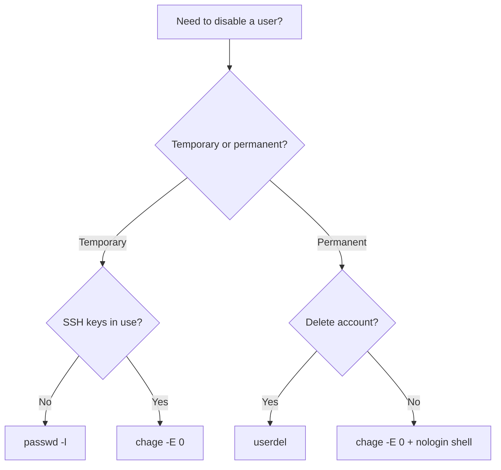

# How to Lock and Unlock User Accounts on RHEL 9

Author: [nawazdhandala](https://www.github.com/nawazdhandala)

Tags: RHEL, User Management, Account Locking, Security, Linux

Description: A complete guide to locking and unlocking user accounts on RHEL 9 using passwd, usermod, and chage, including how to verify lock status and handle edge cases.

---

## When to Lock an Account

There are plenty of reasons to lock a user account: an employee leaves the company, a contractor's engagement ends, you suspect a compromised account, or you just need to temporarily disable access during an audit. RHEL 9 gives you several ways to do this, each with slightly different behavior. Knowing the differences matters because locking an account the wrong way can leave a backdoor open.

## Method 1: passwd -l (Lock the Password)

The `passwd -l` command locks the account by prepending an exclamation mark (`!`) to the encrypted password in `/etc/shadow`. This makes the password hash invalid, so password authentication fails.

```bash
# Lock the user's password
sudo passwd -l jsmith
```

To unlock:

```bash
# Unlock the user's password
sudo passwd -u jsmith
```

**What this does and does not do:**
- It prevents password-based login (local console, SSH with password)
- It does NOT prevent SSH key-based login
- It does NOT prevent `su - jsmith` if you are root
- It does NOT affect running processes owned by that user

This is the lightest form of locking. If the user has SSH keys set up, they can still get in.

## Method 2: usermod -L (Same Thing, Different Command)

`usermod -L` does the same thing as `passwd -l`. It prepends `!` to the password hash.

```bash
# Lock the account using usermod
sudo usermod -L jsmith
```

To unlock:

```bash
# Unlock the account using usermod
sudo usermod -U jsmith
```

The difference between `passwd -l` and `usermod -L` is mostly a matter of preference. They produce the same result. I tend to use `passwd -l` because it is shorter to type, but either is fine.

## Method 3: chage -E (Expire the Account)

This is a stronger lock. Setting the account expiration date to a date in the past makes the account completely unusable.

```bash
# Expire the account immediately (set expiry to epoch day 0)
sudo chage -E 0 jsmith
```

To un-expire:

```bash
# Remove the account expiration
sudo chage -E -1 jsmith
```

The value `0` sets the expiry to January 1, 1970 (day zero of the epoch). The value `-1` removes the expiry entirely.

**What this does:**
- Blocks ALL authentication methods, including SSH keys
- The user sees "Your account has expired" when trying to log in
- PAM enforces this at every authentication point

This is the approach I recommend when you actually want to fully disable an account.

## Method 4: Set the Shell to /sbin/nologin

Changing the login shell to `/sbin/nologin` prevents interactive logins while still allowing the account to own files and run cron jobs.

```bash
# Set the shell to nologin
sudo usermod -s /sbin/nologin jsmith
```

To restore:

```bash
# Restore the normal shell
sudo usermod -s /bin/bash jsmith
```

When someone tries to log in, they see the message from `/etc/nologin.txt` (if it exists) or a default "This account is currently not available" message.

**Use this when:**
- The account needs to exist for file ownership
- The account runs services (like `apache` or `nginx`) but should never have interactive logins
- You want to block shell access but allow other PAM-authenticated services

## Comparing the Methods

Here is a quick comparison:

| Method | Blocks Password Auth | Blocks SSH Keys | Blocks su | Blocks All PAM |
|--------|---------------------|----------------|-----------|----------------|
| `passwd -l` | Yes | No | No | No |
| `usermod -L` | Yes | No | No | No |
| `chage -E 0` | Yes | Yes | Yes | Yes |
| `nologin` shell | Yes (interactive) | Yes (interactive) | Yes | No |



## Checking if an Account is Locked

You need to verify the lock status, not just trust that you ran the command. Here are the checks.

### Check the Password Hash

```bash
# Look at the shadow entry - a '!' or '!!' prefix means locked
sudo grep jsmith /etc/shadow
```

If you see `jsmith:!!:...` or `jsmith:!$6$...`, the password is locked. The `!!` means no password was ever set (and it is locked). The `!` before a hash means a password exists but is locked.

### Check Account Expiry

```bash
# Show account aging information
sudo chage -l jsmith
```

Look at the "Account expires" line. If it shows a past date, the account is expired.

### Check the Shell

```bash
# Check the user's login shell
getent passwd jsmith
```

The last field shows the shell. If it is `/sbin/nologin` or `/bin/false`, interactive login is blocked.

### All-in-One Check

Here is a quick script that checks everything:

```bash
# Comprehensive account lock status check
USER="jsmith"

echo "=== Password Status ==="
sudo passwd -S $USER

echo "=== Account Expiry ==="
sudo chage -l $USER | grep "Account expires"

echo "=== Login Shell ==="
getent passwd $USER | cut -d: -f7
```

The `passwd -S` output shows the account status in the second field:
- `PS` - Password set (active)
- `LK` - Locked
- `NP` - No password

## Locking Multiple Accounts

If you need to lock several accounts at once, for example during a security incident:

```bash
# Lock multiple accounts from a list
for user in jsmith bwilson kpatel; do
    sudo passwd -l "$user"
    sudo chage -E 0 "$user"
    echo "Locked: $user"
done
```

## Handling Active Sessions

Locking an account does not kick out a user who is already logged in. You need to handle active sessions separately.

```bash
# Find active sessions for the user
who | grep jsmith

# Find all processes owned by the user
ps -u jsmith

# Kill all processes owned by the user (use with caution)
sudo pkill -u jsmith
```

If you want to be thorough:

```bash
# Lock the account AND terminate active sessions
sudo passwd -l jsmith
sudo chage -E 0 jsmith
sudo pkill -u jsmith
```

## Service Accounts

Service accounts (like `apache`, `postgres`, `nginx`) should always have their shell set to `/sbin/nologin`. If you find a service account with a real shell, fix it:

```bash
# Find service accounts with real shells (UIDs below 1000)
awk -F: '$3 < 1000 && $7 != "/sbin/nologin" && $7 != "/bin/false" {print $1, $7}' /etc/passwd
```

The only system account that should have a real shell is `root`.

## Wrapping Up

For quick, temporary lockouts where the user only authenticates with passwords, `passwd -l` works fine. For anything serious, like a terminated employee or a suspected compromise, use `chage -E 0` combined with setting the shell to `/sbin/nologin`. Always verify the lock with `passwd -S` and `chage -l`, and do not forget to kill active sessions. The worst thing is locking an account and finding out the user was still logged in via an SSH key the whole time.
