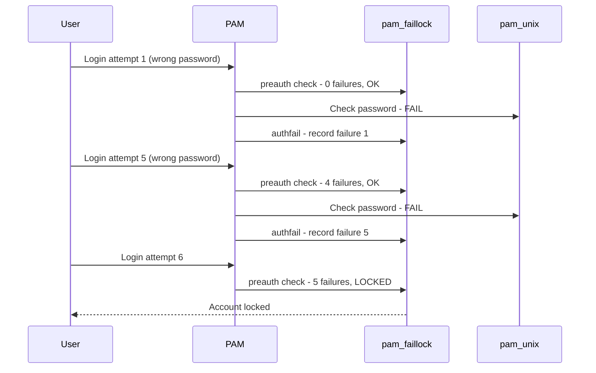

# How to Lock User Accounts After Failed Login Attempts on RHEL

Author: [nawazdhandala](https://www.github.com/nawazdhandala)

Tags: RHEL, Account Locking, faillock, Security, Linux

Description: Configure RHEL to automatically lock user accounts after a specified number of failed login attempts using faillock, with guidance on monitoring and unlocking.

---

Automated account locking is your first line of defense against brute-force attacks. If someone hammers a user account with bad passwords, the account should lock before they get lucky. On RHEL, the `faillock` utility and `pam_faillock` module handle this. Here is how to set it up properly.

## Quick Setup with authselect

The fastest way to enable account locking:

```bash
# Enable the faillock feature
sudo authselect enable-feature with-faillock

# Verify it is enabled
sudo authselect current
```

Then configure the lockout parameters:

```bash
sudo vi /etc/security/faillock.conf
```

```bash
# Lock after 5 failed attempts
deny = 5

# Automatically unlock after 15 minutes (900 seconds)
unlock_time = 900

# Count failures within a 10-minute window
fail_interval = 600

# Log failures to syslog
audit

# Suppress failure messages during pre-auth
silent
```

That is it for the basic setup. Let me walk through the details.

## Understanding the Lock Mechanism



The module appears twice in the PAM stack:
1. **preauth** - Checks if the account is already locked before even trying the password.
2. **authfail** - Records the failure after an unsuccessful authentication.

## Checking and Managing Locked Accounts

### View all failed attempts

```bash
# Show failure records for all users
sudo faillock
```

### Check a specific user

```bash
sudo faillock --user jsmith
```

Output shows each failure with timestamp and source:

```bash
jsmith:
When                Type  Source                                           Valid
2026-03-04 14:22:01 RHOST 10.0.1.50                                       V
2026-03-04 14:22:04 RHOST 10.0.1.50                                       V
2026-03-04 14:22:06 RHOST 10.0.1.50                                       V
2026-03-04 14:22:08 RHOST 10.0.1.50                                       V
2026-03-04 14:22:10 RHOST 10.0.1.50                                       V
```

The `V` means the failure is still valid (within the fail_interval).

### Unlock an account manually

```bash
# Reset the failure counter
sudo faillock --user jsmith --reset

# Verify the account is unlocked
sudo faillock --user jsmith
```

## Advanced Configuration

### Lock root too

By default, root is exempt from locking. To include root:

```bash
sudo vi /etc/security/faillock.conf
```

```bash
even_deny_root
root_unlock_time = 60
```

Use a shorter unlock time for root since locking root permanently could leave you stranded.

### Permanent lockout (until admin intervention)

For high-security environments:

```bash
deny = 3
unlock_time = 0
```

Setting `unlock_time = 0` means the account stays locked until an admin runs `faillock --reset`.

### Adjust the failure window

The `fail_interval` determines how long failures count. If someone fails once today and once next week, that is not a brute-force attack:

```bash
# Only count failures within a 15-minute window
fail_interval = 900
```

## Where Failure Records Are Stored

Failure records are stored in `/var/run/faillock/`:

```bash
# List failure record files
ls -la /var/run/faillock/
```

Each user who has had a failure gets a binary file here. These files are cleared on reboot since `/var/run` is a tmpfs.

If you need failures to persist across reboots:

```bash
# In /etc/security/faillock.conf
dir = /var/lib/faillock
```

```bash
# Create the persistent directory
sudo mkdir -p /var/lib/faillock
sudo chmod 755 /var/lib/faillock
```

## Monitoring Account Lockouts

### Check syslog for lockout events

```bash
# Look for faillock messages
sudo grep faillock /var/log/secure | tail -20

# Look for "account temporarily locked" messages
sudo grep "temporarily locked" /var/log/secure
```

### Create a lockout monitoring script

```bash
sudo vi /usr/local/bin/monitor-lockouts.sh
```

```bash
#!/bin/bash
# Alert on locked accounts

THRESHOLD=5  # This should match your deny setting
ALERT_SENT="/var/run/lockout-alerts"
mkdir -p "$ALERT_SENT"

for record in /var/run/faillock/*; do
    [ -f "$record" ] || continue
    user=$(basename "$record")

    count=$(faillock --user "$user" 2>/dev/null | grep -c " V$")

    if [ "$count" -ge "$THRESHOLD" ]; then
        if [ ! -f "$ALERT_SENT/$user" ]; then
            logger -p auth.crit "LOCKOUT: Account $user is locked ($count failures)"
            touch "$ALERT_SENT/$user"
        fi
    else
        rm -f "$ALERT_SENT/$user" 2>/dev/null
    fi
done
```

```bash
sudo chmod 700 /usr/local/bin/monitor-lockouts.sh

# Run every 5 minutes via cron
echo "*/5 * * * * root /usr/local/bin/monitor-lockouts.sh" | sudo tee /etc/cron.d/lockout-monitor
```

## Testing the Lockout

Always test before relying on it:

```bash
# Create a test user
sudo useradd locktest
sudo passwd locktest

# Try to log in with a wrong password via SSH
# Do this deny+1 times
ssh locktest@localhost   # enter wrong password 6 times

# Check the lock status
sudo faillock --user locktest

# Unlock the test user
sudo faillock --user locktest --reset

# Clean up
sudo userdel -r locktest
```

## Troubleshooting

### Account is not locking after failed attempts

```bash
# Verify faillock is in the PAM stack
grep pam_faillock /etc/pam.d/system-auth
grep pam_faillock /etc/pam.d/password-auth
```

You should see both `preauth` and `authfail` entries.

### Account locked but user says they did not fail

Check the failure records for the source IP:

```bash
sudo faillock --user jsmith
```

If the source is an IP that is not the user's workstation, it could be someone else trying to brute-force that account.

### Lockout happens too quickly

Increase the `deny` value or decrease `fail_interval`:

```bash
deny = 10
fail_interval = 300
```

## Wrapping Up

Account locking with faillock is simple to set up and effective against brute-force attacks. The key decisions are how many failures to allow, how long the lockout lasts, and whether to include root. Start with reasonable defaults (5 attempts, 15-minute lockout), monitor for lockout events, and adjust based on what you see in production. Make sure your helpdesk team knows how to unlock accounts, because they will get those calls.
