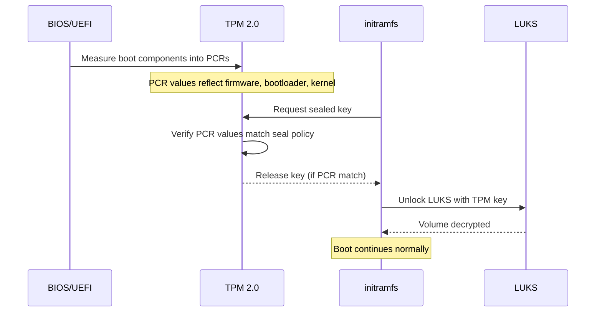

# How to Configure LUKS Encryption with a TPM 2.0 Key on RHEL

Author: [nawazdhandala](https://www.github.com/nawazdhandala)

Tags: RHEL, LUKS, TPM 2.0, Encryption, Secure Boot, Linux

Description: Configure LUKS disk encryption on RHEL to use a TPM 2.0 chip for automated unlocking, binding decryption to the hardware platform state.

---

A Trusted Platform Module (TPM) 2.0 chip can securely store encryption keys bound to the hardware platform state. By binding a LUKS key to the TPM, you can automatically unlock encrypted volumes at boot without entering a passphrase, while ensuring that the volume can only be unlocked on the specific hardware and software configuration it was sealed to. This guide covers the setup on RHEL.

## How TPM-Based LUKS Unlocking Works



If the boot chain changes (different kernel, modified bootloader, or BIOS update), the PCR values will not match and the TPM will refuse to release the key. This protects against offline tampering.

## Prerequisites

```bash
# Verify TPM 2.0 is available
ls /dev/tpm*
# Should show /dev/tpm0 and/or /dev/tpmrm0

# Check TPM details
cat /sys/class/tpm/tpm0/tpm_version_major
# Should show: 2

# Install required packages
sudo dnf install tpm2-tools clevis clevis-luks clevis-dracut clevis-systemd
```

## Understanding Clevis and Tang/TPM

RHEL uses the Clevis framework for automated LUKS unlocking. Clevis supports several pin types:

| Pin | Description |
|-----|-------------|
| tpm2 | Binds to local TPM 2.0 hardware |
| tang | Binds to a network Tang key server |
| sss | Shamir's Secret Sharing (combine multiple pins) |

This guide focuses on the TPM2 pin.

## Step 1: Check TPM PCR Values

Platform Configuration Registers (PCRs) store measurements of the boot chain:

```bash
# View current PCR values
sudo tpm2_pcrread

# Common PCRs:
# PCR 0  - BIOS/firmware
# PCR 1  - BIOS configuration
# PCR 4  - Boot manager
# PCR 7  - Secure Boot state
# PCR 8  - Kernel command line (GRUB)
# PCR 9  - Kernel and initramfs
```

## Step 2: Bind LUKS to TPM

### Basic TPM Binding

```bash
# Bind LUKS to the TPM (uses default PCRs: 7)
sudo clevis luks bind -d /dev/sdb tpm2 '{"pcr_bank":"sha256","pcr_ids":"7"}'

# Enter an existing LUKS passphrase when prompted
```

### Binding with Multiple PCRs

For stronger security, bind to multiple PCRs:

```bash
# Bind to PCRs 7 (Secure Boot) and 8 (kernel command line)
sudo clevis luks bind -d /dev/sdb tpm2 '{"pcr_bank":"sha256","pcr_ids":"7,8"}'
```

### Binding with a PCR Policy and Passphrase

For the most secure setup, require both TPM and a passphrase:

```bash
# This uses Shamir's Secret Sharing to require both factors
sudo clevis luks bind -d /dev/sdb sss \
    '{"t":2,"pins":{"tpm2":{"pcr_bank":"sha256","pcr_ids":"7"},"tang":{"url":"http://tang.example.com"}}}'
```

## Step 3: Configure Boot Integration

### For Root Volume Encryption

If the encrypted device is the root filesystem, you need to rebuild the initramfs:

```bash
# Rebuild initramfs with Clevis support
sudo dracut -fv --regenerate-all

# Verify Clevis modules are included
lsinitrd /boot/initramfs-$(uname -r).img | grep clevis
```

### For Secondary Volumes

For non-root volumes, enable the Clevis systemd units:

```bash
# Enable Clevis unlock at boot for non-root volumes
sudo systemctl enable clevis-luks-askpass.path
```

## Step 4: Test the Configuration

### Test Without Rebooting

```bash
# Verify the Clevis binding
sudo clevis luks list -d /dev/sdb

# Test unlocking with Clevis
sudo cryptsetup luksClose data_encrypted 2>/dev/null
sudo clevis luks unlock -d /dev/sdb -n data_encrypted

# Verify it opened
ls /dev/mapper/data_encrypted
```

### Test with a Reboot

```bash
# Reboot and verify automatic unlock
sudo systemctl reboot

# After reboot, check if the volume was automatically unlocked
lsblk -f
sudo cryptsetup status data_encrypted
```

## Step 5: Maintain a Passphrase Backup

Always keep a passphrase key slot active as a fallback:

```bash
# Verify passphrase slots still exist
sudo cryptsetup luksDump /dev/sdb

# Never remove all passphrase slots
# The TPM binding adds a new key slot, it does not replace existing ones
```

## Handling TPM Seal Failures

If the TPM refuses to unseal (after a BIOS update, kernel update, etc.):

```bash
# At the boot passphrase prompt, enter your passphrase manually

# After booting, re-bind to the TPM with the new PCR values
# First, remove the old binding
sudo clevis luks unbind -d /dev/sdb -s SLOT_NUMBER

# Re-bind with current PCR values
sudo clevis luks bind -d /dev/sdb tpm2 '{"pcr_bank":"sha256","pcr_ids":"7"}'

# Rebuild initramfs
sudo dracut -fv --regenerate-all
```

## Listing and Managing Clevis Bindings

```bash
# List all Clevis bindings on a device
sudo clevis luks list -d /dev/sdb

# Example output:
# 1: tpm2 '{"hash":"sha256","key":"ecc","pcr_bank":"sha256","pcr_ids":"7"}'

# Remove a specific binding (by slot number)
sudo clevis luks unbind -d /dev/sdb -s 1
```

## Advanced: Custom PCR Policy

For environments where kernel updates are frequent, you might want to avoid binding to PCR 9 (which changes with every kernel):

```bash
# Bind only to Secure Boot state (PCR 7)
# This survives kernel updates but still detects firmware tampering
sudo clevis luks bind -d /dev/sdb tpm2 '{"pcr_bank":"sha256","pcr_ids":"7"}'
```

For high-security environments:

```bash
# Bind to firmware, Secure Boot, and boot configuration
sudo clevis luks bind -d /dev/sdb tpm2 '{"pcr_bank":"sha256","pcr_ids":"0,1,7"}'
```

## Troubleshooting

### TPM Device Not Found

```bash
# Check if the TPM module is loaded
lsmod | grep tpm

# Load TPM modules if missing
sudo modprobe tpm_tis
sudo modprobe tpm_crb

# Check dmesg for TPM errors
sudo dmesg | grep -i tpm
```

### Clevis Fails to Unlock

```bash
# Check the journal for errors
sudo journalctl -b | grep -i clevis

# Verify PCR values have not changed
sudo tpm2_pcrread sha256:7

# Test the binding manually
sudo clevis luks unlock -d /dev/sdb -n test_unlock
```

### After BIOS/Firmware Update

A BIOS update changes PCR 0 and potentially other PCRs:

```bash
# Boot with passphrase
# Re-bind to TPM with new PCR values
sudo clevis luks unbind -d /dev/sdb -s SLOT
sudo clevis luks bind -d /dev/sdb tpm2 '{"pcr_bank":"sha256","pcr_ids":"7"}'
sudo dracut -fv --regenerate-all
```

## Summary

TPM 2.0 based LUKS unlocking on RHEL, configured through Clevis, provides hardware-bound automated disk decryption. The TPM seals the encryption key to specific platform state measurements (PCRs), so the volume can only be unlocked on the original hardware with an unmodified boot chain. Always maintain a passphrase key slot as a fallback, and be prepared to re-bind after firmware or boot configuration changes.
