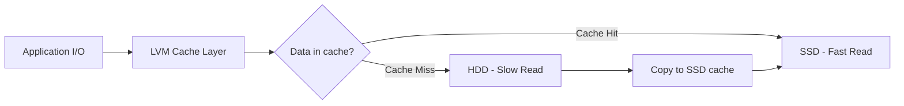

# How to Configure LVM Cache with SSD on RHEL

Author: [nawazdhandala](https://www.github.com/nawazdhandala)

Tags: RHEL, LVM, Cache, SSD, Storage, Linux

Description: Learn how to use LVM caching to accelerate HDD storage with an SSD cache layer on RHEL.

---

If you have slow spinning disks but also have an SSD available, LVM cache lets you use the SSD as a fast cache layer in front of the HDD. Frequently accessed data gets served from the SSD while the bulk storage stays on the cheaper HDD.

## How LVM Cache Works



LVM supports two caching modes:
- **dm-cache**: Full block-level caching with write-back or write-through support
- **dm-writecache**: Write-focused caching that accelerates writes

## Prerequisites

You need:
- A volume group with the origin data on HDD
- An SSD added to the same volume group (or a separate VG)

```bash
# Set up the HDD-based volume group
sudo pvcreate /dev/sdb    # HDD
sudo pvcreate /dev/sdc    # SSD

sudo vgcreate cachevg /dev/sdb /dev/sdc
```

## Creating the Origin Logical Volume

Create the primary data volume on the HDD:

```bash
# Create the data LV on the HDD specifically
sudo lvcreate -L 100G -n datalv cachevg /dev/sdb

# Format and mount
sudo mkfs.xfs /dev/cachevg/datalv
sudo mkdir /data
sudo mount /dev/cachevg/datalv /data
```

## Setting Up dm-cache

Create a cache pool on the SSD and attach it to the data volume:

```bash
# Create the cache data LV on the SSD
sudo lvcreate -L 20G -n cache_data cachevg /dev/sdc

# Create the cache metadata LV on the SSD
# Metadata should be about 1/1000th of cache data, minimum 8MB
sudo lvcreate -L 100M -n cache_meta cachevg /dev/sdc

# Convert these into a cache pool
sudo lvconvert --type cache-pool     --poolmetadata cachevg/cache_meta     cachevg/cache_data

# Attach the cache pool to the origin LV
sudo lvconvert --type cache     --cachepool cachevg/cache_data     cachevg/datalv
```

## Choosing the Cache Mode

```bash
# Write-through (default, safer) - writes go to both cache and origin
sudo lvconvert --type cache     --cachepool cachevg/cache_data     --cachemode writethrough     cachevg/datalv

# Write-back (faster, less safe) - writes go to cache first
sudo lvconvert --type cache     --cachepool cachevg/cache_data     --cachemode writeback     cachevg/datalv
```

Write-through is safer because data exists on both the SSD and HDD after every write. Write-back is faster but risks data loss if the SSD fails before flushing to the HDD.

## Monitoring Cache Performance

```bash
# Check cache statistics
sudo lvs -o lv_name,cache_read_hits,cache_read_misses,cache_write_hits,cache_write_misses cachevg/datalv

# Detailed cache status
sudo dmsetup status cachevg-datalv

# Check cache usage
sudo lvs -o lv_name,cache_dirty_blocks,cache_used_blocks cachevg/datalv
```

## Setting Up dm-writecache (Alternative)

For write-heavy workloads, dm-writecache may be more appropriate:

```bash
# Create a writecache LV on the SSD
sudo lvcreate -L 20G -n wcache cachevg /dev/sdc

# Attach as writecache to the origin
sudo lvconvert --type writecache     --cachevol cachevg/wcache     cachevg/datalv
```

## Removing the Cache

To detach the cache (data is flushed back to the origin first):

```bash
# Remove (uncache) the cache layer
# This flushes dirty data and removes the cache
sudo lvconvert --uncache cachevg/datalv
```

## Summary

LVM cache on RHEL provides a transparent way to accelerate HDD storage with an SSD. Choose write-through mode for safety or write-back for maximum performance. Monitor cache hit rates to ensure the cache is sized appropriately for your workload.

