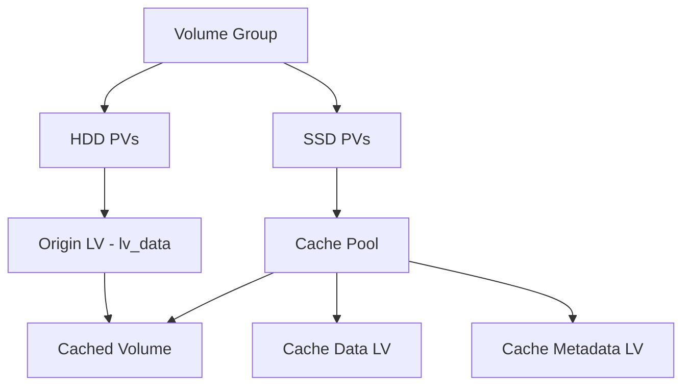

# How to Create an LVM Cache Volume with lvmcache on RHEL 9

Author: [nawazdhandala](https://www.github.com/nawazdhandala)

Tags: RHEL, LVM, lvmcache, Caching, Linux

Description: A step-by-step guide to creating LVM cache volumes using lvmcache on RHEL 9, combining fast and slow storage transparently.

---

LVM cache (lvmcache) is the LVM-native way to add SSD caching to your logical volumes. It wraps dm-cache in a user-friendly LVM interface, so you manage caching with the same `lvcreate`, `lvconvert`, and `lvs` commands you already know.

## Overview

lvmcache creates a cached logical volume by combining:
- An **origin LV** on slow storage (HDD)
- A **cache LV** on fast storage (SSD/NVMe)

All I/O to the cached volume is transparently handled by dm-cache, which promotes hot data to the SSD and evicts cold data back to the HDD.



## Method 1: Single-Command Cache Creation

The simplest approach creates everything in one step:

```bash
# Create a cache for lv_data using space on the SSD
# LVM handles cache data and metadata LVs automatically
lvcreate --type cache -L 50G -n cache0 \
    --cachemode writethrough \
    vg_data/lv_data /dev/nvme0n1p1
```

This:
1. Creates a 50 GB cache data LV on the SSD
2. Creates a metadata LV automatically sized
3. Combines them into a cache pool
4. Attaches the cache to lv_data

## Method 2: Step-by-Step Setup

For more control over each component:

### Create the Cache Pool

```bash
# Create cache data LV on SSD
lvcreate -L 50G -n cachedata vg_data /dev/nvme0n1p1

# Create cache metadata LV on SSD
lvcreate -L 512M -n cachemeta vg_data /dev/nvme0n1p1

# Convert to cache pool
lvconvert --type cache-pool \
    --poolmetadata vg_data/cachemeta \
    --cachemode writethrough \
    vg_data/cachedata
```

### Attach to Origin

```bash
# Attach the cache pool to the origin LV
lvconvert --type cache \
    --cachepool vg_data/cachedata \
    vg_data/lv_data
```

## Method 3: Using cachevol (Simpler Alternative)

RHEL 9 supports the `cachevol` method, which skips the pool concept:

```bash
# Create a cache volume on the SSD
lvcreate -L 50G -n mycachevol vg_data /dev/nvme0n1p1

# Attach it directly as a cache
lvconvert --type cache --cachevol vg_data/mycachevol vg_data/lv_data
```

This is simpler than the pool method and recommended for single-volume caching.

## Verifying Cache Status

```bash
# Show cache information
lvs -o lv_name,cache_mode,cache_policy,cache_read_hits,cache_read_misses,cache_write_hits,cache_write_misses vg_data/lv_data
```

```bash
# Show all LVs including hidden cache components
lvs -a vg_data
```

```bash
# Detailed dm-cache statistics
dmsetup status $(lvs --noheadings -o lv_dm_path vg_data/lv_data | tr -d ' ')
```

## Cache Modes

Set the cache mode at creation time or change it live:

```bash
# Create with writeback mode
lvcreate --type cache -L 50G -n cache0 \
    --cachemode writeback \
    vg_data/lv_data /dev/nvme0n1p1
```

```bash
# Change mode on a live volume
lvchange --cachemode writeback vg_data/lv_data
lvchange --cachemode writethrough vg_data/lv_data
```

## Cache Policy

The default `smq` (Stochastic Multi-Queue) policy works well for most scenarios:

```bash
# Check current policy
lvs -o cache_policy vg_data/lv_data
```

You can set policy at creation time:

```bash
# Explicit policy setting
lvcreate --type cache -L 50G -n cache0 \
    --cachepolicy smq \
    vg_data/lv_data /dev/nvme0n1p1
```

## Cache Settings Tuning

Adjust cache behavior with settings:

```bash
# Set cache settings
lvchange --cachesettings 'migration_threshold=2048' vg_data/lv_data
```

Common settings:
- `migration_threshold` - number of sectors to migrate per time period
- `sequential_threshold` - sequential I/O size to bypass cache

## Monitoring Cache Effectiveness

Track cache hit ratios over time:

```bash
#!/bin/bash
# /usr/local/bin/cache-stats.sh
# Log cache hit ratios

for lv in $(lvs --noheadings -o lv_path --select 'segtype=cache' 2>/dev/null); do
    STATS=$(lvs --noheadings -o lv_name,cache_read_hits,cache_read_misses,cache_write_hits,cache_write_misses "$lv")
    echo "$(date +%Y-%m-%dT%H:%M:%S) $STATS" >> /var/log/cache-stats.log
done
```

## Resizing the Cache

To increase cache size, you need to detach, resize, and reattach:

```bash
# Detach cache
lvconvert --uncache vg_data/lv_data

# The cache LV is now available again
# Extend it
lvextend -L +25G vg_data/cachedata

# Reattach
lvconvert --type cache --cachepool vg_data/cachedata vg_data/lv_data
```

## Removing the Cache

To safely remove a cache:

```bash
# Remove cache (flushes dirty data first)
lvconvert --uncache vg_data/lv_data
```

For writeback mode, this flushes all dirty blocks to the origin before removing the cache. This can take a while depending on how much dirty data exists.

To check dirty blocks before removal:

```bash
# Check for dirty blocks
lvs -o cache_dirty_blocks vg_data/lv_data
```

## Best Practices

1. **Start with writethrough** until you trust the setup, then switch to writeback for performance
2. **Size the cache at 10-20%** of the origin for most workloads
3. **Monitor hit ratios** - if below 50%, the cache might not be helping
4. **Use the same VG** for origin and cache for simplest management
5. **Enterprise SSDs only** for writeback mode - consumer SSDs can lose data on power failure

## Summary

LVM cache on RHEL 9 provides transparent SSD caching for HDD volumes through familiar LVM commands. Use the single-command method for simplicity, or the step-by-step approach for more control. Start with writethrough mode for safety, use the smq policy, and monitor hit ratios to verify the cache is actually helping your workload. The `cachevol` method is the simplest option for single-volume caching scenarios.
