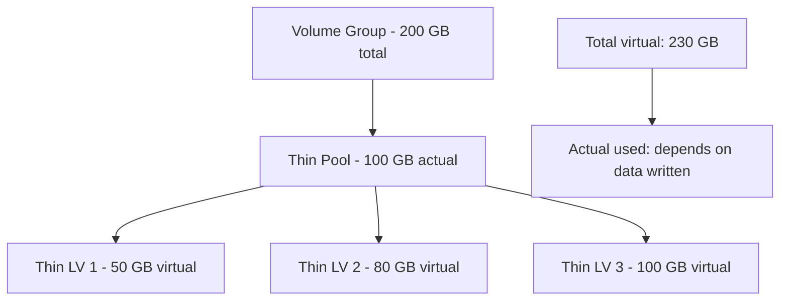

# How to Set Up LVM Thin Provisioning for Efficient Storage Allocation on RHEL 9

Author: [nawazdhandala](https://www.github.com/nawazdhandala)

Tags: RHEL, LVM, Thin Provisioning, Linux

Description: Learn how to set up LVM thin provisioning on RHEL 9 to allocate storage efficiently and avoid wasting disk space on unused capacity.

---

Traditional LVM volumes allocate all their space upfront. If you create a 100 GB logical volume, 100 GB is immediately consumed from the volume group, even if the filesystem only uses 5 GB. Thin provisioning solves this by allocating space on demand, as data is actually written.

## How Thin Provisioning Works

With thin provisioning, you create a "thin pool" that holds the actual data, and "thin volumes" that are virtual volumes mapped to the pool. The thin volumes can be larger than the pool itself (overprovisioning), because you are betting that not everything will be full at the same time.



## Prerequisites

Make sure you have free space in your volume group:

```bash
# Check available space
vgs
```

You need the `device-mapper-persistent-data` and `lvm2` packages (installed by default on RHEL 9):

```bash
# Verify packages
rpm -q device-mapper-persistent-data lvm2
```

## Step 1: Create the Thin Pool

Create a thin pool in your volume group:

```bash
# Create a 100 GB thin pool
lvcreate -L 100G --thinpool thinpool vg_data
```

This creates two LVs behind the scenes:
- The data pool (stores actual data)
- The metadata pool (stores mapping information)

Check the thin pool:

```bash
# View thin pool details
lvs -o lv_name,lv_size,pool_lv,data_percent,metadata_percent vg_data
```

## Step 2: Create Thin Volumes

Create virtual volumes from the thin pool:

```bash
# Create thin volumes - note these are virtual sizes
lvcreate -V 50G --thin -n web_data vg_data/thinpool
lvcreate -V 80G --thin -n db_data vg_data/thinpool
lvcreate -V 100G --thin -n app_data vg_data/thinpool
```

The `-V` flag specifies the virtual size. Notice the total (230 GB) exceeds the pool size (100 GB). This is overprovisioning, and it works because these volumes will not all be full simultaneously.

## Step 3: Create Filesystems

Format and mount the thin volumes just like regular LVs:

```bash
# Create filesystems
mkfs.xfs /dev/vg_data/web_data
mkfs.xfs /dev/vg_data/db_data
mkfs.xfs /dev/vg_data/app_data

# Create mount points
mkdir -p /data/{web,db,app}

# Mount them
mount /dev/vg_data/web_data /data/web
mount /dev/vg_data/db_data /data/db
mount /dev/vg_data/app_data /data/app
```

Add to fstab:

```bash
# Add fstab entries
cat >> /etc/fstab << 'EOF'
/dev/vg_data/web_data  /data/web  xfs  defaults  0 0
/dev/vg_data/db_data   /data/db   xfs  defaults  0 0
/dev/vg_data/app_data  /data/app  xfs  defaults  0 0
EOF
```

## Step 4: Monitor the Thin Pool

This is critical. If the thin pool runs out of space, all thin volumes using it will freeze:

```bash
# Check thin pool usage
lvs -o lv_name,data_percent,metadata_percent vg_data/thinpool
```

You should see something like:

```
  LV       Data%  Meta%
  thinpool 15.23  2.41
```

## Setting Up Thin Pool Metadata

The metadata pool is created automatically, but you should ensure it is adequately sized:

```bash
# Check metadata size
lvs -o lv_name,lv_size vg_data/thinpool_tmeta
```

For large thin pools, you might need to increase metadata:

```bash
# Extend metadata if needed
lvextend -L +1G vg_data/thinpool_tmeta
```

## Extending the Thin Pool

When the pool gets full, extend it:

```bash
# Add 50 GB to the thin pool
lvextend -L +50G vg_data/thinpool
```

Or extend to use all free space:

```bash
# Use all free VG space for the pool
lvextend -l +100%FREE vg_data/thinpool
```

## Overprovisioning Strategy

How much to overprovision depends on your confidence in usage patterns:

| Scenario | Safe Overprovisioning Ratio |
|----------|---------------------------|
| Well-known workloads | 2:1 to 3:1 |
| Development environments | 3:1 to 5:1 |
| Unpredictable workloads | 1.5:1 |
| Production databases | 1:1 to 1.5:1 |

Monitor aggressively when overprovisioning. Running out of pool space is worse than running out of filesystem space because it affects all volumes in the pool simultaneously.

## Enabling Discard/TRIM for Space Reclamation

When files are deleted from thin volumes, the space should be returned to the pool. Enable discard support:

In fstab:

```
/dev/vg_data/web_data  /data/web  xfs  defaults,discard  0 0
```

Or use periodic fstrim:

```bash
# Run fstrim on all mounted thin volumes
fstrim -v /data/web
fstrim -v /data/db
fstrim -v /data/app
```

Schedule it with a systemd timer (RHEL 9 includes `fstrim.timer`):

```bash
# Enable the weekly fstrim timer
systemctl enable --now fstrim.timer
```

## Converting Existing LVs to Thin

You cannot convert a thick LV to thin in place. You need to:

1. Back up the data
2. Remove the thick LV
3. Create a thin pool and thin LV
4. Restore the data

## Summary

LVM thin provisioning on RHEL 9 lets you allocate virtual storage that exceeds physical capacity, with space consumed only as data is written. Set up a thin pool, create thin volumes from it, and monitor pool utilization closely. Enable discard support so deleted files return space to the pool. The key to success with thin provisioning is vigilant monitoring and having a plan to extend the pool before it fills up.
