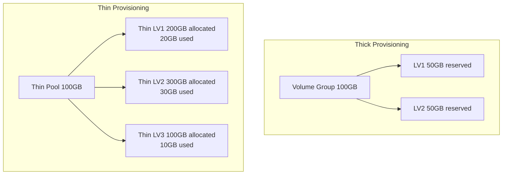

# How to Set Up LVM Thin Provisioning on RHEL

Author: [nawazdhandala](https://www.github.com/nawazdhandala)

Tags: RHEL, LVM, Thin Provisioning, Storage, Linux

Description: A guide to configuring LVM thin provisioning on RHEL for efficient storage allocation and overcommitment.

---

Thin provisioning lets you allocate more logical volume space than physically exists. Instead of reserving all the space upfront, thin volumes only consume physical space as data is actually written. This is particularly useful in virtual environments and for testing.

## Thin vs. Thick Provisioning



With thick provisioning, each LV reserves all its space immediately. With thin provisioning, you can allocate 600GB across thin volumes even though the pool only has 100GB of actual space.

## Creating a Thin Pool

First, create a volume group if you do not already have one:

```bash
# Create PV and VG
sudo pvcreate /dev/sdb
sudo vgcreate thinvg /dev/sdb
```

Create a thin pool within the volume group:

```bash
# Create a thin pool using 90% of the VG space
# The remaining 10% is kept for metadata and pool extension
sudo lvcreate -l 90%VG --thinpool thinpool thinvg

# Verify the thin pool
sudo lvs -o lv_name,lv_size,data_percent,metadata_percent thinvg
```

## Creating Thin Volumes

Create thin volumes from the pool. These can exceed the pool size:

```bash
# Create thin volumes with virtual sizes
# The pool is maybe 90GB, but we can allocate more
sudo lvcreate -V 100G --thin -n vm1 thinvg/thinpool
sudo lvcreate -V 100G --thin -n vm2 thinvg/thinpool
sudo lvcreate -V 100G --thin -n vm3 thinvg/thinpool

# List thin volumes
sudo lvs thinvg
```

## Formatting and Using Thin Volumes

```bash
# Create filesystems
sudo mkfs.xfs /dev/thinvg/vm1
sudo mkfs.xfs /dev/thinvg/vm2
sudo mkfs.xfs /dev/thinvg/vm3

# Mount them
sudo mkdir -p /vms/{vm1,vm2,vm3}
sudo mount /dev/thinvg/vm1 /vms/vm1
sudo mount /dev/thinvg/vm2 /vms/vm2
sudo mount /dev/thinvg/vm3 /vms/vm3
```

## Monitoring Thin Pool Usage

This is critical. If a thin pool runs out of space, writes will fail.

```bash
# Check pool data and metadata usage
sudo lvs -o lv_name,lv_size,data_percent,metadata_percent thinvg/thinpool

# Set up monitoring threshold
# Create a dmeventd-based monitor (enabled by default)
sudo lvchange --monitor y thinvg/thinpool
```

Configure automatic pool extension in `/etc/lvm/lvm.conf`:

```bash
# Edit LVM configuration for auto-extension
sudo vi /etc/lvm/lvm.conf

# Find and set these values in the activation section:
# thin_pool_autoextend_threshold = 80
# thin_pool_autoextend_percent = 20
```

This tells LVM to automatically extend the thin pool by 20% when it reaches 80% full (provided there is free space in the VG).

## Thin Snapshots

Thin volumes support efficient snapshots that do not require pre-allocated space:

```bash
# Create a thin snapshot (no size needed)
sudo lvcreate -s -n vm1_snap thinvg/vm1

# Thin snapshots are writable by default
# Mount and use it
sudo mkdir /mnt/vm1_snap
sudo mount -o nouuid /dev/thinvg/vm1_snap /mnt/vm1_snap
```

## Extending the Thin Pool

When you need more space:

```bash
# Add a new disk to the VG
sudo pvcreate /dev/sdc
sudo vgextend thinvg /dev/sdc

# Extend the thin pool
sudo lvextend -L +100G thinvg/thinpool
```

## Summary

LVM thin provisioning on RHEL provides storage efficiency by allocating physical space on demand rather than upfront. It is ideal for virtual machine storage, development environments, and any scenario where actual usage is much less than allocated capacity. The key requirement is monitoring pool usage closely to prevent out-of-space conditions.

