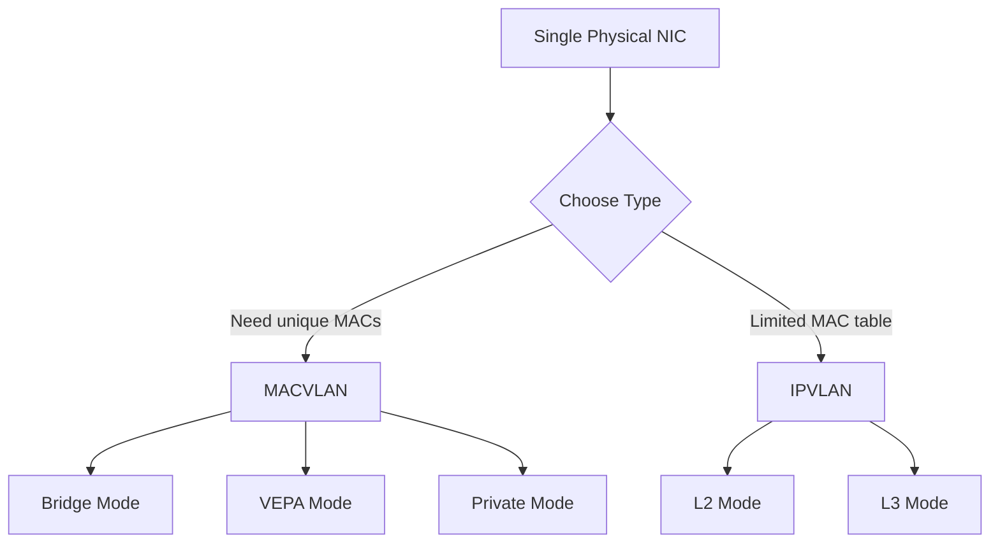

# How to Configure MACVLAN and IPVLAN Interfaces on RHEL 9

Author: [nawazdhandala](https://www.github.com/nawazdhandala)

Tags: RHEL, MACVLAN, IPVLAN, Networking, Virtual Interfaces, Linux

Description: Learn how to create MACVLAN and IPVLAN virtual network interfaces on RHEL 9 for assigning multiple IP or MAC addresses to a single physical interface.

---

MACVLAN and IPVLAN are virtual network interface types that allow you to create multiple logical interfaces on top of a single physical interface. MACVLAN assigns unique MAC addresses to each virtual interface, while IPVLAN shares the parent MAC address and differentiates traffic by IP only.

## When to Use Each



## Prerequisites

- RHEL 9 with a working network interface
- Root or sudo access

## Step 1: Create a MACVLAN Interface

```bash
# Create a MACVLAN interface in bridge mode
# Bridge mode allows MACVLAN interfaces to communicate with each other
sudo ip link add macvlan0 link ens3 type macvlan mode bridge

# Assign an IP address
sudo ip addr add 192.168.1.50/24 dev macvlan0

# Bring the interface up
sudo ip link set macvlan0 up

# Verify the interface has its own MAC address
ip link show macvlan0
ip addr show macvlan0
```

## Step 2: Create Multiple MACVLAN Interfaces

```bash
# Create several MACVLAN interfaces on the same parent
for i in 1 2 3; do
    sudo ip link add macvlan$i link ens3 type macvlan mode bridge
    sudo ip addr add 192.168.1.$((50 + i))/24 dev macvlan$i
    sudo ip link set macvlan$i up
done

# List all MACVLAN interfaces
ip link show type macvlan
```

## Step 3: Create an IPVLAN Interface

```bash
# Create an IPVLAN interface in L2 mode
# L2 mode works like a bridge but shares the parent MAC address
sudo ip link add ipvlan0 link ens3 type ipvlan mode l2

# Assign an IP address
sudo ip addr add 192.168.1.60/24 dev ipvlan0

# Bring the interface up
sudo ip link set ipvlan0 up

# Note: ipvlan0 will have the same MAC as ens3
ip link show ipvlan0
```

## Step 4: IPVLAN L3 Mode

```bash
# Create an IPVLAN in L3 mode for routed traffic
# L3 mode acts as a router between the parent and virtual interface
sudo ip link add ipvlan_l3 link ens3 type ipvlan mode l3

# Assign a different subnet IP
sudo ip addr add 10.10.10.1/24 dev ipvlan_l3

# Bring it up
sudo ip link set ipvlan_l3 up

# In L3 mode, you need routes on other hosts to reach 10.10.10.0/24
```

## Step 5: Make Persistent with nmcli

```bash
# Create a persistent MACVLAN connection
sudo nmcli connection add type macvlan \
    con-name macvlan0 \
    ifname macvlan0 \
    macvlan.parent ens3 \
    macvlan.mode bridge \
    ipv4.addresses 192.168.1.50/24 \
    ipv4.method manual \
    connection.autoconnect yes

# Verify
nmcli connection show macvlan0
```

## Step 6: Use MACVLAN with Containers

```bash
# Create a Podman network using macvlan driver
sudo podman network create --driver macvlan \
    --subnet 192.168.1.0/24 \
    --gateway 192.168.1.1 \
    -o parent=ens3 \
    macvlan-net

# Run a container attached to the macvlan network
sudo podman run -d --name web --network macvlan-net \
    --ip 192.168.1.70 nginx

# The container now has a unique MAC and direct network access
```

## MACVLAN Modes Explained

| Mode | Description | Use Case |
|------|-------------|----------|
| bridge | Virtual interfaces can talk to each other | Most common, general use |
| vepa | Traffic goes to external switch first | Hardware switch-based policies |
| private | No communication between virtual interfaces | Isolation requirements |
| passthru | Only one virtual interface, full control | SR-IOV fallback |

## Troubleshooting

```bash
# Check that the parent interface is up
ip link show ens3

# Verify MACVLAN/IPVLAN interfaces
ip -d link show type macvlan
ip -d link show type ipvlan

# Test connectivity
ping -I macvlan0 192.168.1.1

# Note: MACVLAN interfaces cannot communicate with the parent (ens3)
# This is by design. Use a bridge if you need host-to-container communication.
```

## Summary

You have configured MACVLAN and IPVLAN interfaces on RHEL 9. MACVLAN provides unique MAC addresses for each virtual interface, making it ideal for containers and VMs that need direct network access. IPVLAN shares the parent MAC and is better suited for environments with MAC address limitations. Both types can be made persistent with NetworkManager.
