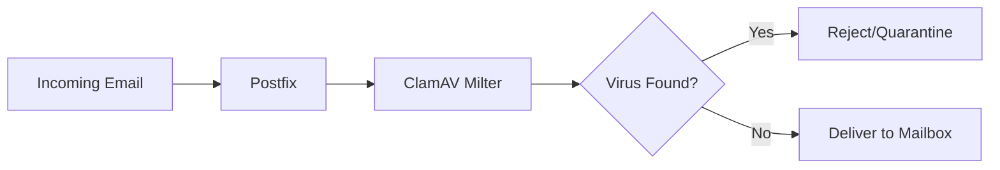

# How to Set Up Mail Server Anti-Virus Scanning with ClamAV on RHEL

Author: [nawazdhandala](https://www.github.com/nawazdhandala)

Tags: RHEL, ClamAV, Anti-Virus, Mail Server, Linux

Description: Install and integrate ClamAV with Postfix on RHEL to scan incoming and outgoing email for viruses and malware.

---

## Why Scan Email for Viruses?

Email remains the top delivery vector for malware. Even if your users run endpoint protection, catching malicious attachments at the mail server level prevents them from reaching inboxes in the first place. ClamAV is the open-source standard for server-side virus scanning on Linux. It is free, actively maintained, and integrates well with Postfix through milters or content filters.

## Architecture



## Prerequisites

- RHEL with Postfix installed and running
- EPEL repository enabled (ClamAV packages are in EPEL)
- Sufficient disk space for virus definitions (about 400 MB)

## Installing ClamAV

```bash
# Enable EPEL repository
sudo dnf install -y epel-release

# Install ClamAV and the milter interface
sudo dnf install -y clamav clamd clamav-milter clamav-update
```

## Configuring ClamAV Daemon

Edit `/etc/clamd.d/scan.conf`:

```bash
# Remove or comment the Example line
# Example

# Socket for communication
LocalSocket /run/clamd.scan/clamd.sock

# Log settings
LogFile /var/log/clamd.scan
LogTime yes
LogVerbose no

# Performance settings
MaxThreads 12
ReadTimeout 180
MaxDirectoryRecursion 20
MaxFileSize 25M
MaxScanSize 100M

# Scan settings
ScanPE yes
ScanELF yes
ScanOLE2 yes
ScanPDF yes
ScanHTML yes
ScanMail yes
ScanArchive yes
```

## Updating Virus Definitions

Edit `/etc/freshclam.conf`:

```bash
# Remove or comment the Example line
# Example

# Database directory
DatabaseDirectory /var/lib/clamav

# Update log
UpdateLogFile /var/log/freshclam.log

# Check for updates 4 times per day
Checks 4

# Database mirror
DatabaseMirror database.clamav.net
```

Run the initial update:

```bash
# Download virus definitions
sudo freshclam
```

Enable automatic updates:

```bash
# Enable the freshclam timer for automatic updates
sudo systemctl enable --now clamav-freshclam
```

## Configuring the ClamAV Milter

The milter is the component that integrates ClamAV with Postfix. Edit `/etc/mail/clamav-milter.conf`:

```bash
# Remove or comment the Example line
# Example

# Socket for Postfix communication
MilterSocket /run/clamav-milter/clamav-milter.sock
MilterSocketMode 660
MilterSocketGroup postfix

# ClamAV daemon socket
ClamdSocket unix:/run/clamd.scan/clamd.sock

# Action when a virus is found
OnInfected Reject

# Action when scanning fails (Accept to avoid blocking mail during ClamAV issues)
OnFail Accept

# Add a header showing scan results
AddHeader Replace

# Log settings
LogFile /var/log/clamav-milter.log
LogTime yes
LogVerbose no
```

The `OnInfected Reject` setting rejects infected messages outright. Alternatives:
- `Quarantine` - Accept but quarantine the message
- `Accept` - Accept and just add a header (not recommended)

## Integrating with Postfix

Add the milter to Postfix. Edit `/etc/postfix/main.cf`:

```
# ClamAV milter for virus scanning
smtpd_milters = unix:/run/clamav-milter/clamav-milter.sock
non_smtpd_milters = unix:/run/clamav-milter/clamav-milter.sock
milter_default_action = accept
```

If you already have other milters (like OpenDKIM), add ClamAV to the list:

```
smtpd_milters = inet:localhost:8891, unix:/run/clamav-milter/clamav-milter.sock
non_smtpd_milters = inet:localhost:8891, unix:/run/clamav-milter/clamav-milter.sock
```

## Starting Services

```bash
# Start ClamAV daemon
sudo systemctl enable --now clamd@scan

# Start ClamAV milter
sudo systemctl enable --now clamav-milter

# Reload Postfix
sudo postfix reload
```

Verify everything is running:

```bash
# Check service status
sudo systemctl status clamd@scan
sudo systemctl status clamav-milter
sudo systemctl status clamav-freshclam
```

## Testing Virus Scanning

### Test with EICAR Test String

The EICAR test string is a harmless file that all antivirus products detect as a test virus:

```bash
# Create a test message with the EICAR test string
cat << 'MSGEOF' | sendmail testuser@example.com
From: test@example.com
To: testuser@example.com
Subject: Virus Test
MIME-Version: 1.0
Content-Type: text/plain

X5O!P%@AP[4\PZX54(P^)7CC)7}$EICAR-STANDARD-ANTIVIRUS-TEST-FILE!$H+H*
MSGEOF
```

Check the logs:

```bash
# ClamAV milter should reject the message
sudo tail -20 /var/log/clamav-milter.log

# Postfix log should show the rejection
sudo tail -20 /var/log/maillog
```

You should see something like:

```
clamav-milter: Message from test@example.com infected by Eicar-Signature FOUND
```

### Test with a Clean Message

```bash
# Send a clean test message
echo "This is a clean message" | mail -s "Clean Test" testuser@example.com
```

Check that it was delivered normally:

```bash
sudo grep "status=sent" /var/log/maillog | tail -5
```

## Scanning Headers

ClamAV adds a header to scanned messages. Check delivered mail for:

```
X-Virus-Scanned: ClamAV
X-Virus-Status: Clean
```

## Performance Tuning

For high-volume mail servers, tune the ClamAV daemon:

```
# In /etc/clamd.d/scan.conf

# Increase threads for more concurrent scans
MaxThreads 20

# Increase scan limits if you receive large attachments
MaxFileSize 50M
MaxScanSize 200M

# Enable scan caching
ConcurrentDatabaseReload yes
```

## Monitoring ClamAV

```bash
# Check virus definition version
sudo clamscan --version

# View scan statistics
sudo clamdtop

# Check freshclam update log
sudo tail -20 /var/log/freshclam.log

# Count infected messages in the last day
sudo grep "FOUND" /var/log/clamav-milter.log | wc -l
```

## SELinux Configuration

If SELinux blocks ClamAV, fix the contexts:

```bash
# Allow ClamAV milter to communicate with Postfix
sudo setsebool -P antivirus_can_scan_system 1

# If using custom socket paths, set contexts
sudo semanage fcontext -a -t antivirus_var_run_t "/run/clamav-milter(/.*)?"
sudo restorecon -Rv /run/clamav-milter/
```

## Troubleshooting

**ClamAV milter not starting:**

Check the socket permissions:

```bash
sudo ls -la /run/clamd.scan/clamd.sock
```

Make sure the clamd service is running before the milter:

```bash
sudo systemctl restart clamd@scan
sudo systemctl restart clamav-milter
```

**All mail being rejected:**

If ClamAV cannot reach the clamd socket, the milter behavior depends on `OnFail`. Set it to `Accept` so mail flows even if scanning is temporarily unavailable.

**Freshclam update failures:**

```bash
# Check freshclam logs
sudo tail -20 /var/log/freshclam.log

# Try a manual update
sudo freshclam --verbose
```

**High memory usage:**

ClamAV loads virus definitions into memory. The current definitions require about 1-1.5 GB of RAM. If memory is tight, consider running ClamAV on a dedicated server and connecting via TCP socket.

## Wrapping Up

ClamAV provides a solid layer of protection for your mail server. The milter integration with Postfix is clean and efficient. Keep the virus definitions updated with freshclam, monitor the logs for infected messages, and test periodically with the EICAR string to make sure scanning is working. Combined with SpamAssassin and your Postfix restrictions, you have a multi-layered defense against malicious email.
