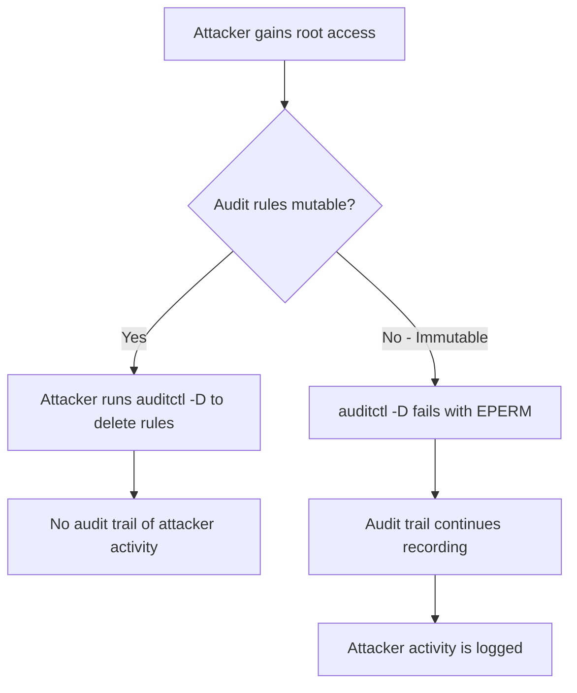

# How to Make Audit Rules Immutable on RHEL for Tamper Resistance

Author: [nawazdhandala](https://www.github.com/nawazdhandala)

Tags: RHEL, auditd, Immutable Rules, Security, Tamper Resistance, Linux

Description: Lock down your audit rules on RHEL by making them immutable, preventing attackers from disabling auditing even with root access.

---

One of the most important hardening steps for the Linux audit system is making the audit rules immutable. When rules are immutable, they cannot be changed, added, or removed without rebooting the system. This prevents an attacker who gains root access from silently disabling auditing to cover their tracks. This guide explains how to set up immutable audit rules on RHEL.

## Why Immutable Rules Matter



Without immutable rules, an attacker with root privileges can simply run `auditctl -D` to delete all audit rules and then operate freely without being monitored. With immutable rules, any attempt to modify the audit configuration returns a "permission denied" error, and the only way to change the rules is to reboot the system.

## Setting Rules to Immutable

The immutable flag is `-e 2` and it must be the very last rule in your audit configuration. Once this rule is processed, no further changes to audit rules are allowed.

### Step 1: Organize Your Rules Files

The rules in `/etc/audit/rules.d/` are loaded in alphabetical order. The immutable flag must be in the last file:

```bash
# List existing rule files
ls -la /etc/audit/rules.d/

# Common naming convention:
# 10-base.rules        - Buffer size, failure mode
# 20-file-watch.rules  - File monitoring rules
# 30-syscall.rules     - System call rules
# 99-finalize.rules    - Immutable flag (always last)
```

### Step 2: Create the Immutable Rules File

```bash
sudo tee /etc/audit/rules.d/99-finalize.rules << 'EOF'
## Make audit rules immutable
## This MUST be the last rule file loaded
## Once set, rules cannot be changed without a reboot

# Lock the audit configuration
-e 2
EOF
```

### Step 3: Verify Rule Order

Before loading, verify the order of all your rules:

```bash
# Preview what augenrules will produce
sudo cat /etc/audit/rules.d/*.rules
```

Make sure `-e 2` appears at the very end. If it appears before other rules, those rules will fail to load.

### Step 4: Load the Rules

```bash
# Generate and load the compiled rules
sudo augenrules --load

# Verify the rules are loaded
sudo auditctl -l

# Check that the immutable flag is set
sudo auditctl -s
```

The status output should show:

```bash
enabled 2
```

The value `2` means rules are locked (immutable). Compare this to:
- `0` = auditing disabled
- `1` = auditing enabled, rules are mutable
- `2` = auditing enabled, rules are immutable

## Testing Immutability

Try to modify the rules to verify they are locked:

```bash
# Attempt to add a rule (should fail)
sudo auditctl -w /tmp/test -p wa -k test_rule
# Expected output: Error sending add rule data request (Operation not permitted)

# Attempt to delete all rules (should fail)
sudo auditctl -D
# Expected output: Error sending flush request (Operation not permitted)

# Attempt to disable auditing (should fail)
sudo auditctl -e 0
# Expected output: Error sending enable request (Operation not permitted)
```

All of these operations should fail with "Operation not permitted" when the rules are immutable.

## Changing Rules After Making Them Immutable

The only way to modify audit rules after they have been locked is to:

1. Edit the rule files in `/etc/audit/rules.d/`
2. Reboot the system

```bash
# Edit your rules as needed
sudo vi /etc/audit/rules.d/20-file-watch.rules

# Reboot to load the new rules
sudo systemctl reboot
```

After the reboot, augenrules will load all the rules in order, including any changes you made, and then lock them again with the `-e 2` flag.

## Complete Example Configuration

Here is a full example showing the recommended rule file structure:

```bash
# /etc/audit/rules.d/10-base.rules
# Base audit configuration
-D
-b 8192
-f 1
--backlog_wait_time 60000
```

```bash
# /etc/audit/rules.d/20-identity.rules
# Identity and authentication monitoring
-w /etc/passwd -p wa -k identity
-w /etc/shadow -p wa -k identity
-w /etc/group -p wa -k identity
-w /etc/gshadow -p wa -k identity
-w /etc/sudoers -p wa -k sudoers
-w /etc/sudoers.d/ -p wa -k sudoers
```

```bash
# /etc/audit/rules.d/30-ssh.rules
# SSH configuration monitoring
-w /etc/ssh/sshd_config -p wa -k sshd_config
-w /etc/ssh/sshd_config.d/ -p wa -k sshd_config
```

```bash
# /etc/audit/rules.d/40-syscalls.rules
# System call monitoring
-a always,exit -F arch=b64 -S unlink -S unlinkat -S rename -S renameat -F auid>=1000 -F auid!=4294967295 -k file_delete
-a always,exit -F arch=b64 -S adjtimex -S settimeofday -k time_change
```

```bash
# /etc/audit/rules.d/99-finalize.rules
# Lock the configuration - MUST BE LAST
-e 2
```

## Important Considerations

1. **Test thoroughly before locking.** Since you cannot change rules without a reboot, make sure all your rules are correct first. Test them without the `-e 2` flag, verify everything works, and then add the immutable flag.

2. **Keep a backup of your rules.** Store copies of your rule files in a safe location so you can restore them if needed.

3. **Document the reboot requirement.** Make sure your team knows that audit rule changes require a reboot when immutable rules are in place.

4. **Do not use -e 2 in the middle of your rules.** It must always be the last line processed. Any rules after it will fail to load.

5. **The -D (delete all) flag still works at the start of rules loading during boot.** The immutable lock only applies at runtime, so your rules can still begin with `-D` to clear any stale rules.

## Compliance Requirements

Many security frameworks and compliance standards require or recommend immutable audit rules:

- **CIS Benchmark for RHEL** requires `-e 2` as the final audit rule
- **DISA STIG** mandates that the audit configuration be locked
- **PCI DSS** recommends tamper-resistant audit logging

## Summary

Making audit rules immutable on RHEL is a critical security hardening step. Add `-e 2` as the very last line in your audit rules by placing it in a file named `99-finalize.rules`. This prevents anyone, including root users, from modifying or disabling audit rules at runtime. The only way to change the configuration is to edit the files and reboot the system, which itself will be logged.
