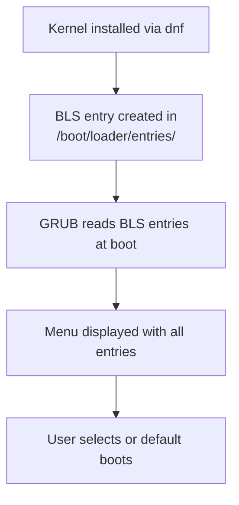

# How to Manage Boot Loader Entries (BLS) on RHEL

Author: [nawazdhandala](https://www.github.com/nawazdhandala)

Tags: RHEL, BLS, Boot Loader, GRUB2, Linux

Description: Learn how to manage Boot Loader Specification (BLS) entries on RHEL, including viewing, creating, editing, and removing boot entries for kernel management.

---

## What Is BLS?

The Boot Loader Specification (BLS) is the method RHEL uses to manage boot entries. Instead of embedding every kernel entry directly in `grub.cfg`, each kernel gets its own small configuration file in `/boot/loader/entries/`. GRUB2 reads these snippet files at boot time and builds the menu dynamically.

This approach makes kernel management cleaner. Adding a kernel means dropping a file into a directory. Removing a kernel means deleting its entry file. No more manually editing a monolithic `grub.cfg`.

## BLS Entry File Format

```bash
# List all BLS entry files
ls -la /boot/loader/entries/

# View a typical entry
cat /boot/loader/entries/*.conf | head -20
```

A BLS entry file looks like this:

```bash
title Red Hat Enterprise Linux (5.14.0-362.el9.x86_64) 9.3
version 5.14.0-362.el9.x86_64
linux /vmlinuz-5.14.0-362.el9.x86_64
initrd /initramfs-5.14.0-362.el9.x86_64.img
options root=/dev/mapper/rhel-root ro crashkernel=256M resume=/dev/mapper/rhel-swap rd.lvm.lv=rhel/root rd.lvm.lv=rhel/swap
grub_users $grub_users
grub_arg --unrestricted
grub_class rhel
```

| Field | Purpose |
|-------|---------|
| title | Text shown in the GRUB menu |
| version | Kernel version string |
| linux | Path to the kernel image (relative to /boot) |
| initrd | Path to the initramfs image |
| options | Kernel command-line parameters |
| grub_users | GRUB password protection scope |
| grub_class | Used for theming the menu entry |

## Managing Entries with grubby

The `grubby` command is the official tool for managing BLS entries on RHEL.

```bash
# List all entries
sudo grubby --info=ALL

# Show only the default entry
sudo grubby --info=DEFAULT

# Show information for a specific kernel
sudo grubby --info=/boot/vmlinuz-5.14.0-362.el9.x86_64
```

### Modifying Entry Options

```bash
# Add a kernel parameter to all entries
sudo grubby --update-kernel=ALL --args="net.ifnames=0"

# Add a parameter to a specific entry
sudo grubby --update-kernel=/boot/vmlinuz-5.14.0-362.el9.x86_64 --args="debug"

# Remove a parameter
sudo grubby --update-kernel=ALL --remove-args="quiet"
```

### Setting the Default Entry

```bash
# Set default by kernel path
sudo grubby --set-default=/boot/vmlinuz-5.14.0-362.el9.x86_64

# Set default by index (0-based)
sudo grubby --set-default-index=0

# Check the current default
sudo grubby --default-kernel
sudo grubby --default-index
```

## Manually Editing BLS Entries

While `grubby` is the recommended tool, you can edit BLS entry files directly.

```bash
# Edit an entry file
sudo vi /boot/loader/entries/<entry-id>.conf

# Change the title
# Modify the options line to add/remove parameters
```

After manual edits, no regeneration is needed. GRUB reads the files directly at boot time.

## Creating a Custom Boot Entry

You might want a custom entry for testing or for a special-purpose boot configuration.

```bash
# Copy an existing entry as a template
sudo cp /boot/loader/entries/existing-entry.conf /boot/loader/entries/custom-debug.conf

# Edit the new entry
sudo vi /boot/loader/entries/custom-debug.conf
```

Modify it to include your custom parameters:

```bash
title RHEL Debug Mode (5.14.0-362.el9.x86_64)
version 5.14.0-362.el9.x86_64
linux /vmlinuz-5.14.0-362.el9.x86_64
initrd /initramfs-5.14.0-362.el9.x86_64.img
options root=/dev/mapper/rhel-root ro loglevel=7 systemd.log_level=debug
```

## Removing a Boot Entry

```bash
# Remove an entry by deleting its BLS file
sudo rm /boot/loader/entries/<entry-id>.conf

# Or use dnf to remove the kernel package (which cleans up the BLS entry)
sudo dnf remove kernel-core-5.14.0-xxx.el9.x86_64
```

## BLS and grub2-mkconfig

On RHEL, `grub2-mkconfig` respects the BLS configuration. The generated `grub.cfg` contains logic to read and display BLS entries rather than hardcoding them.

```bash
# Check if BLS is enabled
grep GRUB_ENABLE_BLSCFG /etc/default/grub
# Should show: GRUB_ENABLE_BLSCFG=true

# Regenerate GRUB config (BLS entries are still used)
sudo grub2-mkconfig -o /boot/grub2/grub.cfg
```



## Troubleshooting BLS Issues

```bash
# Verify BLS entries are valid
for f in /boot/loader/entries/*.conf; do
    echo "--- $f ---"
    cat "$f"
    echo
done

# Check that the kernel and initramfs files referenced in entries exist
for f in /boot/loader/entries/*.conf; do
    kernel=$(grep "^linux" "$f" | awk '{print $2}')
    initrd=$(grep "^initrd" "$f" | awk '{print $2}')
    echo "Entry: $f"
    ls -la /boot${kernel} 2>/dev/null || echo "  MISSING: $kernel"
    ls -la /boot${initrd} 2>/dev/null || echo "  MISSING: $initrd"
done

# If entries are out of sync, reinstalling the kernel fixes them
sudo dnf reinstall kernel-core-$(uname -r)
```

## Wrapping Up

BLS on RHEL simplifies boot loader management by treating each kernel as an independent file-based entry. Use `grubby` for day-to-day management, and only edit BLS files directly when you need custom entries or troubleshooting. The biggest advantage of BLS is that you never need to worry about `grub.cfg` getting out of sync with your installed kernels, since each entry is self-contained and read dynamically at boot.
