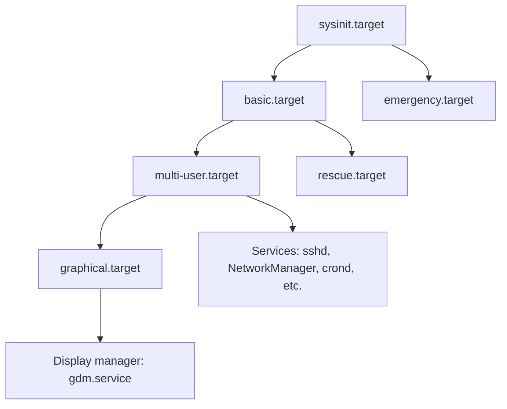

# How to Manage System Boot Targets and Switch Between Multi-User and Graphical Mode on RHEL

Author: [nawazdhandala](https://www.github.com/nawazdhandala)

Tags: RHEL, systemd, Boot Targets, Linux, System Administration

Description: Learn how to manage systemd boot targets on RHEL, including switching between multi-user and graphical mode, using rescue and emergency targets, and understanding target dependencies.

---

If you've been around Linux long enough, you remember the days of SysV runlevels. Numbers 0 through 6, each mapping to a different system state. RHEL uses systemd targets instead, which are more flexible and easier to understand once you get the hang of them. This guide walks through managing boot targets, switching between modes, and using rescue and emergency targets when things go sideways.

## Understanding Targets

A systemd target is a unit that groups other units together. When the system boots, it activates a default target, which pulls in all the services and other targets needed for that operational mode.

Here's how the old runlevels map to systemd targets:

| SysV Runlevel | systemd Target | Purpose |
|---------------|----------------|---------|
| 0 | `poweroff.target` | Halt the system |
| 1 | `rescue.target` | Single-user mode |
| 2 | `multi-user.target` | Multi-user (no network on SysV) |
| 3 | `multi-user.target` | Multi-user with networking |
| 4 | `multi-user.target` | Unused / custom |
| 5 | `graphical.target` | Multi-user with GUI |
| 6 | `reboot.target` | Reboot |



The key thing to understand is that targets build on each other. `graphical.target` depends on `multi-user.target`, which depends on `basic.target`, which depends on `sysinit.target`. Each layer adds more services.

## Checking the Default Target

The default target determines what mode the system boots into:

```bash
# See the current default boot target
systemctl get-default
```

On a server, this will typically show `multi-user.target`. On a workstation, it'll be `graphical.target`.

## Switching the Default Boot Target

To change what the system boots into by default:

```bash
# Set the default to multi-user (no GUI) - typical for servers
sudo systemctl set-default multi-user.target

# Set the default to graphical (with GUI) - typical for workstations
sudo systemctl set-default graphical.target
```

This change takes effect on the next reboot. It creates a symlink at `/etc/systemd/system/default.target` pointing to the chosen target.

```bash
# Verify the symlink
ls -la /etc/systemd/system/default.target
```

## Switching Targets at Runtime with isolate

You don't need to reboot to switch between targets. The `isolate` command switches to a different target immediately, stopping all services that aren't part of the new target.

```bash
# Switch to multi-user mode (stops the display manager and GUI)
sudo systemctl isolate multi-user.target

# Switch to graphical mode (starts the display manager)
sudo systemctl isolate graphical.target
```

Not all targets can be isolated. A target must have `AllowIsolate=yes` in its unit file to support this. The standard boot targets all have this set.

```bash
# Check if a target supports isolation
systemctl cat multi-user.target | grep AllowIsolate
```

## Rescue Target

The rescue target boots the system into single-user mode with a minimal set of services. It mounts filesystems, starts udev, and gives you a root shell. This is useful when you need to fix something but the full multi-user environment won't boot properly.

### Booting into Rescue Mode from a Running System

```bash
# Switch to rescue mode immediately
sudo systemctl isolate rescue.target
```

You'll get a prompt asking for the root password, then a root shell.

### Booting into Rescue Mode from GRUB

If the system isn't booting at all, you need to use GRUB:

1. Reboot the system
2. When the GRUB menu appears, press `e` to edit the boot entry
3. Find the line that starts with `linux` (the kernel command line)
4. Append `systemd.unit=rescue.target` to the end of that line
5. Press `Ctrl+X` to boot with the modified parameters

Once you've fixed the issue, reboot normally:

```bash
# Exit rescue mode and reboot
systemctl reboot
```

## Emergency Target

The emergency target is even more minimal than rescue. It mounts the root filesystem read-only and starts almost nothing. Use this when even rescue mode doesn't work, for example when there's a filesystem corruption issue.

### Booting into Emergency Mode

From the GRUB menu, follow the same process as rescue mode but use:

```
systemd.unit=emergency.target
```

In emergency mode, the root filesystem is mounted read-only. You'll need to remount it read-write to make any changes:

```bash
# Remount root filesystem as read-write
mount -o remount,rw /

# Fix whatever is broken...

# Reboot when done
systemctl reboot
```

## Comparing Rescue and Emergency Targets

| Feature | rescue.target | emergency.target |
|---------|--------------|-----------------|
| Root filesystem | Read-write | Read-only |
| Other filesystems | Mounted | Not mounted |
| Network | Not started | Not started |
| udev | Running | Not running |
| Logging | Running | Minimal |
| Use case | Service/config problems | Filesystem issues |

## Listing Available Targets

```bash
# List all available targets
systemctl list-units --type=target --all

# List only active targets
systemctl list-units --type=target

# Show what a target pulls in (its dependencies)
systemctl list-dependencies multi-user.target

# Show the full dependency tree (can be verbose)
systemctl list-dependencies graphical.target --all
```

## Common Target Management Scenarios

### Scenario 1: Removing the GUI from a Server

If a RHEL system was installed with a graphical desktop but you want to run it as a headless server:

```bash
# Switch the default target to multi-user
sudo systemctl set-default multi-user.target

# Optionally, switch immediately without rebooting
sudo systemctl isolate multi-user.target

# If you want to free up disk space, remove the desktop packages
sudo dnf groupremove "Server with GUI" -y
```

### Scenario 2: Adding a GUI to a Server

Going the other direction, if you need a graphical environment on a server:

```bash
# Install the GNOME desktop
sudo dnf groupinstall "Server with GUI" -y

# Set the default target to graphical
sudo systemctl set-default graphical.target

# Switch to graphical mode now
sudo systemctl isolate graphical.target
```

### Scenario 3: Temporarily Booting into a Different Target

If you want to boot into a different target just once without changing the default:

At the GRUB menu, press `e`, add `systemd.unit=multi-user.target` (or whichever target you want) to the kernel command line, and press `Ctrl+X`. The default target remains unchanged for future boots.

### Scenario 4: Troubleshooting a Service That Prevents Boot

If a service is causing boot to hang, you can use rescue mode to disable it:

```bash
# Boot into rescue.target via GRUB, then:

# Check which service is causing problems
systemctl list-units --state=failed

# Disable the problematic service
systemctl disable problematic-service.service

# If it's really bad, mask it
systemctl mask problematic-service.service

# Reboot into normal operation
systemctl reboot
```

## Creating Custom Targets

You can create your own targets for specialized use cases. For example, a "maintenance" target that runs only essential services:

Create the target file:

```bash
sudo vim /etc/systemd/system/maintenance.target
```

```ini
[Unit]
Description=Maintenance Mode
Requires=basic.target
Conflicts=rescue.target
After=basic.target
AllowIsolate=yes
```

Then create a "wants" directory and symlink the services you need:

```bash
# Create the wants directory for your target
sudo mkdir -p /etc/systemd/system/maintenance.target.wants

# Link the services you want active in maintenance mode
sudo ln -s /usr/lib/systemd/system/sshd.service \
    /etc/systemd/system/maintenance.target.wants/sshd.service
sudo ln -s /usr/lib/systemd/system/chronyd.service \
    /etc/systemd/system/maintenance.target.wants/chronyd.service

# Reload and switch to your custom target
sudo systemctl daemon-reload
sudo systemctl isolate maintenance.target
```

## Tips

**Servers should default to multi-user.target.** Unless you have a specific reason for a GUI, running a desktop environment on a server wastes resources and increases the attack surface.

**Know rescue vs emergency.** When the system won't boot properly, try rescue first. Only use emergency if rescue mode itself won't start, typically because of filesystem issues.

**Test target changes before rebooting.** Use `systemctl isolate` to test a target switch at runtime. If something breaks, you can switch back without a reboot cycle.

**Document GRUB rescue procedures.** When a server is down and you're stressed, having a printed runbook for "how to boot into rescue mode on this specific hardware" is worth its weight in gold. Some servers have different key combinations for accessing GRUB, and UEFI systems may behave differently.

## Wrapping Up

Boot targets on RHEL are straightforward once you understand the hierarchy. For day-to-day work, you really only need `multi-user.target` and `graphical.target`, plus `rescue.target` and `emergency.target` for when things go wrong. The commands are simple, and `systemctl isolate` lets you switch between modes without rebooting, which makes managing servers and troubleshooting boot issues much less painful.
