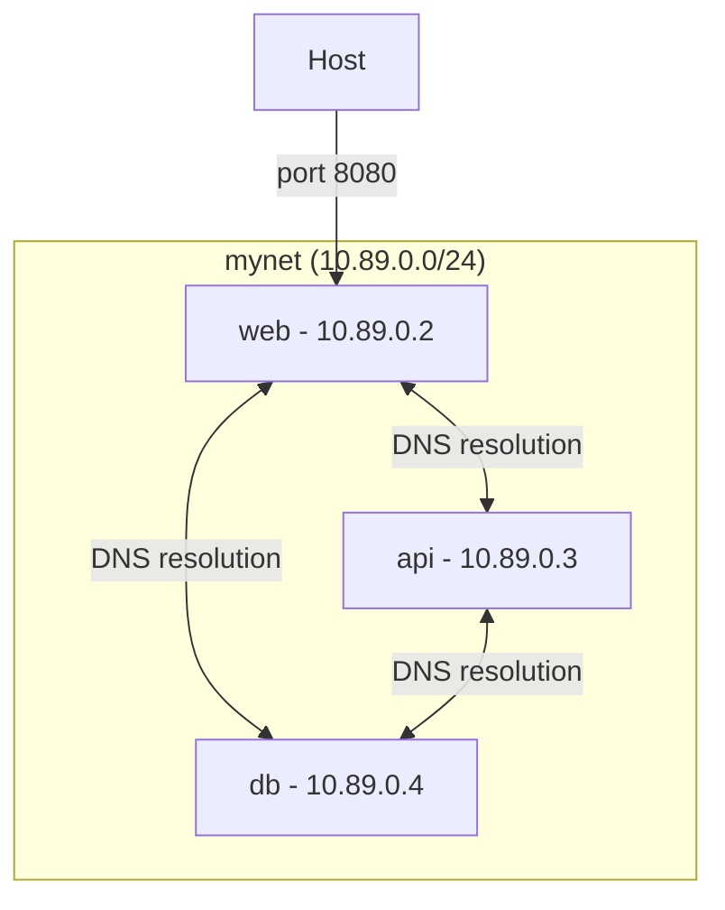

# How to Manage Container Networking with Podman on RHEL 9

Author: [nawazdhandala](https://www.github.com/nawazdhandala)

Tags: RHEL, Podman, Container Networking, Linux

Description: A complete guide to Podman networking on RHEL 9, covering bridge networks, DNS resolution, port mapping, and network troubleshooting for both rootful and rootless containers.

---

Container networking can be confusing, especially when you are juggling rootful and rootless modes with different network backends. On RHEL 9, Podman uses Netavark as the default network backend for rootful containers and pasta for rootless networking. This guide covers how to set up and manage networks for your containers.

## Default Networking Behavior

When you run a container without specifying a network, Podman connects it to the default `podman` bridge network:

# Run a container on the default network
```bash
podman run -d --name web1 docker.io/library/nginx:latest
```

# Check which network the container is using
```bash
podman inspect web1 --format '{{.NetworkSettings.Networks}}'
```

## Checking Your Network Backend

RHEL 9 uses Netavark (not CNI) as the default:

# Verify the network backend
```bash
podman info --format '{{.Host.NetworkBackend}}'
```

You should see `netavark` for rootful containers. Rootless containers use `pasta` (or `slirp4netns` on older setups) for port forwarding and network access.

## Port Mapping

Expose container ports to the host:

# Map host port 8080 to container port 80
```bash
podman run -d --name web -p 8080:80 docker.io/library/nginx:latest
```

# Map to a specific host IP
```bash
podman run -d --name web -p 192.168.1.100:8080:80 docker.io/library/nginx:latest
```

# Map a range of ports
```bash
podman run -d --name web -p 8080-8090:80-90 docker.io/library/nginx:latest
```

# Map to a random host port
```bash
podman run -d --name web -p 80 docker.io/library/nginx:latest
podman port web
```

## Creating Custom Networks

Custom networks let you isolate groups of containers and enable DNS-based service discovery:

# Create a custom bridge network
```bash
podman network create mynet
```

# Create a network with a specific subnet
```bash
podman network create --subnet 10.89.0.0/24 --gateway 10.89.0.1 backend-net
```

# Create a network with IPv6
```bash
podman network create --subnet fd00:dead:beef::/64 --ipv6 ipv6net
```

# List all networks
```bash
podman network ls
```

# Inspect a network
```bash
podman network inspect mynet
```

## Using Custom Networks



# Run containers on a custom network
```bash
podman run -d --name db --network mynet docker.io/library/mariadb:latest -e MYSQL_ROOT_PASSWORD=secret
podman run -d --name api --network mynet docker.io/library/nginx:latest
podman run -d --name web --network mynet -p 8080:80 docker.io/library/nginx:latest
```

Containers on the same custom network can reach each other by name:

# Test DNS resolution between containers
```bash
podman exec web ping -c 2 api
podman exec web ping -c 2 db
```

## Connecting Containers to Multiple Networks

A container can be on multiple networks:

# Create two networks
```bash
podman network create frontend
podman network create backend
```

# Run a container on the frontend network
```bash
podman run -d --name gateway --network frontend -p 8080:80 docker.io/library/nginx:latest
```

# Connect it to the backend network as well
```bash
podman network connect backend gateway
```

# Disconnect from a network
```bash
podman network disconnect frontend gateway
```

## Static IP Assignment

Assign specific IPs to containers:

# Run with a specific IP address
```bash
podman run -d --name fixedip --network mynet --ip 10.89.0.100 docker.io/library/nginx:latest
```

# Verify the assigned IP
```bash
podman inspect fixedip --format '{{.NetworkSettings.Networks.mynet.IPAddress}}'
```

## Macvlan Networks

For containers that need to appear as physical devices on your network:

# Create a macvlan network attached to eth0
```bash
podman network create --driver macvlan --subnet 192.168.1.0/24 --gateway 192.168.1.1 -o parent=eth0 macnet
```

# Run a container on the macvlan network
```bash
podman run -d --name maccontainer --network macnet --ip 192.168.1.200 docker.io/library/nginx:latest
```

Macvlan containers get IPs on your physical network and can be reached directly by other devices.

## Host Networking

Skip network isolation entirely and use the host's network stack:

# Run with host networking (no isolation)
```bash
podman run -d --name hostnet --network host docker.io/library/nginx:latest
```

The container shares the host's network interfaces, IP addresses, and ports. This gives the best performance but no network isolation.

## Troubleshooting Container Networking

When containers cannot communicate, check these:

# Verify container network settings
```bash
podman inspect <container> --format '{{json .NetworkSettings}}' | jq .
```

# Check if containers are on the same network
```bash
podman network inspect mynet | jq '.[0].Containers'
```

# Test connectivity from inside a container
```bash
podman exec web curl -s http://api:80
```

# Check DNS resolution inside a container
```bash
podman exec web cat /etc/resolv.conf
podman exec web nslookup api
```

# Check iptables/nftables rules for port forwarding
```bash
sudo nft list ruleset | grep 8080
```

## Cleaning Up Networks

# Remove a specific network (must not have containers attached)
```bash
podman network rm mynet
```

# Remove all unused networks
```bash
podman network prune
```

## Summary

Podman's networking on RHEL 9 with Netavark gives you bridge networks with DNS, macvlan for physical network integration, and host networking for maximum performance. Custom networks with automatic DNS resolution make it easy to build multi-container applications where services find each other by name.
