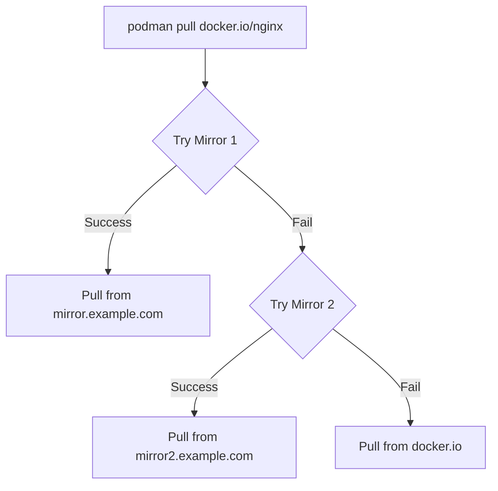

# How to Manage Container Registries and Image Pull Policies on RHEL

Author: [nawazdhandala](https://www.github.com/nawazdhandala)

Tags: RHEL, Podman, Registries, Image Pull, Linux

Description: A comprehensive guide to configuring container registries, authentication, mirror registries, and image pull policies for Podman on RHEL.

---

When you type `podman pull nginx`, how does Podman know where to look? The answer is in your registry configuration. On RHEL, this configuration controls which registries are searched, which are blocked, where mirrors live, and how images are resolved. Getting this right is especially important in enterprise environments where you need to control exactly which images your systems can pull.

## Registry Configuration File

The main configuration file is `/etc/containers/registries.conf`:

# View the current registry configuration
```bash
cat /etc/containers/registries.conf
```

On a default RHEL installation, you will see something like:

```toml
unqualified-search-registries = ["registry.access.redhat.com", "registry.redhat.io", "docker.io"]

short-name-mode = "enforcing"
```

## Understanding Short Names

When you pull `nginx` instead of `docker.io/library/nginx`, Podman needs to resolve the short name. The `short-name-mode` setting controls this:

- `enforcing` - Prompts you to choose a registry (default on RHEL)
- `permissive` - Prompts but allows pulling without confirmation
- `disabled` - Searches registries in order without prompting

# Pull with a short name (will prompt for registry selection)
```bash
podman pull nginx
```

# Pull with a fully qualified name (no ambiguity)
```bash
podman pull docker.io/library/nginx:latest
```

## Configuring Search Registries

Edit the configuration to add or remove search registries:

```bash
sudo vi /etc/containers/registries.conf
```

```toml
# Registries searched when using short names
unqualified-search-registries = ["registry.redhat.io", "registry.access.redhat.com", "docker.io", "quay.io"]
```

## Blocking Registries

Prevent pulling from specific registries:

```toml
[[registry]]
location = "docker.io"
blocked = true
```

This is useful in corporate environments where you want all images to come from your internal registry.

## Setting Up Registry Mirrors

Mirror a public registry with a local one:

```toml
[[registry]]
location = "docker.io"

[[registry.mirror]]
location = "mirror.example.com/docker-hub"

[[registry.mirror]]
location = "mirror2.example.com/docker-hub"
```

When you pull `docker.io/library/nginx`, Podman tries the mirrors first and falls back to Docker Hub if they are unavailable.



## Configuring Insecure Registries

For development registries without TLS:

```toml
[[registry]]
location = "dev-registry.example.com:5000"
insecure = true
```

Only use this for development. Production registries should always use TLS.

## Authentication

Podman stores registry credentials in `${XDG_RUNTIME_DIR}/containers/auth.json`:

# Log in to Red Hat registry
```bash
podman login registry.redhat.io
```

# Log in to Docker Hub
```bash
podman login docker.io
```

# Log in to a private registry
```bash
podman login registry.example.com
```

# View stored credentials
```bash
cat ${XDG_RUNTIME_DIR}/containers/auth.json | jq .
```

# Log out from a registry
```bash
podman logout registry.example.com
```

## Using Authentication Files

For automation and CI/CD, you can specify auth files:

# Create an auth file for CI/CD use
```bash
podman login --authfile /tmp/ci-auth.json registry.example.com
```

# Pull using a specific auth file
```bash
podman pull --authfile /tmp/ci-auth.json registry.example.com/my-app:latest
```

## Image Pull Policies

Control when Podman pulls images:

```bash
# Always pull from registry, even if local copy exists
podman run --pull=always docker.io/library/nginx:latest

# Never pull, only use local image (fail if not available)
podman run --pull=never docker.io/library/nginx:latest

# Pull only if image is not available locally (default)
podman run --pull=missing docker.io/library/nginx:latest

# Pull if image is newer on registry
podman run --pull=newer docker.io/library/nginx:latest
```

## Configuring Default Pull Policies

Set a default pull policy in `/etc/containers/containers.conf`:

```toml
[engine]
image_pull_policy = "missing"
```

Options: `always`, `missing`, `never`, `newer`.

## Registry Certificates

For private registries with custom CA certificates:

# Copy the registry CA certificate
```bash
sudo mkdir -p /etc/containers/certs.d/registry.example.com/
sudo cp ca.crt /etc/containers/certs.d/registry.example.com/
```

# For client certificate authentication
```bash
sudo cp client.cert /etc/containers/certs.d/registry.example.com/
sudo cp client.key /etc/containers/certs.d/registry.example.com/
```

The directory name must match the registry hostname.

## Short Name Aliases

Create aliases for commonly used images:

```bash
cat > /etc/containers/registries.conf.d/shortnames.conf << 'EOF'
[aliases]
"nginx" = "docker.io/library/nginx"
"redis" = "docker.io/library/redis"
"mariadb" = "docker.io/library/mariadb"
"ubi" = "registry.access.redhat.com/ubi9/ubi"
"ubi-minimal" = "registry.access.redhat.com/ubi9/ubi-minimal"
EOF
```

Now `podman pull nginx` resolves directly without prompting.

## Credential Helpers

For more secure credential management:

```bash
# Install a credential helper
sudo dnf install -y podman-credential-helpers

# Configure Podman to use it
cat > ~/.config/containers/containers.conf << 'EOF'
[engine]
helper_binaries_dir = ["/usr/libexec/podman"]
EOF
```

## Per-User Registry Configuration

Users can override system-wide settings:

```bash
mkdir -p ~/.config/containers/
cp /etc/containers/registries.conf ~/.config/containers/registries.conf
```

Edit the user-level file to add personal registries or override settings.

## Troubleshooting Registry Issues

# Test connectivity to a registry
```bash
skopeo inspect docker://registry.example.com/my-app:latest
```

# Check TLS certificate issues
```bash
openssl s_client -connect registry.example.com:443 -showcerts
```

# Pull with debug logging
```bash
podman --log-level debug pull registry.example.com/my-app:latest
```

# Verify auth credentials are stored
```bash
podman login --get-login registry.example.com
```

## Summary

Registry configuration on RHEL gives you fine-grained control over where images come from. Set up mirrors for faster pulls in your network, block untrusted registries, configure authentication for private registries, and use pull policies to control caching behavior. The configuration is flexible enough to handle everything from a developer workstation to a locked-down production environment.
